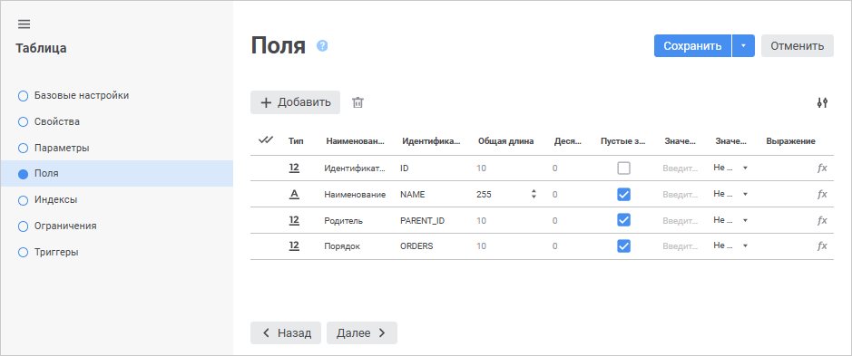
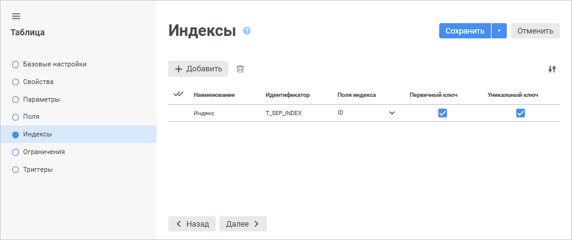

# Пример создания таблицы

Пример создания таблицы
-

# Пример создания таблицы

Ниже рассмотрен процесс создания таблицы в веб-приложении на примере
 таблицы-справочника «Социально-экономические показатели».

Для создания таблицы в [навигаторе
 объектов](GetStarted.chm::/Interface/Interface_Navigator.htm):

	- Нажмите кнопку  «Создать»
	 в главном меню и выберите «Таблица»
	 на боковой панели «[Новый
	 объект](UiNav.chm::/02_Navigator/General_Principles_of_Work.htm#add_object)».

	- Определите наименование и идентификатор объекта на странице «Базовые свойства»:

		- Наименование: Социально-экономические показатели;

		- Идентификатор: T_SEP.

Примечание.
 В названиях идентификаторов рекомендуется использовать префиксы, показывающие
 отношение объекта к определенному классу объектов. Например, префикс «T_»
 для таблиц (от англ. Table - таблица), «R_» или «REP_» для отчетов
 (от англ. Report - отчет).

	- Выберите в списке объектов репозитория базу данных, в которой
	 будет создана таблица, на странице «[Свойства](Master/UiDb_relational_table_master_Property.htm)».

	- Добавьте поля таблицы на странице «[Поля](Master/UiDb_relational_table_master_field.htm)».
	 Для это нажмите кнопку  «Добавить».

Создайте четыре поля со следующими параметрами:

		 Наименование
		 Идентификатор
		 Тип поля
		 Длина
		 Пустые значения

		 Наименование
		 NAME
		 Строковый
		 255
		 Допускаются

		 Идентификатор
		 ID
		 Целый
		 10,0
		 Не допускаются

		 Родитель

		 PARENT_ID
		 Целый
		 10,0
		 Допускаются

		 Порядок
		 ORDER
		 Целый
		 10,0
		 Допускаются

После создания всех полей страница «[Поля](Master/UiDb_relational_table_master_field.htm)» должна выглядеть следующим образом:

Таблица «Социально-экономические показатели»
 организована таким образом, что для однозначного определения записи понадобится
 всего одно поле: «Идентификатор».

	- Создайте индекс на странице «[Индексы](Master/UiDb_relational_table_master_Index.htm)».
	 Для этого нажмите на кнопку  «Добавить».

В раскрывающемся списке «Поля
 индекса» выберите поле «ID», затем установите флажок «Первичный
 ключ». Страница «Индексы»
 примет вид:

Для завершения создания таблицы нажмите кнопку «Сохранить».
 Если все сделано правильно, то созданная таблица появится в навигаторе
 объектов.

Заполнение полей таблицы данными осуществляется двумя способами:

	- непосредственным добавлением данных в созданную таблицу, открытую
	 в режиме просмотра и редактирования;

	- с помощью импорта данных их внешних источников.

См. также:

[Таблица](UiDb_relational_table.htm) |
 [Создание табличных наборов данных](Master/object_type_page.htm)

		Справочная
		 система на версию 10.9
		 от 18/08/2025,
		 © ООО «ФОРСАЙТ»,
