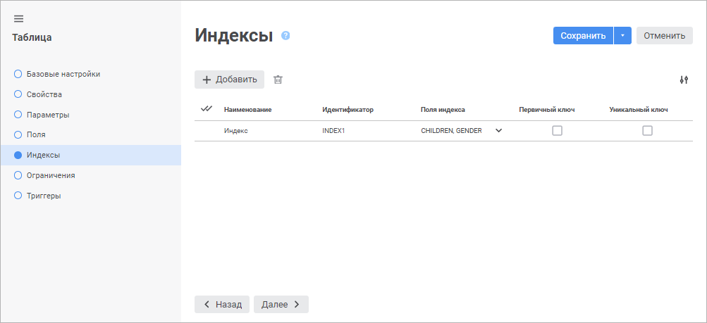
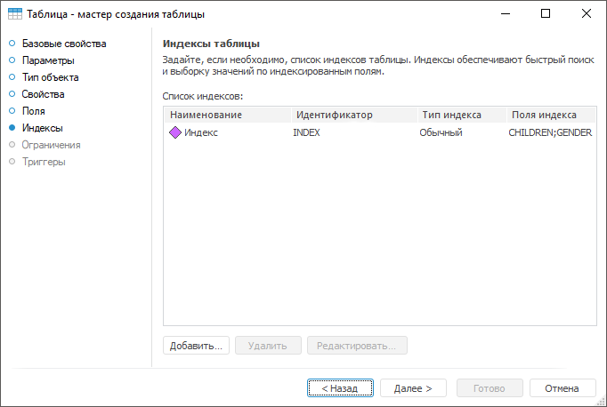
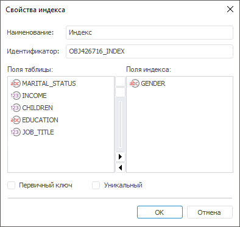

# Страница «Индексы таблицы»: Таблица

Страница «Индексы таблицы»: Таблица
-

# Индексы таблицы

На странице «Индексы» задаётся
 список индексов таблицы. Индексирование обеспечивает быстрый поиск и выборку
 значений, а также соблюдение уникальности значений определенных полей.
 Часто поиск осуществляется по различным полям или группам полей. В таких
 случаях есть смысл создавать несколько индексов.

	Веб-приложение Настольное приложение

		

		

[Создание
 индекса](javascript:TextPopup(this))

	Для создания нового индекса:

		- в веб-приложении нажмите кнопку  «Добавить». В список индексов
		 будет добавлена новая строка;

		- в настольном приложении:

			- нажмите кнопку «Добавить»;

			- дважды щёлкните по свободному пространству списка индексов.

	Будет открыт диалог «Свойства
	 индекса»:

	

	Все поля заполнены значениями по умолчанию.

	Задайте атрибуты индекса:

		- Наименование. Введите
		 наименование индекса. По умолчанию «Индекс»;

		- Идентификатор. Введите
		 уникальный идентификатор индекса в списке индексов таблиц (допускается
		 использование только латинских букв, цифр, не допускается использование
		 пробелов). По умолчанию <Идентификатор
		 таблицы>_INDEX<Порядковый
		 номер>;

		- Поля таблицы. Список
		 всех полей таблицы, добавление которых возможно в поле индекса.
		 Доступно только в настольном приложении;

		- Поля индекса. Выберите
		 из раскрывающегося списка поля в веб-приложении или добавьте поля
		 из списка «Поля таблицы»
		 двойным щелчком или с помощью механизма Drag&Drop в настольном
		 приложении. В списке указаны все поля таблицы, добавление которых
		 возможно в поле индекса. Если индекс состоит из нескольких полей,
		 то поиск первоначально будет происходить по самому первому отмеченному
		 полю, потом по второму и т.д.;

		- Первичный ключ.
		 Установите флажок, если индекс первичный. При установке автоматически
		 устанавливается флажок «Уникальный
		 ключ»;

		- Уникальный ключ.
		 Установите флажок, если индекс уникальный. Уникальный индекс однозначно
		 определяет каждую запись. При создании уникального или первичного
		 индекса необходимо помнить, что данные индексы не могут быть построены
		 на основе полей, которые могут содержать пустые значения, поскольку
		 в данном случае мы теряем однозначность.

	Примечание.
	 Если в веб-приложении выбрана база данных СУБД ClickHouse на странице
	 «[Свойства](UiDb_relational_table_master_Property.htm)»,
	 то «Уникальный ключ» заменяется
	 на «Ключ сортировки».
	 Ключ сортировки определяет порядок хранения данных и не зависит
	 от флажка «Первичный ключ».
	 Если первичный ключ не задан, то ключ сортировки используется
	 в качестве первичного ключа.

	Для изменения отображаемых свойств в веб-приложении установите или
	 снимите отметку около требуемых свойств в раскрывающемся меню кнопки
	  «Настройки».

[Редактирование
 индекса](javascript:TextPopup(this))

	Для редактирования выбранного индекса:

		- в веб-приложении задайте или измените требуемые настройки
		 индекса в соответствующих столбцах;

		- в настольном приложении нажмите кнопку «Редактировать»
		 или дважды щёлкните по индексу в списке. Будет открыт диалог «Свойства индекса».

[Удаление
 индекса](javascript:TextPopup(this))

	Для удаления выбранного индекса:

		- в веб-приложении нажмите кнопку  «Удалить»;

		- в настольном приложении нажмите кнопку «Удалить»
		 или нажмите сочетание клавиш CTRL+DELETE.

	Будет отображено окно подтверждения удаления.

Для перехода на следующую страницу мастера нажмите кнопку «Далее».

См. также:

[Таблица](../UiDb_relational_table.htm) |
 [Ограничения
 таблицы](UiDb_relational_table_master_contingencies.htm)

		Справочная
		 система на версию 10.9
		 от 18/08/2025,
		 © ООО «ФОРСАЙТ»,
