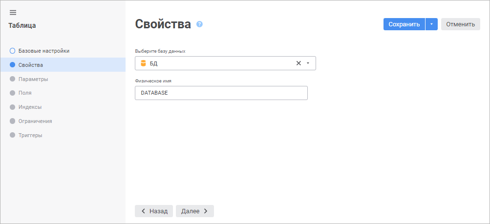
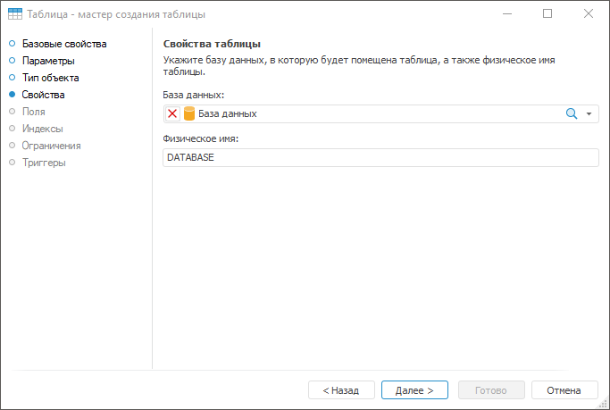

# Страница «Свойства таблицы»: Таблица

Страница «Свойства таблицы»: Таблица
-

# Свойства таблицы

На странице «Свойства» определяется
 база данных, в которой будет создана таблица, а также физическое имя.
 Физическое имя таблицы - имя, с которым она будет создана в выбранной
 базе данных. В качестве физического имени таблицы по умолчанию предлагается
 использовать идентификатор таблицы.

Примечание.
 Если заданное физическое имя таблицы уже используется в репозитории, то
 оно будет сохранено в формате: <физическое
 имя>_<порядковый номер>.
 Порядковый номер начинается с единицы и возрастает в зависимости от количества
 дубликатов одного и того же используемого физического имени.

	Веб-приложение Настольное приложение

		

		

Выберите базу данных в раскрывающемся списке. При выборе базы данных СУБД ClickHouse создаётся таблица с помощью механизма
 [MergeTree](https://clickhouse.com/docs/ru/engines/table-engines/mergetree-family/mergetree). Использование базы данных СУБД ClickHouse
 доступно только в веб-приложении.

Для быстрого выбора объекта в списке введите
 название искомого объекта в поле поиска. Поиск будет выполняться автоматически
 по мере ввода текста. В списке будут отображаться только те объекты, наименования
 которых содержат вводимый текст.

Для быстрого выбора объекта в поле для поиска введите его название/идентификатор/ключ,
 в зависимости от настроек отображения. Поиск будет выполняться автоматически
 по мере ввода текста. Список будет содержать объекты, наименования/идентификаторы/ключи
 которых содержат вводимый текст.

Для настройки отображения объектов репозитория в списке нажмите кнопку
  «Отображение
 объекта» и выберите в раскрывающемся меню вариант отображения:

	- Наименование. Объекты
	 отображаются под своими наименованиями. Вариант по умолчанию;

	- Идентификатор. Объекты
	 отображаются под своими идентификаторами;

	- Ключ. Объекты отображаются
	 под своими ключами.

Выбрать можно несколько вариантов. Идентификатор и ключ будут указаны
 в скобках.

Для сброса отметки выбранных объектов нажмите кнопку 
 «Очистить».

Примечание.
 Настройка отображения объекта доступна в веб-приложении.

См. также:

[Таблица](../UiDb_relational_table.htm) |
 [Поля
 таблицы](UiDb_relational_table_master_field.htm)

		Справочная
		 система на версию 10.9
		 от 18/08/2025,
		 © ООО «ФОРСАЙТ»,
