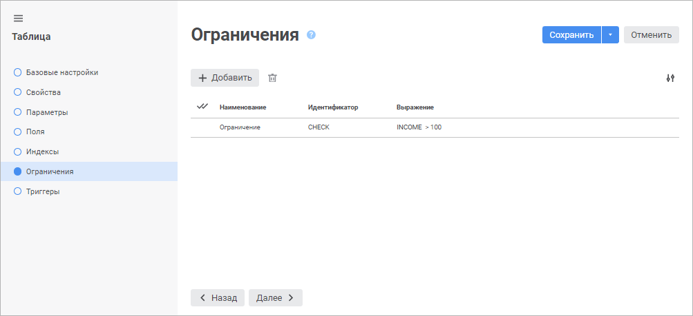
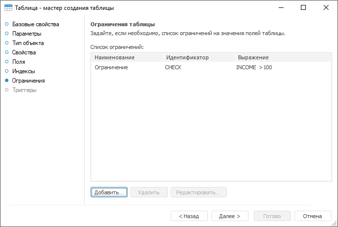
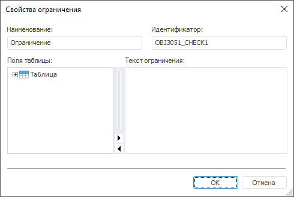

# Страница «Ограничения таблицы»: Таблица

Страница «Ограничения таблицы»: Таблица
-

# Ограничения таблицы

На странице «Ограничения» задаётся
 список ограничений на поля таблицы. Ограничения используются для автоматического
 контроля над данными, хранящимися в таблице. Например, сумма наличных
 денег не может быть отрицательной или дата выдачи кредита должна быть
 больше, чем дата основания банка.

	Веб-приложение Настольное приложение

		

		

[Создание
 ограничения](javascript:TextPopup(this))

	Для создания нового ограничения:

		- в веб-приложении нажмите кнопку  «Добавить». В список ограничений
		 будет добавлена новая строка;

		- в настольном приложении:

			- нажмите кнопку «Добавить»;

			- дважды щёлкните по свободному пространству списка ограничений.

	Будет открыт диалог «Свойства
	 ограничения»:

	

	Все поля заполнены значениями по умолчанию.

	Задайте атрибуты ограничения:

		- Наименование. Введите
		 наименование ограничения. По умолчанию «Ограничение»;

		- Идентификатор. Введите
		 уникальный идентификатор ограничения (допускается использование
		 только латинских букв, цифр и знаков `_`, не допускается использование
		 пробелов). По умолчанию <Идентификатор
		 таблицы>_CHECK<Порядковый
		 номер>;

		- Поля таблицы. Область
		 недоступна для редактирования. Включает в себя поля таблицы, на
		 которые будут накладываться ограничения. Доступно только в настольном
		 приложении;

		- Выражение/Текст ограничения.
		 Сформируйте выражение, по которому будет накладываться ограничения
		 на указываемые данные. Выражение должно возвращать логическое
		 значение (True/False),
		 для составления выражения используются поля таблицы, арифметические,
		 логические, унарные операции, операции отношения, а также [встроенные
		 SQL-функции](Function/UiDb_relational_table_funct.htm).

	Для изменения отображаемых свойств в веб-приложении установите или
	 снимите отметку около требуемых свойств в раскрывающемся меню кнопки
	  «Настройки».

[Редактирование
 ограничения](javascript:TextPopup(this))

	Для редактирования выбранного ограничения:

		- в веб-приложении задайте или измените требуемые настройки
		 ограничения в соответствующих столбцах;

		- в настольном приложении нажмите кнопку «Редактировать»
		 или дважды щёлкните по ограничению в списке. Будет открыт диалог
		 «Свойства ограничения».

[Удаление
 ограничения](javascript:TextPopup(this))

	Для удаления выбранного ограничения:

		- в веб-приложении нажмите кнопку  «Удалить»;

		- в настольном приложении нажмите кнопку «Удалить»
		 или нажмите сочетание клавиш CTRL+DELETE.

	Будет отображено окно подтверждения удаления.

Для перехода на следующую страницу мастера нажмите кнопку «Далее».

См. также:

[Таблица](../UiDb_relational_table.htm) |
 [Триггеры таблицы](UiDb_relational_table_master_trigger.htm)

		Справочная
		 система на версию 10.9
		 от 18/08/2025,
		 © ООО «ФОРСАЙТ»,
