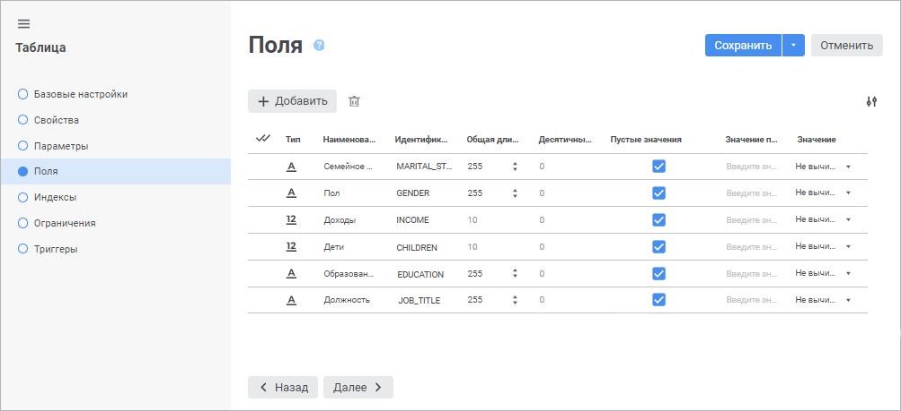
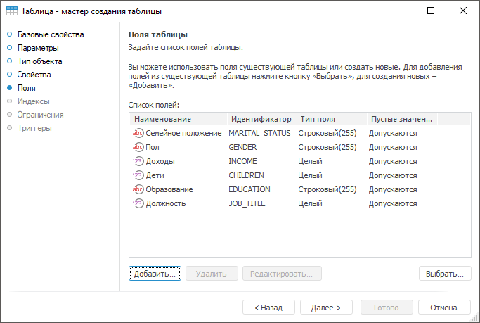
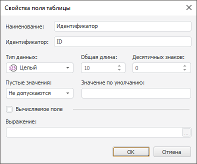
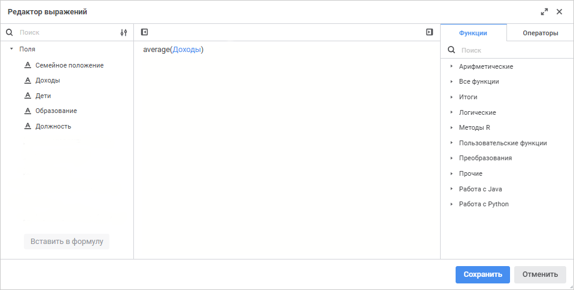
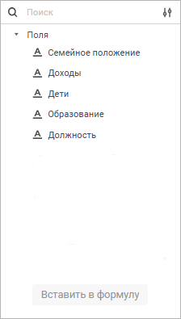

# Страница «Поля таблицы»: Таблица

Страница «Поля таблицы»: Таблица
-

# Поля таблицы

На странице «Поля» определяется
 структура таблицы, то есть задаётся список полей таблицы и их характеристики.

	Веб-приложение Настольное приложение

		

		

[Добавление
 полей](javascript:TextPopup(this))

	Для добавления нового поля:

		- в веб-приложении нажмите кнопку  «Добавить». В конец списка будет
		 добавлена строка, в которой укажите свойства поля;

		- в настольном приложении:

			- нажмите кнопку «Добавить»;

			- дважды щёлкните в области списка полей.

	Откроется окно «Свойства
	 поля таблицы», в котором задайте свойства поля:

	

	Также существует возможность добавить
	 в таблицу описание полей ранее созданных таблиц. Для этого нажмите
	 кнопку «Выбрать». В открывшемся
	 окне выберите существующую таблицу. Описания всех полей выбранной
	 таблицы будут добавлены в список полей создаваемой таблицы.

	Задайте свойства поля:

		- Тип/Тип данных.
		 В раскрывающемся списке выберите тип данных:

			- Строковый;

			- Целочисленный;

			- Вещественный;

			- Дата и время;

			- Пользовательский.
			 Доступен только в настольном приложении;

			- Текстовый. Хранит
			 данные, определённые в наборе символов базы данных или в национальном
			 наборе символов, если база данных использует [юникод
			 для представления данных](../../database/UiDb_database_master_property.htm). Доступен только в настольном
			 приложении;

			- Двоичный. Хранит
			 неструктурированные двоичные данные. Доступен только в настольном
			 приложении.

	По умолчанию выбран строковый тип;

	Примечание.
	 СУБД Oracle поддерживает типы данных «Текстовый»
	 и «Двоичный» только для версий
	 Oracle 9.x и выше. Принцип работы с такими полями приведён в разделе
	 «[Работа
	 с полями, имеющими пользовательский тип данных](KnowledgeBase.chm::/01_Fore/KnowledgeBase_KB000031.htm)».

		- Наименование. Введите
		 наименование, характеризующее назначение поля. По умолчанию «Поле
		 <Порядковый номер>»;

		- Идентификатор. Определите
		 уникальное имя поля таблицы, которое будет использоваться для
		 SQL-запросов, определения связей между таблицами. Идентификатор
		 может состоять только из букв латинского алфавита, цифр и символа
		 подчеркивания. По умолчанию FIELD<Порядковый
		 номер>;

		- Общая длина. Определите
		 максимально возможную длину поля таблицы: для символьного -
		 количество символов, для числового - количество цифр;

		- Десятичных знаков.
		 Определите количество десятичных знаков после запятой для числовых
		 полей;

		- Пустые значения.
		 Определите возможность хранения в поле пустых значений с помощью
		 флажка в веб-приложении или раскрывающегося списка в настольном
		 приложении;

	Примечание.
	 Если в веб-приложении выбрана база данных СУБД ClickHouse на странице
	 «[Свойства](UiDb_relational_table_master_Property.htm)»
	 и снят флажок «Пустые значения»,
	 то при добавлении записи с пустым значением в поле таблицы будет
	 подставляться значение по умолчанию. Для изменения автоматической подстановки значения
	 используйте параметр [input_format_null_as_default](https://clickhouse.com/docs/ru/operations/settings/formats#input_format_null_as_default)
	 в настройках СУБД ClickHouse.

		- Значение по умолчанию.
		 Определите значение, которое будет присвоено полю при его создании.
		 Можно ввести, например, наиболее часто встречающееся значение;

		- Значение/Вычисляемое поле.
		 Определите признак вычисляемости поля с помощью раскрывающегося
		 списка в веб-приложении или флажка в настольном приложении. При
		 установке вычисляемого поля отображается окно подтверждения действия
		 с предупреждением об удалении всех данных поля. После подтверждения
		 действия задайте формулу, по которой будет вычисляться значение
		 поля. Для этого нажмите кнопку  «Вставить формулу» в веб-приложении
		 или кнопку  «Вставить
		 формулу» в настольном приложении. Будет открыто окно [редактора выражения](#formula).

	Для изменения количества отображаемых свойств в веб-приложении установите/снимите
	 флажки напротив наименования свойств в раскрывающемся меню кнопки
	  «Настройки».

[Редактирование
 полей](javascript:TextPopup(this))

	Для редактирования параметров выбранного поля таблицы:

		- в веб-приложении измените значения в соответствующих столбцах;

		- в настольном приложении:

			- нажмите кнопку «Редактировать»;

			- дважды щёлкните по наименованию поля.

	Откроется окно «Свойства
	 поля таблицы», в котором измените соответствующие свойства.

	Примечание.
	 Если при редактировании поля были внесены изменения в его идентификатор
	 и другие свойства, то применится только изменение идентификатора.

[Удаление
 полей](javascript:TextPopup(this))

	Для удаления выделенных полей:

		- в веб-приложении нажмите кнопку  «Удалить»;

		- в настольном приложении нажмите кнопку «Удалить»
		 или нажмите сочетание клавиш CTRL+DELETE.

	Будет запрошено подтверждение действия.

## Редактор выражения

Настройка формул выполняется с помощью редактора выражения:

	- редактор выражения в настольном приложении универсален для всех
	 инструментов и объектов платформы. Описание универсального редактора
	 выражения приведено в разделе «[Создание формул и выражений](uinav.chm::/GUI/ExpressionEditor.htm)»;

	- редактор выражения в веб-приложении отличается в зависимости
	 от настраиваемого инструмента или объекта.

Окно редактора выражения для настройки вычисляемых полей таблицы в веб-приложении
 имеет вид:

Сформируйте формулу, по которой будет рассчитываться вычисляемое поле.

В формуле допускается использование операндов, арифметических операций,
 функций, цифр, знаков сравнения и круглых скобок. При этом имеются некоторые
 особенности:

	- вставка всех типов элементов, кроме цифр, может осуществляться
	 как с помощью клавиатуры, так и с помощью специальных панелей;

	- вставка цифр осуществляется только с помощью клавиатуры.

[Вставка операндов](javascript:TextPopup(this))

	Операнды отображаются на панели операндов редактора выражения:

	

	В качестве операндов используются другие поля и параметры таблицы.

Для вставки операнда в область формул выполните одно из действий:

	- с помощью панели операндов:

		- выделите операнд и нажмите кнопку «Вставить
		 в формулу»;

		- дважды щёлкните по операнду;

		- перенесите операнд в область формул с помощью механизма
		 Drag&Drop;

	- с помощью области формул:

		- введите наименование операнда в области формул;

		- щёлкните в области формул в том месте, куда нужно вставить
		 операнд, нажмите сочетание клавиш CTRL+SHIFT и выберите на всплывающей
		 панели требуемый операнд.

Для быстрого поиска операнда начните вводить его наименование частично
 или целиком в строке поиска. После выполнения действия на панели операндов
 будут отображены те операнды, наименования которых удовлетворяют условиям
 поиска.

Для настройки отображения списка операндов используйте команды в раскрывающемся
 меню кнопки  «Настройки
 отображения»:

	- Наименование. По умолчанию.
	 Отображение только наименований операндов;

	- Идентификатор. Отображение
	 только идентификаторов операндов;

	- Наименование и идентификатор.
	 Отображение наименований и идентификаторов операндов в формате: <наименование> (<идентификатор>).

Для скрытия панели операндов нажмите кнопку  «Скрыть панель операндов», для отображения -
 нажмите кнопку  «Отобразить
 панель операндов».

[Вставка функций
 и операторов](javascript:TextPopup(this))

	Функции и операторы отображаются на панели функций и операторов
	 на соответствующих вкладках:

	

	Для вставки функции или оператора в область формул выполните одно
	 из действий:

		- с помощью панели функций и операторов:

			- выделите функцию/оператор. Отобразится панель с описанием:

	

	Нажмите кнопку «Вставить
	 в формулу»;

			- дважды щёлкните по функции/оператору;

			- перенесите функцию/оператор в область формул с помощью
			 механизма Drag&Drop;

		- с помощью области формул:

			- введите функцию/оператор в области формул;

			- щёлкните в области формул в том месте, куда нужно вставить
			 функцию/оператор, нажмите сочетание клавиш CTRL+SHIFT и выберите
			 на всплывающей панели требуемую функцию/оператор.

	Для быстрого поиска функции или оператора начните вводить функцию/оператор
	 частично или целиком в строке поиска. После выполнения действия на
	 панели функций и операторов будут отображены функции/операторы, удовлетворяющие
	 условиям поиска.

	Для скрытия панели функций и операторов нажмите кнопку  «Скрыть
	 панель функций и операторов», для отображения - нажмите
	 кнопку  «Отобразить
	 панель функций и операторов».

См. также:

[Таблица](../UiDb_relational_table.htm) |
 [Индексы
 таблицы](UiDb_relational_table_master_Index.htm)

		Справочная
		 система на версию 10.9
		 от 18/08/2025,
		 © ООО «ФОРСАЙТ»,
