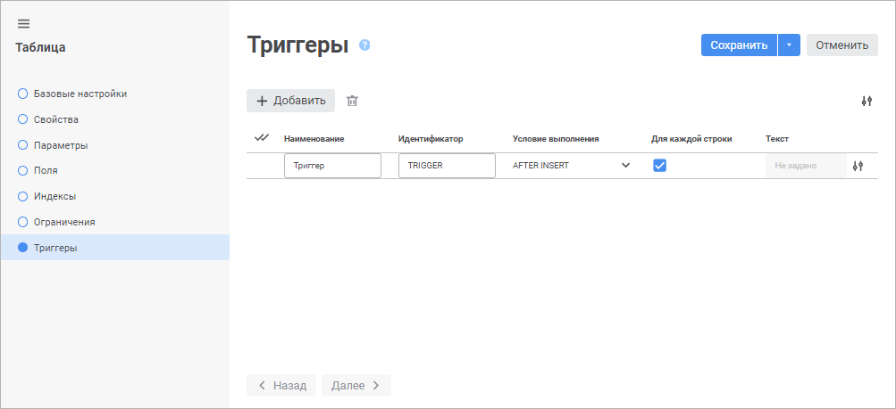
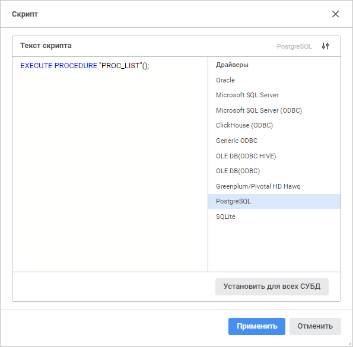
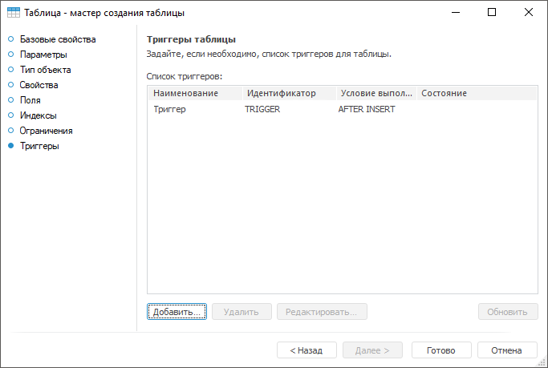
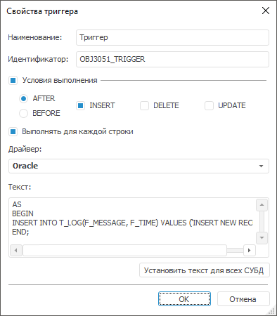

# Страница «Триггеры таблицы»: Таблица

Страница «Триггеры таблицы»: Таблица
-

# Триггеры таблицы

На странице «Триггеры» задаётся
 список триггеров для таблицы. Если в веб-приложении выбрана база данных
 СУБД ClickHouse на странице «[Свойства](UiDb_relational_table_master_Property.htm)»,
 то добавление триггеров недоступно.

Триггер - это функция,
 состоящая из SQL-операторов и описывающая действия, которые необходимо
 выполнить при определенных условиях.

	Веб-приложение Настольное приложение

		

		Для создания триггера нажмите кнопку  «Добавить». В конец списка будет
		 добавлена строка, в которой определите следующие атрибуты:

			- Наименование.
			 Введите наименование триггера. По умолчанию «Триггер»;

			- Идентификатор.
			 Введите уникальный идентификатор триггера (допускается использование
			 только латинских букв, цифр и знака «_», не допускается использование
			 пробелов). По умолчанию <идентификатор
			 таблицы>_TRIGGER<порядковый
			 номер>;

			- Условие
			 выполнения. Определите условие, при котором будет выполняться
			 вычисление. Задайте время выполнения события, для этого установите
			 соответствующий переключатель:

				- AFTER. После
				 добавления, удаления или изменения данных;

				- BEFORE.
				 До вставки, удаления или изменения данных.

			Затем выберите событие, при котором будет срабатывать триггер,
			 для этого установите флажки:

				- INSERT.
				 Добавление данных в таблицу;

				- DELETE.
				 Удаление данных из таблицы;

				- UPDATE.
				 Изменение данных в таблице;

			- Для
			 каждой строки. При необходимости снимите флажок для
			 триггера, который будет выполняться один раз для всего измененного
			 множества записей (без «for each row»). По умолчанию флажок
			 установлен, триггер выполняется один раз для каждой измененной
			 записи («for each row»).

		Примечание.
		 Атрибут используется только при указании текста скрипта для драйверов
		 Oracle, PostgresSQL в окне «Скрипт».

			- Текст. Укажите
			 текст скрипта триггера на языке SQL.

		Для редактирования выбранного триггера измените значение в соответствующем
		 столбце.

		Для изменения количества отображаемых атрибутов нажмите кнопку
		  «Настройки»
		 и установите/снимите флажок напротив наименования атрибута.

		Для удаления одного или нескольких триггеров выделите их и нажмите
		 кнопку  «Удалить».
		 Будет запрошено подтверждение выполняемого действия.

		Для завершения работы мастера нажмите кнопку «Сохранить».

## Текст скрипта

		Для указания текста скрипта триггера нажмите кнопку  «Скрипт»,
		 расположенную в поле атрибута «Текст».

		После выполнения действия будет открыто окно «Скрипт»:

		

		В поле «Текст скрипта»
		 укажите код триггера на языке SQL. Код указывается в соответствии
		 с тем синтаксисом SQL, который установлен для выбранного драйвера
		 СУБД. Например, для серверов на базе Microsoft SQL Server весь
		 код должен указываться между ключевыми словами:

		AS

		BEGIN

		...

		END;

		А для серверов на базе Oracle весь код должен указываться между
		 ключевыми словами:

		BEGIN

		...

		END;

		Напротив поля «Текст скрипта»
		 отображается выбранный драйвер СУБД и список драйверов. По умолчанию
		 в списке драйверов выделен драйвер, используемый при [настройке
		 подключения к репозиторию](setup.chm::/06_ak_client_config/uinav_repoconfig_repo1.htm). Если для одного
		 или нескольких драйверов указан текст скрипта, то в списке драйверов
		 будет установлена отметка.

		Для скрытия/отображения списка драйверов используйте кнопку
		  «Скрыть
		 список драйверов»/«Отобразить
		 список драйверов».

		Для установки указанного текста скрипта для всех СУБД нажмите
		 кнопку «Установить для всех СУБД».
		 После чего будет открыто окно подтверждения. Если хотя бы для
		 одного драйвера, отличного от текущего, уже указан текст скрипта,
		 то при положительном ответе все заданные скрипты будут замещены
		 текущим.

		Для применения текстов скрипта триггера к выбранным драйверам
		 СУБД нажмите кнопку «Применить».

		

		Для создания триггера:

			- нажмите кнопку «Добавить»;

			- дважды щелкните в области списка триггеров.

		Будет открыт диалог «Свойства
		 триггера».

		Для редактирования выбранного триггера:

			- нажмите кнопку «Редактировать»;

			- дважды щелкните по триггеру;

		Будет открыт диалог «Свойства
		 триггера». Внесите в нём требуемые изменения. Также окно
		 свойств триггеров можно вызвать двойным щелчком мыши.

		Для удаления текущего триггера нажмите кнопку «Удалить»
		 или нажмите сочетание клавиш CTRL+DELETE.

		Если триггер создан вне «Форсайт. Аналитическая платформа»
		 (например, в TOAD), то его можно обновить. Для этого используйте
		 кнопку «Обновить».

## Свойства триггера

		Диалог «Свойства триггера»
		 будет открыт при создании и редактировании триггера:

		

		В открывшемся диалоге определите следующие атрибуты:

			- Наименование.
			 Введите наименование триггера;

			- Идентификатор.
			 Уникальный идентификатор триггера (допускается использование
			 только латинских букв, цифр и знака «_», не допускается использование
			 пробелов);

			- Условия
			 выполнения. Определяется условие, при котором будет
			 выполняться вычисление, первым задается время выполнения одного
			 или нескольких выбранных событий, для этого необходимо установить
			 соответствующие переключатели:

				- AFTER. После
				 добавления, удаления или изменения данных;

				- BEFORE.
				 До вставки, удаления или изменения данных.

			Затем выбирается событие, при котором будет срабатывать
			 триггер, для этого необходимо установить флажки:

				- INSERT.
				 Добавление данных в таблицу;

				- DELETE.
				 Удаление данных из таблицы;

				- UPDATE.
				 Изменение данных в таблице;

		Примечание.
		 Если выбран какой-либо драйвер Microsoft SQL Server, то переключатель
		 After/Before не влияет на создаваемый триггер, так как в Microsoft
		 SQL Server такое деление отсутствует.

			- Выполнять
			 для каждой строки. Флажок доступен при выборе драйверов
			 семейства Oracle. Поскольку для них могут быть настроены триггеры,
			 выполняющиеся один раз для каждой измененной записи («for
			 each row») либо триггеры, выполняющиеся один раз для всего
			 измененного множества записей (без «for each row»);

			- Драйвер.
			 В раскрывающемся списке выберите тип драйвера. Более подробно
			 о доступных драйверах читайте в подразделе «[Поддерживаемые
			 СУБД](Setup.chm::/01_SysReq/database_Support.htm)». Драйвер, соответствующий базе данных
			 таблицы, выделяется полужирным начертанием. При открытии диалога
			 он будет выбран по умолчанию. Для каждого драйвера можно задать
			 свой текст, то есть текст триггера, вводимый в соответствующем
			 поле, должен быть привязан к выбранному типу СУБД. Условия
			 выполнения к драйверу не привязываются. При снятии флажка
			 «Условия выполнения»
			 список «Драйвер» и
			 кнопка «Установить для всех
			 СУБД» остаются доступными;

			- Текст.
			 В данном поле указывается код триггера на языке SQL. Код указывается
			 в соответствии с тем синтаксисом SQL, который установлен для
			 выбранной СУБД. Например, для серверов на базе Microsoft
			 SQL Server весь код должен указываться между ключевыми
			 словами:

		AS

		BEGIN

		...

		END;

		А для серверов на базе Oracle
		 весь код должен указываться между ключевыми словами:

		BEGIN

		...

		END;

			- Установить
			 текст для всех СУБД. Команда позволяет установить заданный
			 текст для всех СУБД. Если хотя бы для одного драйвера, отличного
			 от текущего, текст триггера непустой, то при нажатии кнопки
			 откроется окно подтверждения. При положительном ответе отображаемый
			 текст триггера будет указываться для всех СУБД, то есть все
			 существующие тексты триггеров будут замещены текущим. Если
			 текст триггеров пустой для всех драйверов и отличается от
			 текущего, запрос на подтверждение действия не выдается.

См. также:

[Таблица](../UiDb_relational_table.htm)

		Справочная
		 система на версию 10.9
		 от 18/08/2025,
		 © ООО «ФОРСАЙТ»,
