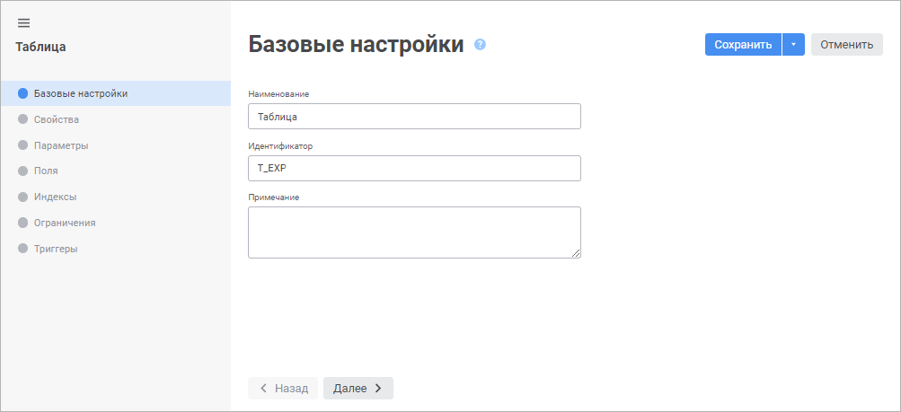
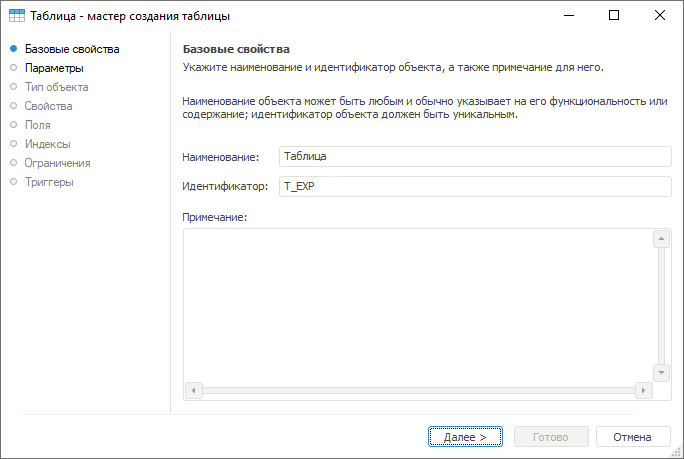

# Страница «Базовые настройки»: Таблица

Страница «Базовые настройки»: Таблица
-

# Базовые настройки

На странице «Базовые настройки»
 в веб-приложении и «Базовые свойства»
 в настольном приложении задаются наименование объекта, идентификатор и
 примечание.

	Веб-приложение Настольное приложение

		

		

Задайте общие параметры:

	- Наименование. Строка
	 символов, несущая смысловую нагрузку (функциональность объекта или
	 его содержание). Наименование объекта отображается в навигаторе объектов
	 и в большинстве мест интерфейса. Понятное наименование облегчает интерпретацию
	 объекта в системе;

	- Идентификатор. Последовательность
	 букв латинского алфавита, цифр и знаков подчёркивания, начинающаяся
	 с буквы. Идентификатор должен быть уникальным в пределах репозитория;

	- Примечание. Заметки
	 или аннотации к объекту. Поле необязательно для заполнения.

Для перехода на следующую страницу мастера нажмите кнопку «Далее».

См. также:

[Таблица](../UiDb_relational_table.htm)

		Справочная
		 система на версию 10.9
		 от 18/08/2025,
		 © ООО «ФОРСАЙТ»,
