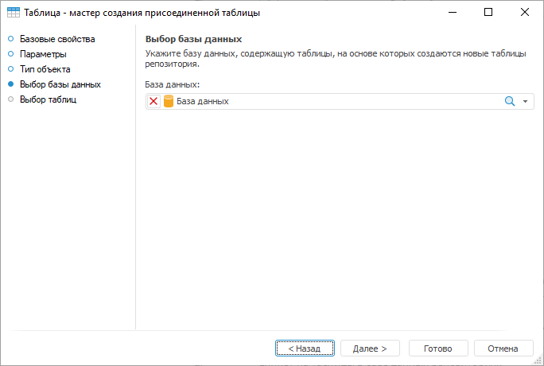
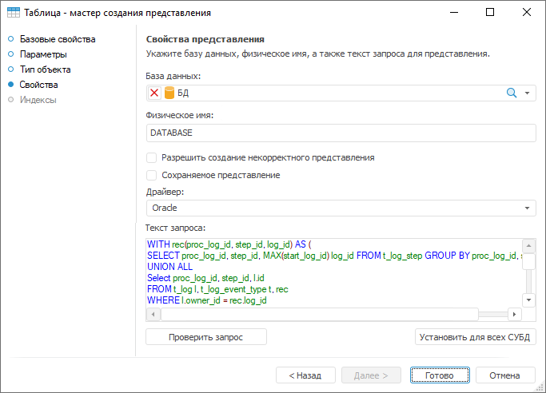
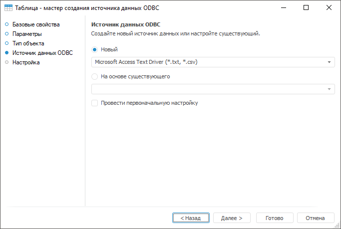

# Создание табличных наборов данных

Создание табличных наборов данных
-

# Создание табличных наборов данных

Наборы данных - это класс объектов репозитория, представляющих
 собой двумерный массив данных. Для хранения данных используется БД. В
 «Форсайт. Аналитическая платформа»
 наличие наборов данных является обязательным условием для создания [справочников](../../reference_book/Create.htm) и [кубов](../../Cube/UiMd_Cube_Type.htm),
 элементов, необходимых для выполнения анализа данных в репозитории платформы.
 Также к табличному набору данных относят журнал, предназначенный для хранения
 информации о выполнении задач ETL. Фактически журнал представляет собой
 таблицу с заданным списком полей.

Для создания набора данных в навигаторе объектов:

	- в веб-приложении нажмите кнопку  «Создать» в главном меню и выберите
	 тип объекта на боковой панели «[Новый объект](UiNav.chm::/02_Navigator/General_Principles_of_Work.htm#add_object)»;

	- в настольном приложении:

		- Выполните одно из действий:

			- выполните команду «Создать >
			 Таблица» в контекстном меню;

			- нажмите кнопку «Новый
			 объект», расположенную в группе «Создать»
			 на вкладке «[Главная](GetStarted.chm::/Interface/Interface_Description.htm#customize_ribbon)»
			 ленты инструментов, и выберите пункт «Таблица».

		- Выберите тип создаваемого
		 объекта на странице «Тип объекта».

После выполнения одного из действий будет открыт мастер табличного
 набора данных. Страницы мастера зависят от:

	- выбранного типа создаваемой таблицы в веб-приложении;

	- выбранного объекта на странице «Тип
	 объекта» в настольном приложении.

После создания набора данных перейдите к [работе
 с ним](../Work/UiDb_relational_table_work.htm).

Существуют следующие виды наборов данных:

	- [Таблица](../UiDb_relational_table.htm).
	 Физическая таблица в базе данных. Набор полей таблицы полностью определяется
	 пользователем. Для формирования структуры данных «с нуля» используются
	 поля, добавленные вручную или автоматически на основе существующей
	 таблицы. Данные в таблицу могут быть введены пользователем или загружены
	 из внешних источников с помощью встроенных инструментов ETL:

	Веб-приложение Настольное приложение

		

		

	- [Присоединенная
	 таблица](../../Attach_table/UiDb_relational_AttachTable.htm). Виртуальная таблица, полностью дублирующая таблицу
	 в базе данных. Редактирование данных в присоединенной таблице приводит
	 к изменению данных в исходной таблице. Удаление присоединённой таблицы
	 не влечёт удаление исходной таблицы:

	Веб-приложение Настольное приложение

		

		

	- [Представление](../../conception/UiDb_relational_conception.htm).
	 Виртуальная таблица с возможностью индексирования, основанная на SQL-запросе
	 к одной или нескольким физическим таблицам в базе данных в репозитории
	 или в какой-либо внешней базе данных. Редактирование данных доступно
	 при соблюдении ряда условий. Удаление представления не влияет на таблицы
	 в базе данных репозитория:

	Веб-приложение Настольное приложение

		

		

	- [Запрос](../../Query/Query.htm).
	 Виртуальная таблица, основанная на пользовательском SQL-запросе к
	 одной или нескольким физическим таблицам в базе данных в репозитории
	 или в какой-либо внешней базе данных. Редактирование данных доступно
	 при соблюдении ряда условий. Удаление запроса не влияет на таблицы
	 в базе данных репозитория:

	Веб-приложение Настольное приложение

		

		

	- [Источник
	 данных ODBC](../../ODBC/UiDb_relational_ODBC.htm). Виртуальная таблица, основанная на источнике
	 данных ODBC, расположенном вне репозитория. Редактирование данных
	 доступно при соблюдении ряда условий. Удаление объекта репозитория
	 «Источник данных ODBC» не
	 влияет на источник данных, расположенный вне репозитория:

Наборы данных поддерживают механизм параметризации, с помощью которого
 доступно динамическое изменение условия отбора данных в набор. Если набор
 данных содержит параметры, то каждый раз при обращении к набору пользователю
 необходимо вводить значения параметров. Также доступна установка значения
 параметров по умолчанию. Если набор данных является основой для построения
 справочника, то параметры набора также позволяют управлять составом элементов
 справочника.

Также для хранения данных о работе встроенных инструментов ETL предназначен
 журнал. [Журнал](../../journal/UiDb_relational_journal.htm) -
 это физическая таблица с предопределенным набором полей, хранящаяся в
 базе данных. Для получения подробной информации о создании журнала обратитесь
 к разделу «[Журнал](../../journal/UiDb_relational_journal.htm)».

См. также:

[Работа с табличным набором данных](../Work/UiDb_relational_table_work.htm)

		Справочная
		 система на версию 10.9
		 от 18/08/2025,
		 © ООО «ФОРСАЙТ»,
