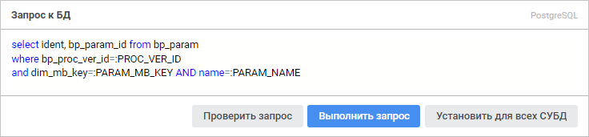

# Изменение запроса к базе данных

Изменение запроса к базе данных
-

# Изменение запроса к базе данных

При [работе с табличным набором
 данных](UiDb_relational_table_work.htm), открытым на [редактирование](UiDb_relational_table_work.htm#edit),
 доступно изменение запроса к базе данных следующих объектов:

	- [представление](../../conception/UiDb_relational_conception.htm);

	- [запрос](../../Query/Query.htm).

Примечание.
 Изменение запроса к базе данных доступно только в веб-приложении.

Для изменения запроса к базе данных используйте панель «Запрос
 к БД»:

На панели отображается используемый драйвер СУБД и содержится запрос
 к базе данных, заданный при [создании](../../Query/Master/UiDb_relational_query_master_Property.htm)
 объекта. Сформируйте новый запрос на языке SQL в соответствии с синтаксисом,
 который установлен для драйвера СУБД.

Для проверки корректности сформированного запроса нажмите кнопку «Проверить запрос».

Для установки указанного запроса к БД для всех СУБД нажмите кнопку «Установить для всех СУБД». После
 чего будет открыто окно подтверждения. Если хотя бы для одного драйвера,
 отличного от текущего, уже указан запрос, то при положительном ответе
 все существующие запросы будут замещены текущим.

Для выполнения запроса нажмите кнопку «Выполнить
 запрос». После чего содержимое набора данных будет изменено в соответствии
 с сформированным запросом.

Для сохранения изменений:

	- нажмите кнопку «Сохранить»;

	- подтвердите свои действия в информационном окне при переходе
	 в [навигатор
	 объектов](getstarted.chm::/Interface/Interface_Navigator.htm)/[мастер
	 табличного набора данных](../Master/object_type_page.htm).

См. также:

[Работа
 с набором данных](UiDb_relational_table_work.htm)

		Справочная
		 система на версию 10.9
		 от 18/08/2025,
		 © ООО «ФОРСАЙТ»,
