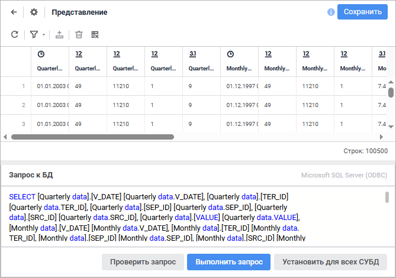
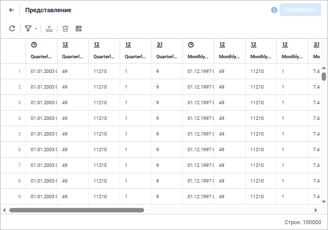
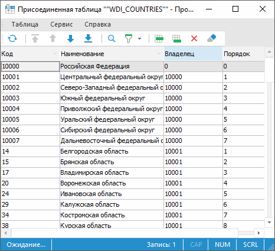

# Работа с табличным набором данных

Работа с табличным набором данных
-

# Работа с табличным набором данных

К табличным наборам данных относятся следующие типы объекта:

	- [таблица](../UiDb_relational_table.htm);

	- [присоединенная
	 таблица](../../Attach_table/UiDb_relational_AttachTable.htm);

	- [представление](../../conception/UiDb_relational_conception.htm);

	- [запрос](../../Query/Query.htm);

	- [источник данных
	 ODBC](../../ODBC/UiDb_relational_ODBC.htm). Доступен только в настольном приложении;

	- [журнал](../../journal/UiDb_relational_journal.htm).

Для работы с набором данных откройте его на редактирование или просмотр
 в [навигаторе
 объектов](GetStarted.chm::/Interface/Interface_Navigator.htm).

[Открытие
 табличного набора данных на редактирование](javascript:TextPopup(this))

	Для открытия табличного набора данных на редактирование:

		- в веб-приложении:

			- выполните команду «Редактировать»
			 в контекстном меню справочника;

			- выполните команду «Редактировать
			 в новой вкладке» в контекстном меню справочника;

			- выполните команду «Редактировать
			 в новом окне» в контекстном меню справочника;

			- нажмите клавишу F4;

		- в настольном приложении:

			- нажмите кнопку 
			 «Редактировать» на вкладке
			 «Главная» ленты инструментов
			 в настольном приложении;

			- выполните команду «Редактировать»
			 в контекстном меню справочника;

			- нажмите клавишу F4.

	Способ редактирования табличного набора данных зависит от типа объекта:

		- Таблица. При редактировании
		 табличного набора данных будет открыт [мастер
		 таблицы](../UiDb_relational_table.htm#master);

		- Присоединенная таблица.
		 При редактировании табличного набора данных будет открыт [мастер
		 присоединительной таблицы](../../Attach_table/UiDb_relational_AttachTable.htm#master);

		- Представление. При
		 редактировании табличного набора данных открыто [окно
		 редактирования представления](Changing_Database_Query.htm). В веб-приложении доступно открытие
		 мастера с помощью кнопки 
		 «Настройки» через окно
		 редактирования;

		- Запрос. При редактировании
		 табличного набора данных открыто [окно
		 редактирования запроса](Changing_Database_Query.htm). В веб-приложении доступно открытие
		 мастера с помощью кнопки 
		 «Настройки» через окно
		 редактирования;

		- Источник данных ODBC.
		 Доступен только в настольном приложении. При редактировании табличного
		 набора данных будет открыт [мастер
		 источника данных ODBC](../../ODBC/UiDb_relational_ODBC.htm#master);

		- Журнал. При редактировании
		 табличного набора данных открыто [окно
		 редактирования журнала](UiDb_relational_table_work_edit_data.htm). В веб-приложении доступно открытие
		 мастера с помощью кнопки 
		 «Настройки» через окно
		 редактирования.

[Сохранение табличного
 набора данных](javascript:TextPopup(this))

	Для сохранения нового табличного набора данных или при открытии
	 табличного набора данных на редактирование в веб-приложении:

		- в [мастере табличного
		 набора данных](../Master/object_type_page.htm):

			- нажмите кнопку «Сохранить»;

			- выполните команду «Сохранить
			 и закрыть» в раскрывающемся меню кнопки «Сохранить».
			 После этого будут сохранены заданные настройки, закрыт мастер
			 табличного набора данных и выполнен переход:

				- в [навигатор
				 объектов](getstarted.chm::/Interface/Interface_Navigator.htm) для таблицы, присоединенной
				 таблицы;

				- в режим редактирования для представления, запроса
				 и журнала.

	Примечание.
	 Команда «Сохранить и закрыть»
	 доступна только при редактировании настроек.

		- в [режиме
		 редактирования](../../reference_book/Work/Work_Dictionary.htm#edit) для представления, запроса и журнала:

			- нажмите кнопку «Сохранить»;

			- подтвердите производимое действие в информационном окне
			 при переходе в [навигатор
			 объектов](getstarted.chm::/Interface/Interface_Navigator.htm)/[мастер
			 табличного набора данных](../Master/object_type_page.htm).

	Для сохранения нового табличного набора данных или при открытии
	 табличного набора данных на редактирование в настольном приложении
	 в мастере табличного набора данных нажмите кнопку «Готово».

[Открытие табличного
 набора данных на просмотр](javascript:TextPopup(this))

	Для открытия набора данных на просмотр выполните одно из следующих
	 действий:

		- в веб-приложении:

			- выполните команду «Открыть»
			 в контекстном меню объекта;

			- дважды щёлкните по объекту;

			- нажмите клавишу ENTER;

		- в настольном приложении:

			- нажмите кнопку  «Открыть»,
			 расположенную в группе «Открыть»
			 на вкладке «[Главная](GetStarted.chm::/Interface/Interface_Description.htm#customize_ribbon)»
			 ленты инструментов;

			- выполните команду «Открыть»
			 в контекстном меню объекта;

			- дважды щёлкните по объекту;

			- нажмите клавишу ENTER.

Примечание.
 В настольном приложении доступно только редактирование объекта с помощью
 [мастера](../Master/object_type_page.htm) и открытие набора
 данных на просмотр.

Окно редактирования/просмотра набора
 данных:

	Редактирование в веб-приложении Просмотр в веб-приложении Просмотр в настольном приложении

		

		

		

Примечание.
 В веб-приложении при открытии набора данных, содержащего более 100 тысяч
 записей, будут отображены только первые 100 тысяч записей и выдано соответствующее
 сообщение.

Операции с набором данных:

	- [редактирование
	 данных](UiDb_relational_table_work_edit_data.htm);

	- [изменение запроса к базе
	 данных](Changing_Database_Query.htm). Доступно только для представления и запроса в веб-приложении;

	- [поиск данных](UiDb_relational_table_work_search.htm);

	- [фильтрация данных](UiDb_relational_table_work_Filter.htm);

	- [использование
	 автофильтра](UiDb_relational_table_work_AutoFilter.htm). Доступно только в настольном приложении;

	- [выбор отображаемых
	 столбцов](UiDb_relational_table_work_pic_row.htm). Доступно только в настольном приложении;

	- [сортировка столбцов](UiDb_relational_table_work_sort.htm).
	 Доступно только в настольном приложении.

В веб-приложении для переименования табличного набора данных:

	- Щёлкните по наименованию в области «Базовые
	 настройки». Наименование будет переведено в режим редактирования.

	- Внесите требуемые изменения.

	- Щёлкните за пределами наименования табличного набора данных.

Дополнительные возможности в настольном приложении:

	- для открытия [среды
	 разработки](UiDevEnv.chm::/01_Development_Environment/01_Purpose_of_the_constructor/Purpose_of_the_constructor.htm) выполните команду «Сервис >
	 Среда разработки» в главном меню;

	- для [смены
	 пароля](UiNav.chm::/02_Navigator/UiNav_ChangePass.htm)
	 выполните команду «Сервис >
	 Сменить пароль» в главном меню;

	- для выбора [интеллектуального
	 анализа](DataMining.chm::/DataMining_Title.htm) выполните команду «Сервис >
	 Интеллектуальный анализ данных» в главном меню;

	- для открытия [менеджера
	 безопасности](Admin.chm::/Admin_Title.htm)
	 выполните команду «Сервис >
	 Менеджер безопасности» в главном меню;

	- для настройки параметров навигатора объектов выполните команду
	 «Сервис > Настройка»
	 в главном меню;

	- для [настройки
	 параметров репозитория](setup.chm::/06_ak_client_config/UiNav_RepoConfig.htm) выполните команду «Сервис > Параметры» в главном
	 меню;

	- для открытия справочной системы выполните команду «Справка >
	 Содержание» в главном меню;

	- для открытия окна «О программе»
	 выполните команду «Справка >
	 О программе» в главном меню.

См. также:

[Создание
 табличных наборов данных](../Master/object_type_page.htm)

		Справочная
		 система на версию 10.9
		 от 18/08/2025,
		 © ООО «ФОРСАЙТ»,
