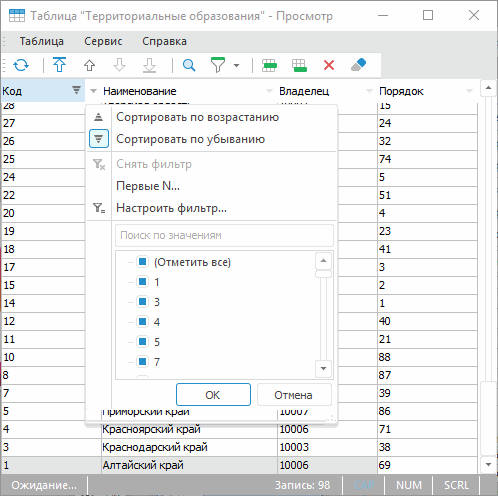
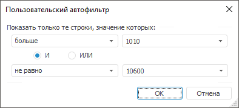

# Использование автофильтра

Использование автофильтра
-

# Использование автофильтра

При [работе с табличным набором
 данных](UiDb_relational_table_work.htm) доступно использование автофильтра. Автофильтр предоставляет
 дополнительные возможности по фильтрации данных.

Примечание.
 Использование автофильтра доступно только в настольном приложении.

Для включения/отключения автофильтра выберите пункт «Автофильтр»:

	- в главном меню «Таблица»;

	- в раскрывающемся меню кнопки  «Включить/выключить фильтр» на панели
	 инструментов.

При включенном автофильтре в заголовках столбцов набора данных будет
 отображаться кнопка , используемая
 для вызова меню автофильтра:

В наборе данных будут отображаться все элементы отмеченные в списке,
 сформированном из всех значений фильтруемых строк.

Первые две строки содержат способы сортировки «Сортировать
 по возрастанию» и «Сортировать
 по убыванию». При установленной сортировке направление сортировки
 отображается в заголовке соответствующего столбца.

Следующие три строки содержат стандартные операции автофильтра:

	- Снять фильтр. Операция
	 предназначена для отображения всех строк;

	- Первые N. Операция предназначена
	 для вывода указанного количества элементов списка. Количество элементов
	 задается либо явно, либо в процентах от общего количества фильтруемых
	 элементов:

В данном окне можно установить
 следующие параметры:

		- Количество строк.
		 Поле ввода, с помощью которого можно определить количество отображаемых
		 строк;

		- Признак. Определяет
		 какие элементы будут отображаться - наибольшие или наименьшие;

		- Условие выбора.
		 Определяет каким образом задается количество элементов - явно
		 или в процентах от количества элементов.

Примечание.
 Данный фильтр доступен, если в фильтруемых строках присутствуют числовые
 значения.

	- Настроить фильтр. Операция,
	 предназначенная для определения условий фильтрации в окне
	 «Пользовательский автофильтр»:

В данном окне можно установить
 следующие параметры:

		- Условие выбора.
		 Раскрывающийся список, определяющий условие для отображения элементов
		 (равно, не равно...);

		- Значение. Раскрывающийся
		 список, определяющий значение условия для отображения элементов.
		 Данный список элементов содержит все значения диапазона автофильтра,
		 отсортированные без учета регистра. Регистр учитывается только
		 при совпадении значений;

		- Условия фильтрации.
		 Переключатель, определяющий порядок использования двух условий
		 одновременно.

Предусмотрено два варианта использования
 сочетаний условий:

		- при установке переключателя «И»
		 будут отображаться строки, удовлетворяющие обоим условиям;

		- при установке переключателя «ИЛИ»
		 будут отображаться строки, удовлетворяющие хотя бы одному из двух
		 условий.

См. также:

[Работа
 с набором данных](UiDb_relational_table_work.htm)

		Справочная
		 система на версию 10.9
		 от 18/08/2025,
		 © ООО «ФОРСАЙТ»,
