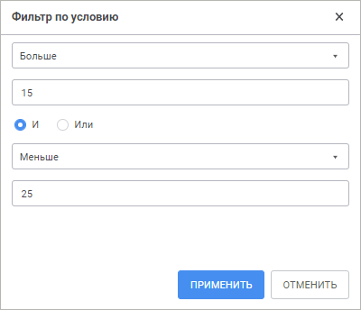
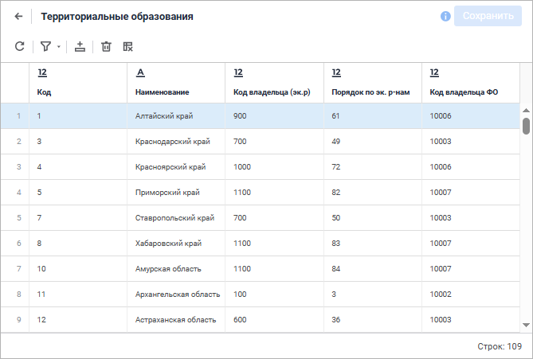
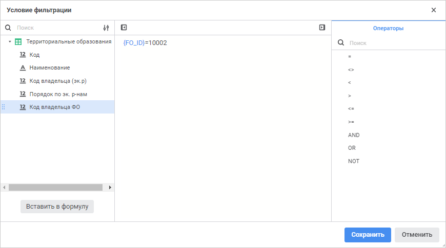
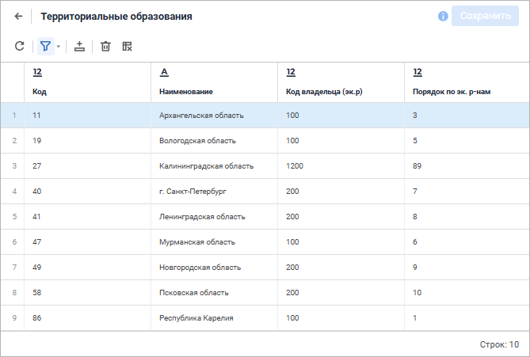
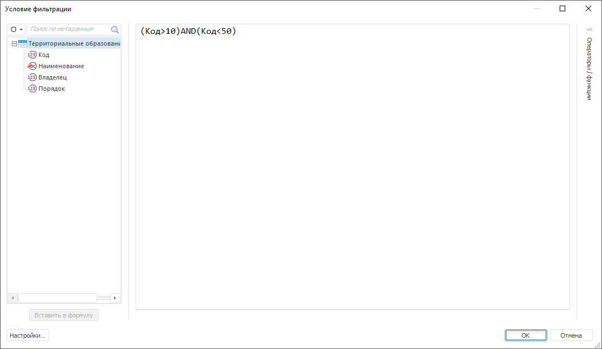

# Фильтрация данных

Фильтрация данных
-

# Фильтрация данных

При [работе с табличным набором
 данных](UiDb_relational_table_work.htm) доступна фильтрация для исключения из набора данных строк и
 столбцов, удовлетворяющих определенному условию.

Для включения/отключения фильтрации данных таблицы:

	- в веб-приложении:

		- нажмите кнопку  «Фильтрация»
		 на панели инструментов. Активное состояние кнопки включает фильтр,
		 неактивное - отключает;

		- выполните команду  «Очистить фильтр» в раскрывающемся
		 меню кнопки  «Фильтрация»
		 на панели инструментов;

	- в настольном приложении:

		- нажмите кнопку  «Включить/выключить фильтр» на
		 панели инструментов. Активное состояние кнопки включает фильтр,
		 неактивное - отключает;

		- выполните команду главного меню «Таблица >
		 Фильтровать».

После выполнения одного из действий фильтрация данных будет включена/отключена.

## Определение условия фильтрации данных таблицы

Для определения условия фильтрации данных таблицы:

	- в веб-приложении:

		- нажмите кнопку  «Фильтрация»
		 панели инструментов, если условия ещё не были заданы;

		- выполните команду  «Параметры фильтрации» в раскрывающемся
		 меню кнопки  «Фильтрация»
		 панели инструментов;

	- в настольном приложении:

		- выполните команду «Редактировать»
		 в раскрывающемся меню кнопки  «Включить/выключить фильтр» на
		 панели инструментов;

		- выполните команду главного меню «Таблица >
		 Редактировать фильтр».

После выполнения одного из действий будет открыт [редактор выражения](UiNav.chm::/GUI/ExpressionEditor.htm)
 для создания условия фильтрации. После создания/редактирования условия
 фильтрация будет автоматически включена.

## Определение условия фильтрации данных поля

Примечание.
 Доступно только в веб-приложении.

Для определения условия фильтрации данных поля выполните команду  «Фильтр по условию» в раскрывающемся
 меню кнопки  «Настройка» заголовка поля, для которого
 настраивается фильтр. После чего будет открыто окно «Фильтр
 по условию»:

Задайте параметры:

	- Условие выбора. Выберите
	 условие для отображения элементов (равно, не равно...) из раскрывающегося
	 списка;

	- Значение. Укажите значение
	 условия для отображения элементов;

	- Условия фильтрации.
	 Переключатель, определяющий порядок использования двух условий одновременно:

		- И. При установке
		 переключателя будут отображаться строки, удовлетворяющие обоим
		 условиям;

		- ИЛИ. При установке
		 переключателя будут отображаться строки, удовлетворяющие хотя
		 бы одному из двух условий.

После создания/редактирования условия нажмите кнопку «Применить»
 для включения фильтрации.

Для отключения фильтрации данных поля выполните команду  «Очистить
 фильтр» в раскрывающемся меню кнопки  «Настройка» заголовка поля.

## Пример фильтрации данных

	 Веб-приложение Настольное приложение

		Для использования фильтрации:

			- [Откройте таблицу с
			 данными](UiDb_relational_table_work.htm).

		Пример исходной таблицы:

		

			- Откройте редактор выражения, нажав кнопку  «Фильтрация»
			 панели инструментов:

		

			- Выберите элемент, по которому будет происходить фильтрация.
			 Для этого выполните одно из действий:

				- дважды щёлкните по нужному элементу на панели «Метаданные»;

				- выделите нужный элемент на панели «Метаданные»
				 и нажмите кнопку «Вставить
				 в формулу»;

				- перетащите нужный элемент из панели «Метаданные»
				 в область формул с помощью механизма Drag&Drop.

		Элемент будет добавлен в формулу,
		 где с ним можно составить необходимое выражение.

			- Составьте в редакторе необходимое
			 выражение, по которому будет происходить фильтрация.

		В указанном примере сформировано
		 выражение «{FO_ID}=10002». Таким образом, по условию будут отбираться
		 записи, значение поля «Код владельца
		 ФО» которых равно 10002.

			- Выполните фильтрацию, нажав кнопку «Сохранить».

		В результате выполнения действий в
		 таблице останутся только строки, удовлетворяющие заданному условию:

		

		Для отмены фильтрации повторно нажмите кнопку  «Фильтрация»
		 панели инструментов. Таблица примет исходный вид.

		Для использования фильтрации:

			- [Откройте таблицу с
			 данными](UiDb_relational_table_work.htm).

		Пример исходной таблицы данных:

		

			- Откройте [редактор
			 выражения](UiNav.chm::/GUI/ExpressionEditor.htm), выполнив команду «Редактировать»
			 в раскрывающемся меню кнопки  «Фильтрация» на панели инструментов:

		

			- Выберите элемент, по которому будет происходить фильтрация.

		Для этого дважды щёлкните по нужному
		 элементу в списке «Данные».
		 Элемент будет добавлен в формулу, где его можно скопировать и
		 составить необходимое выражение.

			- Составьте в редакторе необходимое
			 выражение.

		В поле «Формула»
		 составьте выражение, по которому будет происходить фильтрация.

		В указанном примере сформировано
		 выражение «(Код>10) And (Код<50)».

			- Выполните фильтрацию, нажав кнопку «ОК».

		В таблице останутся строки, удовлетворяющие
		 заданному условию:

		

			- Для отмены фильтрации нажмите кнопку  «Фильтрация».

		Таблица примет первоначальный вид.

См. также:

[Работа с таблицей](UiDb_relational_table_work.htm)

		Справочная
		 система на версию 10.9
		 от 18/08/2025,
		 © ООО «ФОРСАЙТ»,
