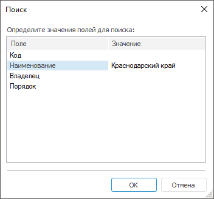

# Поиск данных

Поиск данных
-

# Поиск данных

При [работе с табличным набором
 данных](UiDb_relational_table_work.htm) доступен поиск данных.

Для поиска данных:

	- в веб-приложении используйте средства браузера;

	- в настольном приложении:

		- выполните команду «Таблица >
		 Поиск» в главном меню;

		- нажмите кнопку  «Поиск записи» на панели инструментов;

		- нажмите клавишу F3;

		- используйте сочетание клавиш CTRL+F.

После выполнения одного из действий будет
 открыто окно «Поиск»:

Определите значения полей, по которым будет
 осуществляться поиск, в столбце «Значение».
 В столбце «Поле» представлены
 все поля набора данных, по которым может быть осуществлен поиск.

При нажатии кнопки «ОК»
 будет осуществлен поиск по заданным условиям. Данный диалог будет закрыт,
 первая запись, соответствующая условиям поиска, будет выделена.

Для поиска всех значений по условию используйте [фильтрацию](UiDb_relational_table_work_Filter.htm).

См. также:

[Работа
 с набором данных](UiDb_relational_table_work.htm)

		Справочная
		 система на версию 10.9
		 от 18/08/2025,
		 © ООО «ФОРСАЙТ»,
