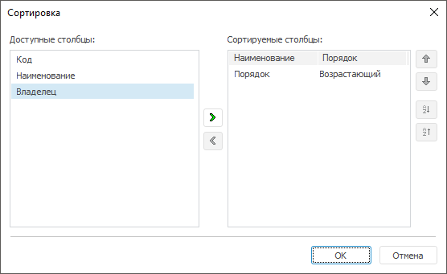
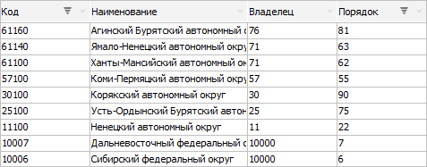

# Сортировка столбцов

Сортировка столбцов
-

# Сортировка столбцов

При [работе с табличным набором
 данных](UiDb_relational_table_work.htm) доступна сортировка столбцов.

Примечание.
 Сортировка столбцов доступна только в настольном приложении.

Сортировка столбцов выполняется одним из способов:

	- нажатием на заголовок столбца. Для задания сортировки по нескольким
	 столбцам выделите необходимые столбцы с зажатой клавишей CTRL;

	- при включенном [автофильтре](UiDb_relational_table_work_AutoFilter.htm)
	 у каждого столбца в заголовке будет отображено меню, через которое
	 доступна настройка сортировки столбца;

	- в контекстном меню заголовка столбца выполните команду «Сортировка», будет открыто
	 окно для настройки сортировки столбцов:

В окне расположите сортируемые
 столбцы в правой части, задайте порядок сортировки.

Сортировка по нескольким столбцам позволяет
 сортировать столбцы с идентичным значением в первом сортируемом столбце.

## Пример сортировки по нескольким столбцам

В таблице настроим сортировку по первому и третьему столбцам:

	- Parent;

	- Name.

Все элементы набора данных будут отсортированы по первому столбцу (Parent).

Элементы Азия, Америка, Европа имеют одинаковые значения (10) в первом
 столбце, следовательно, их сортировка продолжится по значениям третьего
 столбца (Name).

См. также:

[Работа
 с набором данных](UiDb_relational_table_work.htm)

		Справочная
		 система на версию 10.9
		 от 18/08/2025,
		 © ООО «ФОРСАЙТ»,
