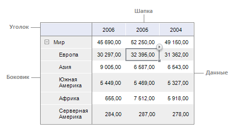

# Табличный визуализатор

Табличный визуализатор
-

# Табличный визуализатор

Табличный визуализатор представляет собой электронную
 таблицу, построенную на основе многомерного источника данных отчета.

## Структура таблицы

Таблица состоит из нескольких основных элементов, каждый из которых
 имеет собственные настройки.

Элементы таблицы:

[Уголок](UiAnalyticalArea.chm::/TableView/Corner_show_dims.htm) - верхняя
 левая ячейка таблицы, позволяющая отображать наименования измерений по
 строкам или столбцам.

[Боковик](UiAnalyticalArea.chm::/Select_areas.htm#select_sidehead) - элемент
 таблицы, который отображает наименования элементов измерения, размещенного
 по строкам.

[Шапка](UiAnalyticalArea.chm::/Select_areas.htm) - элемент
 таблицы, который отображает наименования элементов измерения, размещенного
 по столбцам.

[Данные](UiAnalyticalArea.chm::/Select_areas.htm#select_data) - элемент
 таблицы, состоящий из ячеек с данными.

Для применения настроек к одному из элементов таблицы, необходимо [выделить этот элемент](UiAnalyticalArea.chm::/Select_areas.htm).

Примечание.
 При выделении элемента таблицы группа вкладок боковой панели «Таблица»
 будет переименована в соответствии с выделенным элементом: если выделены
 боковик или шапка, вкладка будет называться «Заголовок»,
 если выделен уголок - «Уголок»,
 если выделены данные - «Данные».

## Операции с таблицей

[Создание
 табличного визуализатора](javascript:TextPopup(this))

	Для создания табличного визуализатора используйте группу вкладок
	 «Документ» на [боковой панели](GetStarted.chm::/Interface/Interface_Description.htm#side_panel):

		- Добавьте источник данных на вкладку «Источники»:

			- нажмите кнопку .
			 В раскрывающемся меню выберите пункт «Добавить
			 источник». Будет открыто стандартное окно выбора объектов
			 репозитория. Выберите необходимый источник данных;

			- на панели «[Репозиторий](../organizational_management/Starting.htm)»
			 выберите источник данных и перетащите его на вкладку «Источники», используя механизм
			 Drag&Drop;

			- выполните команду «Добавить
			 источник» в контекстном меню свободной области на вкладке
			 «Источники».

		- Добавьте срез источника данных. Для этого на вкладке «Источники» для добавленного
		 источника выполните команду контекстного меню «Добавить
		 срез».

		- Добавьте область данных. Для этого:

			- на вкладке «Источники»
			 для добавленного среза выполните команду контекстного меню
			 «Добавить область данных».
			 При этом левый верхний угол аналитической области данных будет
			 совпадать с активной ячейкой;

			- с вкладки «Источники»
			 перетащите добавленный срез на необходимую ячейку листа отчета,
			 используя метод Drag&Drop.

	Для одновременного добавления источника, среза и таблицы перетащите
	 методом Drag&Drop источник данных на лист регламентного отчета:

		- с вкладки «Источники»
		 группы вкладок «Документ»
		 [боковой
		 панели](GetStarted.chm::/Interface/Interface_Description.htm#side_panel);

		- с панели «[Репозиторий](../organizational_management/Starting.htm)».

	Для создания табличного визуализатора через ленту инструментов на
	 вкладке «Вставка» в группе
	 «Области данных» нажмите кнопку
	 «Область данных» и в раскрывшемся
	 списке выберите срез.

	На лист регламентного отчета будет добавлен табличный визуализатор.

[Настройка общих
 параметров таблицы](javascript:TextPopup(this))

	В регламентном отчете доступна [настройка
	 общих параметров таблицы](UiAnalyticalArea.chm::/Parameters/Parameters.htm) как объекта на листе.

[Настройка внешнего
 вида таблицы](javascript:TextPopup(this))

	В таблице данных доступны следующие настройки для изменения внешнего
	 вида таблицы:

		- [автоподгонка
		 размера ячеек](uianalyticalarea.chm::/tableview/autofit_cells.htm);

		- [изменение масштаба
		 отображения таблицы](uianalyticalarea.chm::/tableview/zoom.htm);

		- [отображение
		 наименований измерений в уголке таблицы](uianalyticalarea.chm::/tableview/corner_show_dims.htm);

		- [отображение
		 разметки таблицы](uianalyticalarea.chm::/tableview/mark_up.htm);

		- [оформление
		 таблицы и ее элементов](uianalyticalarea.chm::/tableview/formatting/formatting_table.htm);

		- [поворот
		 таблицы](uianalyticalarea.chm::/tableview/rotate_table.htm);

		- [размещение
		 элементов таблицы](uianalyticalarea.chm::/tableview/autofit_cells.htm);

		- [отображение
		 сносок в таблице](uianalyticalarea.chm::/tableview/table_footnotes.htm).

[Работа с
 данными таблицы](javascript:TextPopup(this))

	При работе с данными таблицы доступны следующие операции:

		- [детализация
		 и обобщение](uianalyticalarea.chm::/working_with_table_data/drill_down.htm);

		- [изменение
		 и сохранение данных](uianalyticalarea.chm::/working_with_table_data/edit_and_save_data.htm);

		- [поиск
		 и замена](uianalyticalarea.chm::/working_with_table_data/search.htm);

		- [сортировка](uianalyticalarea.chm::/working_with_table_data/sorting_table_data.htm);

		- [исключение
		 данных из таблицы](uianalyticalarea.chm::/working_with_table_data/delete_data.htm);

		- [фильтрация](uianalyticalarea.chm::/working_with_table_data/filtering.htm);

		- [выбор данных для построения визуализаторов](../Reports/Visualization.htm#data).

[Работа с гиперссылками
 в таблице](javascript:TextPopup(this))

	При работе с гиперссылками в таблице доступны следующие операции:

		- [отображение/скрытие
		 гиперссылок в таблице](uianalyticalarea.chm::/hyperlinks/working_with_hyperlinks.htm#show_hide_hyperlinks);

		- [действия
		 при переходе по гиперссылке](uianalyticalarea.chm::/hyperlinks/working_with_hyperlinks.htm#hyperlink_click_actions).

[Работа с измерениями
 в таблице](javascript:TextPopup(this))

	При работе с измерениями в таблице доступны следующие операции:

		- [выделение
		 элементов измерения в таблице](uianalyticalarea.chm::/work_with_dimensions/select_dimensions_elements_in_table.htm);

		- [настройка
		 метрик для таблицы](uianalyticalarea.chm::/work_with_dimensions/table_metrics.htm);

		- [размещение
		 элементов измерения](uianalyticalarea.chm::/tableview/layout/layout_dim.htm);

		- [фиксация
		 элементов измерения в таблице](uianalyticalarea.chm::/work_with_dimensions/fixing.htm).

[Работа с элементами
 измерений в таблице](javascript:TextPopup(this))

	При работе с элементами измерения в таблице доступны следующие операции:

		- [изменение
		 отметки из таблицы](UiAnalyticalArea.chm::/Working_with_table_data/Change_selection.htm);

		- [выделение
		 элементов измерения в таблице](UiAnalyticalArea.chm::/Work_with_dimensions/Select_dimensions_elements_in_table.htm);

		- [размещение
		 элементов измерения](UiAnalyticalArea.chm::/TableView/Layout/Layout_Dim.htm);

		- [расшифровка
		 элементов измерения](UiAnalyticalArea.chm::/Hyperlinks/Working_with_hyperlinks.htm);

		- [оформление
		 измерений и уровней в таблице](UiAnalyticalArea.chm::/TableView/Formatting/Formatting_dims.htm);

		- [настройка
		 метрик для таблицы](UiAnalyticalArea.chm::/Work_with_dimensions/Table_metrics.htm);

		- [фиксация
		 элементов измерения в таблице](UiAnalyticalArea.chm::/Work_with_dimensions/Fixing.htm);

		- [специальная
		 фильтрация измерения](UiAnalyticalArea.chm::/Working_with_table_data/Filtering.htm#dimension);

		- [вычисляемые
		 элементы](UiAnalyticalArea.chm::/Work_with_dimensions/Edited_elements.htm).

[Анализ данных
 в таблице](javascript:TextPopup(this))

	В таблице доступен анализ данных при помощи следующих средств:

		- [валидация
		 данных](uianalyticalarea.chm::/analysis/data_validation.htm);

		- [индикатор
		 роста](uianalyticalarea.chm::/analysis/growth_rate.htm);

		- [преобразование
		 данных](uianalyticalarea.chm::/analysis/convert_data.htm);

		- [ранжирование
		 данных](uianalyticalarea.chm::/analysis/ranking_data.htm);

		- [распределение](uianalyticalarea.chm::/analysis/distribution.htm);

		- [спарклайны](uianalyticalarea.chm::/analysis/sparklines.htm);

		- [статистические
		 характеристики](uianalyticalarea.chm::/analysis/statistics.htm);

		- [условное
		 форматирование](uianalyticalarea.chm::/analysis/conditional_formatting.htm).

[Расширенная
 аналитика](javascript:TextPopup(this))

	В таблице доступно применение [расширенной
	 аналитики](UiAnalyticalArea.chm::/Analysis/AdvancedAnalytics.htm):

		- эконометрика;

		- валидация данных;

		- интеллектуальный анализ данных.

[Расчет итоговых
 значений](javascript:TextPopup(this))

	При расчете итоговых значений в таблице доступны следующие настройки:

		- [отображение
		 итоговых значений](uianalyticalarea.chm::/totals/calculate_totals.htm#show_totals);

		- [параметры
		 расчета итогов](uianalyticalarea.chm::/totals/calculate_totals.htm#totals_parameters);

		- [оформление
		 данных и заголовков итогов](uianalyticalarea.chm::/totals/calculate_totals.htm#formatting_totals);

		- [скрытие
		 итогов](uianalyticalarea.chm::/totals/calculate_totals.htm#hide_totals).

[Прикрепление
 вложений к ячейкам](javascript:TextPopup(this))

	Для пояснения данных в ячейке таблицы доступно [прикрепление вложений](UiAnalyticalArea.chm::/Attachments.htm)
	 в виде файлов или ссылок.

См. также:

[Начало
 работы с инструментом «Отчёты» в веб-приложении](../../Web/organizational_management/Starting.htm) | [Область
 данных](UiReport_AreaData.htm) | [Реляционная
 область данных](../Relational_data_area/UIReport_Relational_data_area.htm) | [Область
 формул](../AreaFormula/UiReport_AreaFormula.htm) | [Расширенная
 аналитика](../Table/AdvancedAnalytics.htm) | [Построение отчёта](../CreateReport.htm) | [Работа с готовым
 отчётом](../Reports/OperationReport/Work_witn_report.htm)

		Справочная
		 система на версию 10.9
		 от 18/08/2025,
		 © ООО «ФОРСАЙТ»,
