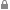

# Отображение прав доступа к данным

Отображение прав доступа к данным
-

# Отображение прав доступа к данным

При настройке регламентного отчёта реализована возможность включения
 отображения пиктограмм для ячеек, на которые у пользователя нет прав.

Настройка прав доступа к источникам данных зависит от выбранного метода
 разграничения доступа и производится в [менеджере безопасности](Admin.chm::/03_Admin/Admin_AdminObjects.htm). Если пользователю доступно только чтение
 и/или запрещено изменение источника данных, то в отчётах пользователь
 будет видеть данные, но не сможет их редактировать.

Настройка прав доступа к данным:

	- базы данных временных рядов производится в окне «[Права
	 доступа к данным](Admin.chm::/03_Admin/DataAccess/Admin_Data_Access_Right.htm)».
	 Для открытия окна:

		- нажмите кнопку «Права доступа
		 к данным» на вкладке «[Дискреционный
		 контроль](admin.chm::/03_Admin/Admin_AdminObjects_Discretionary.htm#data_access_permissions)» окна «[Параметры
		 управления доступом](Admin.chm::/03_Admin/Admin_AdminObjects.htm)»
		 в менеджере безопасности;

		- выполните команду «Права
		 доступа» контекстного меню объекта в навигаторе объектов;

	- справочника НСИ определяется выбранным методом разграничения
	 доступа. В зависимости от выбранного метода различаются [способы настройки](Admin.chm::/03_Admin/Admin_ElementAccess.htm);

	- куба производится при создании [объектов
	 полномочий](BPM.chm::/Desktop/Facility_Agreement/Create_Authorization_Object.htm).

Если пользователю доступно только чтение и/или запрещено изменение данных,
 то в отчётах пользователь будет видеть данные, но не сможет их редактировать.
 Если пользователю запрещено чтение и изменение данных, то ячейки будут
 пустые.

Для отображения прав на чтение и изменение данных в таблице установите
 флажок «Подсветка прав доступа»,
 расположенный в группе «Показать»
 на вкладке «Вид» ленты инструментов.
 Ячейки, данные в которых не могут быть отредактированы, отмечены значком
 , расположенным слева в ячейке.
 Если для данных в ячейке установлен запрет на чтение, то будет отображаться
 только значок :

Подсветка прав доступа отображает только значки .
 Отображения пиктограмм  для ячеек
 вычисляемых элементов при этом не происходит. Для отображения пиктограмм
  для ячеек вычисляемых элементов используйте [отображение
 пиктограмм в ячейках](UiAnalyticalArea.chm::/TableView/Formatting/Cells_icons.htm).

См. также:

[Начало
 работы с инструментом «Отчёты» в веб-приложении](../../../Web/organizational_management/Starting.htm) | [Область
 данных](../UiReport_AreaData.htm)

		Справочная
		 система на версию 10.9
		 от 18/08/2025,
		 © ООО «ФОРСАЙТ»,
