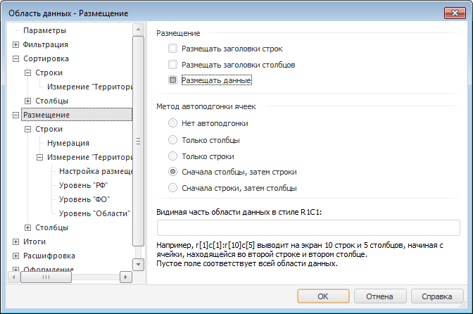

# Настройка размещения: Область данных, регламентный отчёт, настольное приложение

Настройка размещения: Область данных, регламентный отчёт, настольное приложение
-

# Настройка размещения

Для настройки параметров размещения среза в области данных перейдите
 на вкладку «Размещение» окна «[Свойства
 области данных](../UiReport_AreaData_Param.htm)». Окно примет вид:

На данной вкладке определите общие параметры размещения среза в области
 данных:

[Размещение](javascript:TextPopup(this))

	Группа «Размещение» содержит
	 флажки, которые по умолчанию все установлены, допускается снятие любых
	 двух:

		- Размещать заголовки строк.
		 При снятом флажке заголовки строк не будут выводиться;

		- Размещать заголовки столбцов.
		 При снятом флажке заголовки столбцов не будут выводиться;

		- Размещать данные.
		 При снятом флажке область данных не будет выводиться.

[Метод автоподгонки
 ячеек](javascript:TextPopup(this))

	Группа переключателей «Метод автоподгонки
	 ячеек» содержит методы автоподгонки ячеек:

		- Нет автоподгонки.
		 Размеры столбцов и строк остаются неизменными;

		- Только столбцы.
		 Ширина каждого столбца выравнивается по самой длинной строке,
		 содержащейся в ячейке этого столбца. Игнорируются ячейки, в которых
		 установлен перенос по словам, так как такие ячейки способны сами
		 подстраиваться под любую ширину столбца;

		- Только строки. Высота
		 каждой строки выравнивается по самой высокой ячейке, содержащейся
		 в данной строке;

		- Сначала столбцы, затем
		 строки. Сначала выравнивается ширина столбцов, аналогично
		 параметру «Только столбцы»,
		 затем высота строк, аналогично параметру «Только
		 строки»;

		- Сначала строки, затем столбцы.
		 Сначала выравнивается высота строк, аналогично параметру «Только строки», затем ширина
		 столбцов, аналогично параметру «Только
		 столбцы».

[Видимая часть
 области данных в стиле R1C1](javascript:TextPopup(this))

	Поле ввода «Видимая часть области
	 данных в стиле R1C1» и подписи к нему отображаются, когда в
	 группе «Размещение» установлен
	 только один флажок «Размещать данные».

	В данном поле задается диапазон, который необходимо вывести в область
	 данных, то есть в область данных будет выводиться только указанная
	 часть среза.

	По мере ввода происходит проверка правильности вводимого адреса.
	 Если адрес не является корректным относительным адресом в стиле R1C1,
	 поле ввода подсвечивается. При нажатии кнопки «ОК»
	 проверяется правильность введенного значения. Если значение некорректно,
	 выдается сообщение и фокус переходит на поле ввода.

Для настройки размещения строк и столбцов области смотрите статью «[Настройка размещения по
 строкам (столбцам)](UiReport_AreaData_Param_Order_RS.htm)».

Для настройки размещения, привязанного к измерениям, смотрите статью
 «[Настройка размещения,
 привязанного к измерению](UiReport_AreaData_Param_Order_attach.htm)».

Для настройки нумерации строк и столбцов смотрите статью «[Настройка
 нумерации для строк и столбцов](UiReport_AreaData_Param_numbering.htm)».

Для вывода элементов измерения в произвольном порядке и/или с произвольными
 наименованиями смотрите статью «[Настройка
 произвольного размещения](UiReport_AreaData_Param_Order_Tuning.htm)».

См. также:

[Свойства
 области данных](../UiReport_AreaData_Param.htm)

		Справочная
		 система на версию 10.9
		 от 18/08/2025,
		 © ООО «ФОРСАЙТ»,
