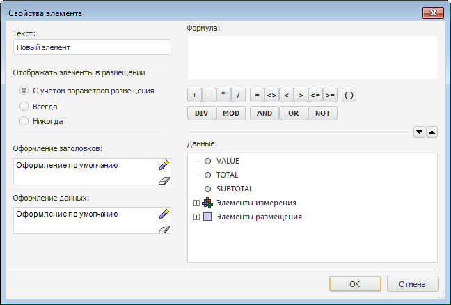
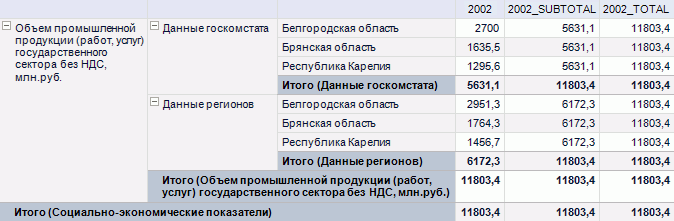

# Свойства элемента

Свойства элемента
-

# Свойства элемента

При выполнении операции [редактирования](UiReport_AreaData_Param_Order_Tuning.htm#edit_element)
 элемента заголовка будет открыт диалог «Свойства
 элемента» для изменения параметров элемента:

Задайте в окне следующие параметры:

[Текст](javascript:TextPopup(this))

	Задайте в поле ввода наименование элемента, которое будет отображаться
	 в области данных.

	Примечание.
	 При использовании [области данных](../../UiReport_AreaData.htm)
	 замена оригинального атрибута на текст из [элемента
	 произвольного размещения](UiReport_AreaData_Param_Order_attach.htm#names_format) совершается только для первого [наименования
	 элементов измерения](UiReport_AreaData_Param_Order_Tuning.htm#add_element).

[Отображать элементы
 в размещении](javascript:TextPopup(this))

	Определите, будет ли отображаться элемент в заголовке области данных:

		- С учетом параметров размещения.
		 Элемент будет отображаться согласно [настройкам
		 размещения](UiReport_AreaData_Param_Order_Tuning.htm);

		- Всегда. Элемент
		 всегда будет отображаться в заголовке области данных;

		- Никогда. Элемент
		 не будет отображаться в заголовке области данных.

[Оформление](javascript:TextPopup(this))

	Оформление настраивается с помощью [стандартного компонента](UiNav.chm::/GUI/Style_setup.htm)
	 для заголовка и данных.

	Примечание.
	 Если в области данных настроено [произвольное
	 размещение](UiReport_AreaData_Param_Order_Tuning.htm), и область [согласована
	 по строкам/столбцам](UiReport_AreaData_Param_Order_RS.htm), то оформление применяется корректно только
	 при полном совпадении структуры (состава элементов) произвольного
	 размещения области данных.

### Редактирование формулы элемента

Для задания формулы расчета вычисляемых элементов перейдите в область
 «Формула». Для составления формулы
 используйте элементы, расположенные в области «Данные»:

	- VALUE. Значение элемента,
	 привязанного к элементу измерения;

	- TOTAL. Значение общего
	 итога элементов по первому размещенному измерению по строкам (если
	 вычисляемый элемент находится в столбце)/столбцам (если вычисляемый
	 элемент находится в строке);

	- SUBTOTAL. Значение промежуточного
	 итога элементов, то есть значение итога элементов измерения по элементу
	 вышестоящего измерения. Такой расчет может быть настроен только при
	 размещении нескольких измерений по строкам (если вычисляемый элемент
	 находится в столбце)/столбцам (если вычисляемый элемент находится
	 в строке);

Примечание.
 При использовании в формуле подстановок VALUE,
 TOTAL, SUBTOTAL
 необходимо чтобы вычисляемый элемент имел привязку к элементу измерения,
 в противном случае расчет произвести будет невозможно. При использовании
 в формуле подстановок TOTAL и/или
 SUBTOTAL настройте для области
 данных [итоги](../UiReport_AreaData_Param_Totals.htm) по иерархии.

	- Элементы измерения.
	 Иерархическое дерево элементов измерения, для которого настраивается
	 размещение;

	- Элементы размещения.
	 Элементы, присутствующие в размещении.

Для понимания, какие значения будут использованы для элементов вычисляемого
 показателя, если в его формуле используются подстановки SUBTOTAL
 и TOTAL, приведен следующий пример:
 в один столбец выведено значение элементов за 2002 год (столбец «2002»),
 в следующий столбец выведено значение промежуточного итога для элементов
 2002 ( «2002_SUBTOTAL»), затем выведено значение общего итога для элементов
 2002 (столбец «2002_TOTAL»).

См. также:

[Настройка произвольного
 размещения](UiReport_AreaData_Param_Order_Tuning.htm)

		Справочная
		 система на версию 10.9
		 от 18/08/2025,
		 © ООО «ФОРСАЙТ»,
