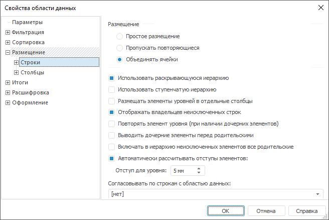
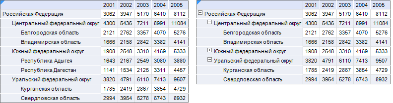
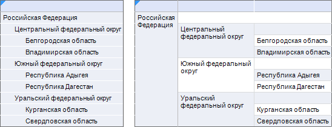
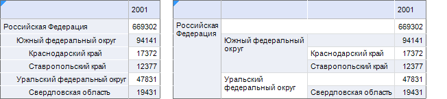
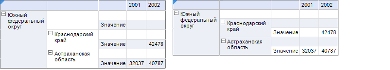
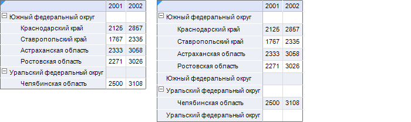
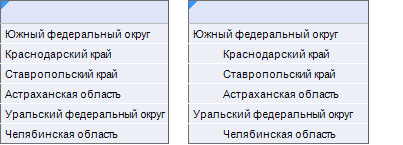

# Настройка размещения по строкам (столбцам): Область данных

Настройка размещения по строкам (столбцам): Область данных
-

# Настройка размещения по строкам (столбцам)

Параметры размещения строк и столбцов области данных аналогичны друг
 другу, но задаются на отдельных страницах.

Примечание.
 Параметры размещения, [привязанные
 к измерениям](UiReport_AreaData_Param_Order_attach.htm), имеют больший приоритет и, тем самым, могут перекрывать
 параметры размещения по строкам/столбцам.

Для настройки размещения строк/столбцов перейдите на вкладку «Размещение > Строки/Столбцы».
 Окно «[Свойства
 области данных](../UiReport_AreaData_Param.htm)» примет вид:

Определите на вкладке параметры размещения строк/столбцов:

[Размещение](javascript:TextPopup(this))

	Область содержит переключатели, применение которых будет заметно,
	 если установлен флажок «Размещать
	 элементы уровней в отдельные столбцы/строки».

	Данная группа содержит переключатели:

		- Простое размещение.
		 Для каждого элемента измерения более низкого уровня выводятся
		 все соответствующие элементы более высоких уровней:

	

		- Пропускать повторяющиеся.
		 Ячейки, содержащие повторяющиеся элементы, остаются пустыми:

	

		- Объединять ячейки.
		 Ячейки, содержащие повторяющиеся элементы, объединяются. Родительские
		 ячейки объединяются независимо от количества измерений, размещенных
		 в строках/столбцах:

	

	Примечание.
	 В приведенных выше примерах установлен флаг «Размещать
	 элементы уровней в отдельные столбцы».

[Использовать
 раскрывающуюся иерархию](javascript:TextPopup(this))

	При установленном флажке появляется возможность сворачивать/разворачивать
	 иерархию справочника с помощью кнопок  (свернутая
	 иерархия) и  (развернутая
	 иерархия).

	Ниже приведен пример без использования (слева) и с использованием
	 (справа) раскрывающейся иерархии:

	

[Использовать
 ступенчатую иерархию](javascript:TextPopup(this))

	При установленном флажке появляется возможность выводить наименования
	 строк/столбцов области данных в виде ступенчатой иерархии в одном
	 столбце/строке (или в нескольких столбцах/строках при использовании
	 дополнительных опций).

	Примечание.
	 Флажок целесообразно использовать, если по строкам/столбцам расположено
	 несколько измерений или несколько уровней одного измерения.

	При установке флажка будут сняты, если ранее были установлены, и
	 недоступны для установки флажки «Выводить
	 дочерние элементы перед родительскими» и «Включать
	 в иерархию неисключенных элементов все родительские».

	Ниже приведены заголовки строк области данных, в параметрах размещения
	 которой установлен флажок «Использовать
	 ступенчатую иерархию», по строкам расположено три уровня измерения
	 «Территориальные образования».
	 Для области данных, отображаемой справа, дополнительно установлен
	 флаг «Размещать элементы уровней
	 в отдельные столбцы»:

	

	Примечание.
	 При установке данного флажка [оформление](../UiReport_AreaData_Param_Example_Design.htm),
	 заданное для [произвольного
	 заголовка](UiReport_AreaData_Param_Order_Tuning.htm), распространяется также на ячейки уровня области данных.

[Размещать элементы
 уровней в отдельные столбцы/строки](javascript:TextPopup(this))

	При установленном флажке каждый уровень справочника будет расположен
	 в отдельном столбце/строке.

	Ниже приведен пример без использования (слева) и с использованием
	 (справа) данного флажка:

	

	Примечание.
	 При установке данного флажка [оформление](../UiReport_AreaData_Param_Example_Design.htm),
	 заданное для [произвольного
	 заголовка](UiReport_AreaData_Param_Order_Tuning.htm), распространяется также на ячейки уровня области данных.

[Отображать владельцев
 неисключенных строк](javascript:TextPopup(this))

	При установке флажка появляется возможность отображать для дочерних
	 элементов, имеющихся в области данных, старшие элементы, которые не
	 отображались в результате фильтрации или сортировки.

	Если для области данных настроена фильтрация, активны флажки «Отображать владельцев неисключенных строк/столбцов»
	 и «Использовать ступенчатую иерархию»,
	 то у владельцев неисключенных строк не выводятся дочерние элементы,
	 кроме тех по которым есть данные.

	Ниже приведен пример без использования фильтрации (слева) и с использованием
	 (справа):

	

[Повторять элемент
 уровня (при наличии дочерних элементов)](javascript:TextPopup(this))

	При установке флажка после элементов более низкого уровня будет
	 повторено наименование элемента более высокого уровня.

	Ниже приведен пример без использования (слева) и с использованием
	 (справа) данного флажка:

	

[Выводить дочерние
 элементы перед родительскими](javascript:TextPopup(this))

	При установке флажка все уровни измерения выводятся в обратном порядке.

	Примечание.
	 Данный флажок будет снят (если ранее был установлен) и недоступен
	 для установки, если используется флажок «Использовать
	 ступенчатую иерархию».

	Ниже приведен пример без использования (слева) и с использованием
	 (справа) данного флажка:

	

	Примечание.
	 При совместном использовании раскрывающейся иерархии сворачивание/разворачивание
	 происходит также в обратную сторону.

[Включать в иерархию
 неисключенных элементов все родительские](javascript:TextPopup(this))

	При установленном флажке появляется возможность отображать для дочерних
	 элементов все родительские без выделения для них дополнительных строк/столбцов.

	Применение флажка будет заметно, если:

		- в параметрах размещения строк/столбцов установлен флажок
		 «Размещать элементы уровней в
		 отдельные столбцы/строки»;

		- в [параметрах
		 размещения для измерения](UiReport_AreaData_Param_Order_attach.htm) был установлен флажок «Отображать
		 только листьевые элементы».

	Примечание.
	 Флажок будет снят (если ранее был установлен) и недоступен для установки,
	 если используется флажок «Использовать
	 ступенчатую иерархию».

	Ниже приведен пример с использованием данного флажка:

	

[Автоматически
 рассчитывать отступы для элементов](javascript:TextPopup(this))

	При установленном флажке появляется возможность использовать отступа
	 для уровня измерения от более высокого уровня. После установки флажка
	 в поле «Отступ для уровня»
	 задайте значение отступа (вручную или с помощью редактора чисел).

	Ниже приведен пример со снятым флажком (слева) и с установленным
	 флажком и заданным отступом равным «5»
	 (справа):

	

	При снятии флажка отступы использоваться не будут, но для отступов
	 может быть использован:

		- отступ, заданный [для
		 ячейки на листе отчета](../../../Table/Attribute/UiReport_Table_Attribute.htm). Для этого на вкладке «[Оформление](../UiReport_AreaData_Param_appearance.htm)» данного диалога должен
		 быть установлен флажок «Использовать
		 существующее оформление листа отчета». Отступ для ячейки
		 листа задается в диалоге «[Формат
		 ячейки](../../../Table/Attribute/UiReport_Table_Attribute.htm)»;

		- отступ, заданный на вкладках [оформления](../UiReport_AreaData_Param_appearance.htm)
		 данного диалога. Например, можно задать одинаковый отступ для
		 заголовков строк области данных, воспользовавшись [общими
		 настройками оформления](../UiReport_AreaData_Param_appearance.htm) или можно задать
		 отступы, отличные для заголовков разных уровней, воспользовавшись
		 настройками [оформления,
		 привязанными к измерениям](../UiReport_AreaData_Param_AppearanceDim.htm).

[Согласовывать
 по строкам / столбцам с областью данных](javascript:TextPopup(this))

	Область данных может согласовываться по строкам/столбцам с другой
	 областью данных при выполнении условий:

		- области данных должны располагаться на одном листе отчета;

		- расположение измерений областей данных должно совпадать;

		- количество измерений в шапке областей данных должно совпадать.

	Выберите в раскрывающемся списке область данных отчета, с которой
	 необходимо согласовать данную область данных. Если согласования между
	 областями данных не требуется, выберите вариант «[нет]».

	При выборе одной из областей будут согласованы заголовки области
	 данных (строка/столбец) с заголовками выбранной области (соответственно
	 строка или столбец). При согласовании в заголовках строк/столбцов
	 отражается содержимое заголовков области данных, с которой осуществлено
	 согласование.

	Если какие-нибудь отмеченные элементы в измерениях срезов обеих
	 областей совпадают, то значения таких элементов будут отражены в области
	 данных, которая согласовывает свои строки/столбцы с выбранной областью
	 данных, в противном случае данных не будет.

	Примечание.
	 Если область данных согласована по строкам/столбцам и для нее настроено
	 [произвольное размещение](UiReport_AreaData_Param_Order_Tuning.htm),
	 то [оформление](UiReport_AreaData_Param_Order_Elem_Prop.htm)
	 заголовка и данных применяется корректно, только при полном совпадении
	 структуры (состава элементов) произвольного размещения области данных.

См. также:

[Настройка размещения](UiReport_AreaData_Param_Order.htm)

		Справочная
		 система на версию 10.9
		 от 18/08/2025,
		 © ООО «ФОРСАЙТ»,
