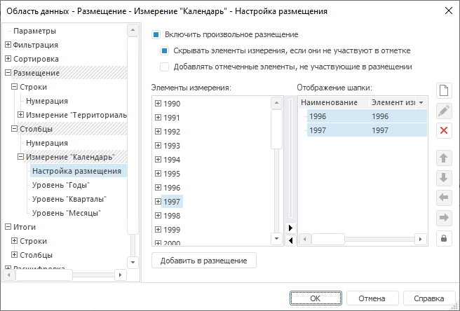
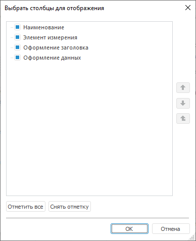

# Настройка произвольного размещения: Область данных

Настройка произвольного размещения: Область данных
-

# Настройка произвольного размещения

Настройка произвольного размещения необходима в случае, если требуется
 вывод элементов измерения в произвольном порядке и/или с произвольными
 наименованиями.

Параметры произвольного размещения строк и столбцов области данных аналогичны
 друг другу, но задаются на отдельных страницах.

Примечание.
 Данная настройка имеет больший приоритет и поэтому может перекрывать другие
 [настройки размещения](UiReport_AreaData_Param_Order.htm).

Шапка формируется для измерения, размещенного по столбцам. Боковик формируется
 для измерения, размещенного по строкам.

Для формирования произвольного заголовка (шапки и боковика) и создания
 вычисляемых элементов для области данных перейдите на вкладку «Размещение
 > Строки/Столбцы > Измерение > Настройка размещения».
 Окно «[Свойства
 области данных](../UiReport_AreaData_Param.htm)» примет вид:

Определите на вкладке параметры размещения:

[Включить произвольное
 размещение](javascript:TextPopup(this))

	При установленном флажке «Включить
	 произвольное размещение» появится возможность настроить отображение
	 заголовка (боковика/шапки) и добавлять вычисляемые элементы.

	Примечание.
	 [Оформление](../UiReport_AreaData_Param_Example_Design.htm),
	 заданное для произвольного заголовка, распространяется также на ячейки
	 уровня области данных.

[Скрывать элементы
 измерения, если они не участвуют в отметке](javascript:TextPopup(this))

	При установленном флажке «Скрывать
	 элементы измерения, если они не участвуют в отметке» в область
	 данных будут выведены только те заголовки, для которых присутствует
	 отметка в срезе. При снятии флажка в область данных будет выведен
	 весь сформированный заголовок независимо от имеющейся отметки, соответственно
	 не будут выведены данные для элементов заголовка, по которым отсутствует
	 отметка в срезе.

[Добавлять отмеченные
 элементы, не участвующие в размещении](javascript:TextPopup(this))

	Установите флажок «Добавлять отмеченные
	 элементы, не участвующие в размещении» для вывода в область
	 данных заголовков элементов, по которым не сформировано произвольное
	 наименование, но имеется отметка в срезе.

## Формирование заголовка из элементов измерения

Для формирования заголовка из элементов измерения, отображенных в области
 «Элементы измерения», выделите
 необходимые элементы и:

	- нажмите кнопку «Добавить в
	 размещение»;

	- выполните команду контекстного меню «Добавить
	 в размещение» элемента измерения;

	- дважды щелкните по элементу в области «Элементы
	 измерения».

Примечание.
 Если в списке отмечено несколько элементов, то при двойном щелчке по любому
 элементу предыдущее выделение будет снято, будет выделен и перемещен в
 область «Отображение боковика/шапки»
 текущий элемент.

	- переместите выделенные элементы в область «Отображение
	 боковика/шапки» с помощью механизма Drag&Drop.

## Операции над элементами измерения

При формировании заголовка из элементов измерения в области «Элементы
 измерения» доступны следующие операции:

[Изменение отметки
 всех элементов](javascript:TextPopup(this))

	Для изменения отметки для всех элементов измерения выполните команду
	 контекстного меню «Отметить все»/«Снять отметку со всех» в области
	 «Элементы измерения».

[Изменение отметки
 уровня](javascript:TextPopup(this))

	Для изменения отметки для всех элементов, расположенных на одном
	 уровне с указанным элементом измерения, выполните команду контекстного
	 меню «Отметить уровень»/«Снять отметку с уровня» элемента.

[Изменение отметки
 подчиненных элементов](javascript:TextPopup(this))

	Для отметки дочерних элементов выбранного элемента измерения выполните
	 команду контекстного меню «Отметить
	 подчиненные» родительского элемента изменения в области «Элементы измерения».

	Для отметки подчиненных по иерархии элементов изменения выполните
	 команду контекстного меню «Отметить
	 все подчиненные» родительского элемента изменения в области
	 «Элементы измерения».

	Для снятия отметки с дочерних и подчиненных по иерархии элементов
	 выбранного элемента измерения выполните команду контекстного меню
	 «Снять отметку с подчиненных»
	 родительского элемента изменения в области «Элементы
	 измерения».

[Копирование
 отметки](javascript:TextPopup(this))

	Для копирования отметки элементов в буфер обмена:

		- выполните команду контекстного меню «Копировать»;

		- нажмите сочетание клавиш CTRL+C, CTRL+INSERT.

	Для вставки отметки элементов из буфера обмена:

		- выполните команду контекстного меню «Вставить»;

		- нажмите сочетание клавиш CTRL+V, SHIFT+INSERT.

	При выполнении команды отметка из буфера обмена замещает текущую
	 отметку в измерении. Для дополнения существующей отметки выполняйте
	 команду с зажатой клавишей CTRL.

[Определение
 наименования элемента](javascript:TextPopup(this))

	Для определения атрибута, используемого для наименования элементов
	 измерения, выполните команду контекстного меню «Наименование»
	 в области «Элементы измерения».

[Работа с группой
 элементов](javascript:TextPopup(this))

	Для выбора группы элементов выполните команду контекстного меню
	 «Группа элементов» в области
	 «Элементы измерения».

	Примечание.
	 Команда доступна, если для измерения настроены [группы
	 элементов](UiNavObj.chm::/reference_book/look-and-feel_Reference_book/UiMd_reference_book_look-and-feel_Group.htm).

[Работа с альтернативной
 иерархией](javascript:TextPopup(this))

	Для выбора альтернативной иерархии выполните команду контекстного
	 меню «Альтернативная иерархия»
	 в области «Элементы измерения».

	Примечание.
	 Команда доступна, если для измерения настроена [альтернативная
	 иерархия](UiNavObj.chm::/reference_book/UiMd_reference_book_Hierarchy.htm).

[Работа с иерархией
 списка](javascript:TextPopup(this))

	Для разворачивания иерархии списка выполните команду контекстного
	 меню «Развернуть все» в области
	 «Элементы измерения».

	Для сворачивания иерархии списка выполните команду контекстного
	 меню «Свернуть все» в области
	 «Элементы измерения».

[Изменение расширенной
 отметки](javascript:TextPopup(this))

	Для изменения расширенной отметки элемента измерения выполните команду
	 контекстного меню «Расширенная отметка»
	 в области «Элементы измерения»
	 и выберите необходимый пункт:

		- отметить уровень;

		- снять отметку с уровня;

		- применить схему отметки;

		- отметить группу;

		- отметить иерархию.

	Данные команды аналогичны командам, описанным выше.

## Операции над элементами заголовка

При работе с элементами заголовка в области «Отображение
 боковика/шапки» доступны следующие операции:

[Добавление
 элемента и подэлемента заголовка](javascript:TextPopup(this))

	Для добавления нового элемента заголовка:

		- нажмите кнопку ;

		- нажмите клавишу INSERT.

	Для добавления элемента заголовка, не привязанного к элементу измерения,
	 выполните команду контекстного меню «Добавить
	 элемент» в области «Отображение
	 боковика/шапки».

	Примечание.
	 Для элементов размещения, не привязанных к измерению, резервируется
	 место при [фильтрация](../UiReport_AreaData_Param_Filter.htm)
	 пустых элементов. Прочие элементы скрываются при фильтрации.

	Для добавления дочернего элемента, не привязанного к элементу измерения,
	 к сфокусированному элементу выполните команду контекстного меню «Добавить подэлемент» в области «Отображение боковика/шапки».

	Добавление элемента осуществляется по следующему принципу:

		- если в списке нет выделенных элементов или выделено больше
		 одного элемента, то новый элемент добавляется в конец списка;

		- если выделен один элемент, то новый элемент добавляется
		 на этот же уровень после выделенного.

[Редактирование
 элемента заголовка](javascript:TextPopup(this))

	Для изменения наименования элемента заголовка выполните одно из
	 действий:

		- дважды щелкните по элементу;

		- выполните команду контекстного меню «Редактировать»;

	После выполнения действия введите новое наименование элемента заголовка.

	Для задания формулы вычисляемого элемента заголовка:

		- нажмите кнопку ;

		- выберите элемент и нажмите клавишу F4.

	После выполнения действия будет открыт диалог «[Свойства
	 элемента](UiReport_AreaData_Param_Order_Elem_Prop.htm)».

[Удаление элемента](javascript:TextPopup(this))

	Для удаления выбранного элемента заголовка:

		- нажмите на кнопку ;

		- нажмите клавишу DELETE;

		- выполните команду контекстного меню «Удалить»
		 элемента заголовка.

	После выполнения любого из действий появится диалог подтверждения
	 производимой операции.

	При удалении элемента заголовка, имеющего дочерние элементы, будут
	 удалены и все дочерние наименования элементов.

[Настройка отображения
 в измерении](javascript:TextPopup(this))

	Для перемещения фокуса в дереве с элементами измерения на элемент,
	 к которому привязан элемент заголовка (если он там имеется), выполните
	 команду контекстного меню «Отобразить
	 в измерении» элемента заголовка.

[Перемещение
 элементов заголовка](javascript:TextPopup(this))

	Для изменения порядка расположения элементов заголовка:

		- перетащите элемент (A), используя механизм Drag&Drop.
		 При этом при перетаскивании элемента (A) на место другого элемента
		 (B) этого же уровня или на уровень выше с зажатой клавишей SHIFT,
		 элемент (A) становится дочерним элементом вместе со всеми своими
		 дочерними элементами. Если клавиша SHIFT при перетаскивании не
		 используется, то элемент (A) будет расположен на одном уровне
		 с элементом (B) вместе со всеми своими дочерними элементами. Выделенные
		 элементы, имеющие общего родителя и находящиеся на одном уровне,
		 также имеют возможность перетаскивания с зажатой клавишей SHIFT.

		- выполните команду контекстного
		 меню:

			- Вверх;

			- Вниз;

			- На один уровень вверх;

			- На уровень вниз.

	Все команды работают для нескольких выделенных
	 элементов, если у них общий родитель и они находятся на одном уровне.

		- нажмите специальную кнопку:

	.
	 Для перемещения элемента заголовка вверх;

	.
	 Для перемещения элемента заголовка вниз;

	.
	 Для перемещения элемента заголовка на один уровень вверх;

	.
	 Для перемещения элемента заголовка на один уровень вниз.

	При нажатии кнопки 
	 «Запретить произвольное размещение
	 элементов измерения» перемещение элементов, имеющих привязку
	 к элементам измерения, становится недоступным, и элементы автоматически
	 выстраиваются в соответствии с их положением в измерении. При автопостроении
	 элементы, не имеющие привязки к элементу измерения, будут размещены
	 на исходном уровне после того элемента размещения, за которым они
	 первоначально были добавлены в произвольное размещение.

[Работа с иерархией
 элементов заголовка](javascript:TextPopup(this))

	Для разворачивания/сворачивания иерархии списка выполните команду
	 контекстного меню «Развернуть всю
	 иерархию»/«Свернуть всю иерархию»
	 в области «Отображение боковика/шапки».

[Размещение
 элементов измерения в заголовке](javascript:TextPopup(this))

	Для запрещения перемещения элементов, имеющих привязку к элементам
	 измерения, выполните команду контекстного меню «Запретить
	 произвольное размещение элементов измерения» элемента.

	После выполнения действия элементы автоматически будут выстроены
	 в соответствие с их расположением в измерении.

[Настройка оформления
 заголовков и данных](javascript:TextPopup(this))

	Для настройки формата заголовка/данных выполните команду контекстного
	 меню «Настроить оформление заголовков»/«Настроить оформление данных» элемента
	 заголовка в области «Отображение
	 боковика/шапки».

	После выполнения действия будет открыт стандартный диалог «[Формат ячейки](../../../Table/Attribute/UiReport_Table_Attribute.htm)» для настройки стиля
	 заголовка/данных.

	Для очистки оформления выполните команду контекстного меню «Очистить» элемента заголовка
	 и выберите оформление, которое требуется очистить: заголовков и/или
	 данных.

[Выбор и отображение
 столбцов](javascript:TextPopup(this))

	Данные в области «Отображение боковика/шапки»
	 отображаются в виде таблицы.

	Для отображения/скрытия столбцов нажмите кнопку ,
	 находящуюся в области «Отображение
	 боковика/шапки», и выполните одно из действий:

		- установите/снимите соответствующие флажки. В раскрывающемся
		 меню кнопки установите/снимите соответствующие флажки;

		- выполните команду «Выбрать
		 столбцы». Откроется окно «Выбрать
		 столбцы для отображения»:

	

	В открывшемся окне для отображения/скрытия
	 столбцов установите/снимите соответствующие флажки. Для установки
	 флажков на все столбцы нажмите кнопку «Отметить
	 все». Для снятия флажков со всех столбцов - «Снять
	 отметку».

	Также возможно перемещение столбцов с
	 помощью специальных кнопок (см. ниже).

	В столбцах для отображения содержится следующая информация:

		- Оформление ячейки.
		 Цвет заливки, рамка, стиль шрифта, способ выравнивания текста;

		- Текст ячейки. Если
		 выбран стиль, то наименование стиля, в противном случае - параметры
		 шрифта (наименование, размер, начертание).

## Общие операции

В зависимости от расположения фокуса в какой-либо области («Элементы
 измерения» или «Отображение боковика/шапки»)
 при работе с элементами измерения и элементами заголовка доступна операция:

[Поиск элемента](javascript:TextPopup(this))

	Для поиска элемента в дереве элементов измерения или произвольного
	 элемента заголовка нажмите клавишу F3 или сочетание клавиш CTRL+F.

	Примечание.
	 Окно поиска вызывается для дерева, в котором находится фокус.

	После выполнения одного из действий появится диалог поиска элемента.

	Для поиска элемента в дереве, начиная с текущего выделенного элемента,
	 нажмите кнопку «Найти далее».
	 При повторном нажатии на кнопку фокус будет перемещен к следующему
	 найденному элементу.

	Комбинированный список содержит историю поисков.

См. также:

[Настройка размещения](UiReport_AreaData_Param_Order.htm)

		Справочная
		 система на версию 10.9
		 от 18/08/2025,
		 © ООО «ФОРСАЙТ»,
