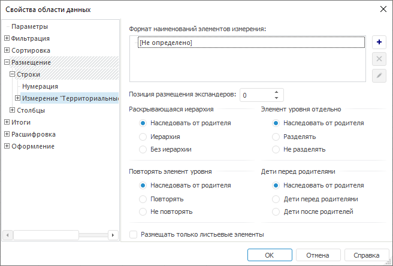
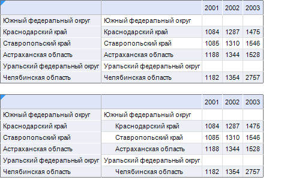
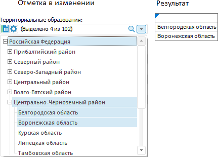

# Настройка размещения, привязанного к измерению

Настройка размещения, привязанного к измерению
-

# Настройка размещения, привязанного к измерению

Параметры размещения, привязанного к измерениям, имеют больший приоритет
 и, тем самым, могут перекрывать [параметры
 размещения по строкам/столбцам](UiReport_AreaData_Param_Order_RS.htm).

Примечание.
 Настройка параметров размещения, привязанных к уровням, аналогична настройке
 параметров размещения, привязанных к измерениям.

Для настройки размещения, привязанного к измерению, перейдите на вкладку
 «Размещение > Строки/Столбцы >
 Измерение». Окно «[Свойства
 области данных](../UiReport_AreaData_Param.htm)» примет вид:

Определите на вкладке параметры размещения:

[Формат
 наименований элементов измерения](javascript:TextPopup(this))

	Данная опция позволяет для каждого измерения и/или уровня измерения
	 задать дополнительные наименования, которые будут отражены в области
	 данных.

	Для добавления нового наименования:

		- Нажмите кнопку .

		- Отредактируйте добавленное наименование измерения. Для этого
		 нажмите кнопку .
		 Откроется [редактор выражения](UiNav.chm::/GUI/ExpressionEditor.htm).

	Примечание.
	 Если не отредактировать добавленное наименование, то оно будет совпадать
	 с наименованием элементов.

	Список наименований элементов измерения всегда по умолчанию содержит
	 один заголовок, который является основным.

	Если список наименований содержит более одного элемента, то наименования,
	 начиная со второго, будут располагаться в дополнительных столбцах
	 (строках). Для дополнительных наименований можно задать отдельное
	 оформление (подробную информацию можно найти в разделе «[Оформление](../UiReport_AreaData_Param_appearance.htm)»).

	Примечание.
	 При использовании [области данных](../../UiReport_AreaData.htm)
	 замена оригинального атрибута на [текст
	 из элемента произвольного размещения](UiReport_AreaData_Param_Order_Elem_Prop.htm#element_text) совершается только для первого
	 наименования элементов измерения.

	Для удаления из списка наименования элемента измерения нажмите кнопку
	 .

[Позиция размещения
 экспандеров](javascript:TextPopup(this))

	Данная опция позволяет переместить экспандеры (кнопки управления
	 иерархией  и ) к соответствующему дополнительному
	 наименованию (заголовку).

	Примечание.
	 Включение опции необходимо в случае использования дополнительных наименований.

	Например, если в списке три заголовка (два из них дополнительных),
	 и необходимо переместить экспандеры ко второму дополнительному заголовку,
	 то для этого в поле для позиции размещения экспандеров задайте значение
	 2.

	Если значение параметра равно «0»,
	 то экспандеры будут расположены по основному заголовку (шапке или
	 боковику).

	Вместе с экспандерами перемещаются и [отступы](UiReport_AreaData_Param_Order_RS.htm#margins),
	 заданные для уровня. Если отображение экспандеров отключено (снят
	 флажок «[Использовать
	 раскрывающуюся иерархию](UiReport_AreaData_Param_Order_RS.htm#drop-down_hierarchy)»), то будут перемещаться только
	 отступы.

### Пример

	Ниже приведен пример области данных, для которой отключено отображение
	 экспандеров и которая имеет один дополнительный заголовок аналогичный
	 основному (верхнее изображение). После задания значения 1 для позиции
	 размещения экспандеров отступы для уровня будут использованы в дополнительном
	 заголовке (нижнее изображение):

	

[Раскрывающаяся
 иерархия](javascript:TextPopup(this))

	Группа «Раскрывающаяся иерархия»
	 содержит переключатели:

		- Наследовать от родителя.
		 Для текущего уровня измерения будут использованы настройки данного
		 параметра от самого измерения;

		- Иерархия. При использовании
		 такого способа размещения элементов пользователю предоставляется
		 возможность сворачивать/разворачивать иерархию измерения с помощью
		 кнопок  (свернутая
		 иерархия),  (развернутая
		 иерархия):

	

		- Без иерархии. При
		 использовании такого способа размещения элементов кнопки управления
		 иерархией отсутствуют:

	

[Элемент уровня
 отдельно](javascript:TextPopup(this))

	Группа «Элемент уровня отдельно»
	 содержит переключатели:

		- Наследовать от родителя.
		 Для текущего уровня измерения будут использованы настройки данного
		 параметра от самого измерения;

		- Разделять. При использовании
		 такого способа размещения элементов, каждый уровень измерения
		 будет расположен в отдельном столбце:

	

		- Не разделять. При
		 использовании такого способа размещения элементов, все уровни
		 измерения будут расположены в одном столбце, разделение между
		 уровнями осуществляется с помощью отступов:

	

	Для размещения элементов уровней в отдельных столбцах установите
	 переключатель «[Размещать
	 элементы уровней в отдельные столбцы](UiReport_AreaData_Param_Order_RS.htm)».

	Примечание.
	 Если этот переключатель не установлен, элементы уровня могут быть
	 скрыты при расположении измерения уровня в строках или столбцах одновременно
	 с другими измерениями.

[Повторять элемент
 уровня](javascript:TextPopup(this))

	Группа «Повторять элемент уровня»
	 содержит переключатели:

		- Наследовать от родителя.
		 Для текущего уровня измерения будут использованы настройки данного
		 параметра от самого измерения;

		- Повторять. Для каждого
		 элемента более низкого уровня будут выведены все соответствующие
		 элементы измерения более высоких уровней;

		- Не повторять. Повторяющиеся
		 элементы измерения более высоких уровней не отображаются.

[Дети перед родителями](javascript:TextPopup(this))

	Группа «Дети перед родителями»
	 содержит переключатели:

		- Наследовать от родителя.
		 Для текущего уровня измерения будут использованы настройки данного
		 параметра от самого измерения;

		- Дети перед родителями.
		 Все уровни измерения выводятся в обратном порядке, при таком способе
		 отображения сворачивание/разворачивание иерархии становится невозможным;

		- Дети после родителей.
		 Стандартное отображение иерархии элементов, все элементы нижних
		 уровней выводятся после элементов верхних уровней.

[Размещать только
 листьевые элементы](javascript:TextPopup(this))

	При установленном флажке появляется возможность выводить в область
	 данных только листьевые элементы.

	Листьевой элемент - это
	 элемент, не имеющий дочерних элементов.

	Примечание.
	 Выборка дочерних элементов ведется не из всего дерева измерения, а
	 только из отмеченных элементов измерения.

	

См. также:

[Настройка размещения](UiReport_AreaData_Param_Order.htm)

		Справочная
		 система на версию 10.9
		 от 18/08/2025,
		 © ООО «ФОРСАЙТ»,
