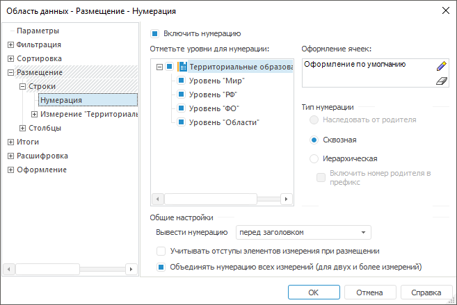

# Настройка нумерации для строк и столбцов: Область данных

Настройка нумерации для строк и столбцов: Область данных
-

# Настройка нумерации для строк и столбцов

Вкладка «Нумерация» для строк
 и вкладка «Нумерация» для столбцов
 аналогичны друг другу.

Для настройки нумерации строк/столбцов перейдите на на вкладку «Размещение > Строки/Столбцы >
 Нумерация». Окно «[Свойства
 области данных](../UiReport_AreaData_Param.htm)» примет вид:

Определите на вкладке параметры нумерации:

[Включить нумерацию](javascript:TextPopup(this))

	При установленном флажке «Включить
	 нумерацию» будет включен режим автоматической нумерации в области
	 данных.

[Уровни для нумерации](javascript:TextPopup(this))

	Иерархический список «Отметьте
	 уровни для нумерации» содержит на первом уровне наименования
	 измерений в порядке, в котором они располагаются в строках/столбцах.
	 На втором уровне находятся уровни измерений в порядке, в котором они
	 определены в измерении.

	При выделении элемента списка в областях «Оформление
	 ячеек» и «Тип нумерации»
	 отображаются его настройки.

[Оформление ячеек](javascript:TextPopup(this))

	Определите оформление для необходимых уровней нумерации. Для этого
	 используйте стандартный компонент редактирования стиля ячейки.

	По умолчанию оформление для уровней наследуется от оформления нумерации
	 измерения.

	Для восстановления наследования нажмите кнопку «Очистить»
	 в редакторе.

[Тип нумерации](javascript:TextPopup(this))

	Группа параметров «Тип нумерации»
	 содержит следующие переключатели:

		- Наследовать от родителя.
		 Тип нумерации будет изменен по цепочке. Доступен только для уровней
		 измерения;

		- Сквозная. Для элементов
		 уровня будет установлена сквозная нумерация, независимо от нумерации
		 родительского уровня;

		- Иерархическая. Нумерация
		 уровня будет подчинена родительскому уровню;

		- Включить номер родителя
		 в префикс. Флажок доступен только для иерархической нумерации.

[Общие настройки](javascript:TextPopup(this))

	Группа параметров «Общие настройки»
	 содержит следующие элементы:

		- Вывести нумерацию.
		 Из раскрывающегося списка выберите область размещения нумерации:
		 слева/справа от элемента, перед заголовком или после заголовка;

		- Учитывать отступы элементов
		 измерения при размещении. При снятом флажке все номера
		 выводятся в один столбец без автоматических отступов. При установленном
		 флажке отступы нумерации будут соответствовать отступам при размещении
		 элементов области данных;

		- Объединять нумерацию всех
		 измерений. При снятом флажке элементы разных измерений
		 нумеруются независимо друг от друга. При установленном флажке
		 нумерация элементов измерения зависит от нумерации объемлющего
		 измерения. Использование данного параметра актуально, если область
		 данных содержит два и более измерений.

Примечание.
 Если для области данных установлены методы [сортировки](../UiReport_AreaData_Param_Sort.htm)
 «По уровням иерархии» и «С нарушением иерархии», то визуально
 иерархия будет нарушена. Поэтому иерархическая нумерация заменяется на
 глобальную сквозную.

При настройке нумерации также следует учитывать количество измерений,
 расположенных по строкам/столбцам. Если по столбцам/строкам расположено
 два измерения и для второго настроена сквозная нумерация, то каждый повторяющийся
 элемент будет иметь уникальный порядковый номер:

См. также:

[Настройка
 размещения](UiReport_AreaData_Param_Order.htm)

		Справочная
		 система на версию 10.9
		 от 18/08/2025,
		 © ООО «ФОРСАЙТ»,
