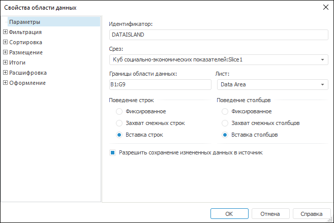

# Свойства области данных

Свойства области данных
-

# Свойства области данных

Для задания параметров области данных при создании новой области данных
 или для уже существующей области данных:

	- выделите любую из ячеек области и выполните команду контекстного
	 меню «Параметры области данных»;

	- выделите область данных на панели «[Источники и срезы данных](../../Source/UiReport_Source.htm)»
	 и выполните команду контекстного меню «Параметры
	 области данных».

После выполнения любого действия откроется окно «Свойства
 области данных»:

Для настройки свойств области данных задайте параметры на следующих
 вкладках:

	- [Параметры](UiReport_AreaData_Param_Param.htm).
	 Определите общие параметры для определения положения и поведения области
	 данных;

	- [Фильтрация](UiReport_AreaData_Param_Filter.htm).
	 Фильтрация области данных позволяет отобразить только те данные, которые
	 соответствуют заданным условиям. Например, при работе с большими запросами,
	 содержащими относительно небольшое количество непустых и ненулевых
	 данных, полезно использовать функцию фильтрации данных по строкам
	 или по столбцам;

	- [Сортировка](UiReport_AreaData_Param_Sort.htm).
	 Сортировка дает возможность производить упорядочивание строк и столбцов
	 области данных по тем или иным атрибутам элементов измерений соответствующего
	 среза. Сортировка может идти с учетом и без иерархии, быть возрастающей
	 или убывающей;

	- [Размещение
	 ](Order/UiReport_AreaData_Param_Order.htm). Определите параметры размещения среза в области данных;

	- [Итоги](UiReport_AreaData_Param_Totals.htm).
	 Определите настройки вывода итоговых значений по строкам и столбцам
	 для области данных на основании данных источника;

	- [Расшифровка](UiReport_AreaData_Param_Decipher.htm).
	 Определите настройки гиперссылок в области данных, которые будут производить
	 автоматическую расшифровку источника данных. Например, при щелчке
	 по гиперссылке может производиться переход на другой лист отчета с
	 позиционированием на диаграмме, которая отображает данные для выбранного
	 элемента. При настройке расшифровки для измерения/уровня все его элементы
	 или часть элементов (в случае задания условия исключения элементов
	 из расшифровки) в области данных будут отображаться в виде гиперссылок;

	- [Оформление](UiReport_AreaData_Param_appearance.htm).
	 Определите настройки оформления ячеек области данных, имеющих различные
	 значения, а также настройки оформления заголовков строк и столбцов.

Примечание.
 Наименование окна «Свойства области данных»
 будет отличаться в зависимости от активной вкладки.

См. также:

[Начало
 работы с инструментом «Отчёты» в веб-приложении](../../../Web/organizational_management/Starting.htm) | [Визуализация
 данных в виде таблиц](../Table_Types.htm)

		Справочная
		 система на версию 10.9
		 от 18/08/2025,
		 © ООО «ФОРСАЙТ»,
