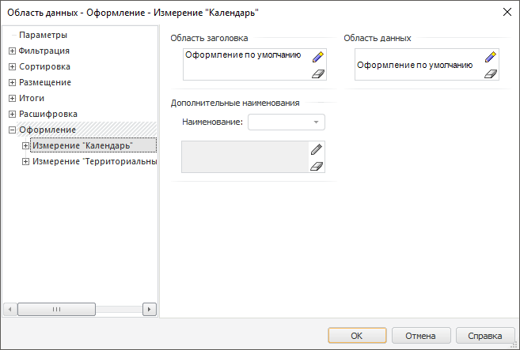

# Настройка оформления, привязанного к измерениям: Регламентный отчёт, настольное приложение

Настройка оформления, привязанного к измерениям: Регламентный отчёт, настольное приложение
-

# Настройка оформления, привязанного к измерениям

Помимо [общих настроек
 оформления](UiReport_AreaData_Param_appearance.htm) области данных, можно настроить оформление вплоть до уровней
 измерений.

Примечание.
 Параметры оформления ячеек, привязанных к измерениям, имеют больший приоритет,
 и тем самым могут перекрывать [общие
 параметры оформления](UiReport_AreaData_Param_appearance.htm) той области, в которой они расположены (по строкам/столбцам).

Настройка параметров оформления, привязанных к уровням, аналогична настройке
 параметров оформления, привязанных к измерениям.

Для настройки оформления, привязанного к измерениям, перейдите на вкладку
 «Оформление > Измерение» окна
 «[Свойства
 области данных](UiReport_AreaData_Param.htm)». Окно примет вид:

Настройка оформления, привязанного к измерениям, аналогична заданию
 [общих настроек оформления](UiReport_AreaData_Param_appearance.htm).

Для задания оформления дополнительных наименований измерения выберите
 наименование из комбинированного списка в области «Дополнительные
 наименования». После чего становится активным [стандартный компонент](uinav.chm::/GUI/Style_setup.htm)
 настройки оформления.

Примечание.
 Создание дополнительных наименований производится на вкладке «[Размещение](Order/UiReport_AreaData_Param_Order_attach.htm)».

См. также:

[Начало
 работы с инструментом «Отчёты» в веб-приложении](../../../Web/organizational_management/Starting.htm) | [Настройка оформления
 области данных](UiReport_AreaData_Param_appearance.htm)

		Справочная
		 система на версию 10.9
		 от 18/08/2025,
		 © ООО «ФОРСАЙТ»,
