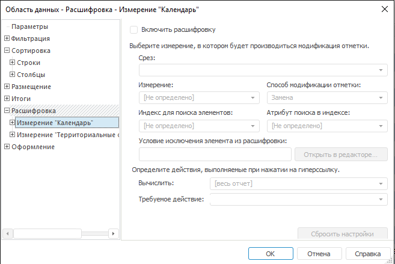

# Настройка расшифровки: Область данных

Настройка расшифровки: Область данных
-

# Настройка расшифровки

Для настройки в шапке и боковике гиперссылок, которые будут открывать
 другие представления данных, перейдите на вкладку «Расшифровка»
 окна «[Свойства
 области данных](UiReport_AreaData_Param.htm)». Например, при щелчке по гиперссылке может
 осуществляться переход на другой лист отчета с позиционированием на диаграмме,
 которая отображает данные для выбранного элемента.

При настройке расшифровки для измерения/уровня все его элементы или
 часть элементов в области данных будут отображаться в виде гиперссылок.
 При срабатывании гиперссылки выбранному измерению передается отметка,
 после чего вычисляется отчет (или лист), и осуществляется заданное действие.

После перехода на вкладку окно примет вид:

Для включения расшифровки по измерению установите флажок «Включить
 расшифровку».

Настройка расшифровки включает два этапа:

	- Настройка поведения отметки при срабатывании гиперссылки.

	- Настройка действия, которое будет происходить при нажатии на
	 гиперссылку.

Для удаления настроек расшифровки выбранного измерения/уровня нажмите
 кнопку «Сбросить настройки».

## Определение поведения отметки

Для настройки поведения отметки при срабатывании гиперссылки определите
 следующие параметры:

[Срез](javascript:TextPopup(this))

	В списке выберите срез, в одном из измерений которого будет производиться
	 модификация отметки.

[Измерение](javascript:TextPopup(this))

	В списке выберите измерение, в котором будет производиться модификация
	 отметки. Список содержит все измерения выбранного среза.

[Способ модификации
 отметки](javascript:TextPopup(this))

	В списке выберите способ изменения отметки в указанном измерении:

		- Не определено. Отметка
		 измерения изменена не будет;

		- Замена. Вся имеющаяся
		 отметка в измерении будет снята и выделен только элемент, гиперссылка
		 которого была нажата;

		- Инвертирование.
		 В измерении будет инвертирована (изменена на противоположную)
		 отметка элемента, гиперссылка которого была нажата;

		- Добавление. В измерении
		 будет отмечен элемент, гиперссылка которого была нажата, только
		 если ранее по данному элементу отметка отсутствовала.

Списки «Индекс для поиска элементов»
 и «Атрибут поиска в индексе» необходимы
 для установки соответствия между элементами измерений:

[Индекс для
 поиска элементов](javascript:TextPopup(this))

	Укажите в списке индекс измерения, выбранного в поле «Измерение».
	 Данный индекс будет использоваться для поиска элемента, гиперссылка
	 которого была нажата. В случае выбора варианта «Не
	 определено» индекс будет выбран автоматически.

[Атрибут поиска
 в индексе](javascript:TextPopup(this))

	Укажите в списке атрибут измерения, для которого производится настройка
	 расшифровки и элементы которого будут являться гиперссылками. По значению
	 данного атрибута будет производиться поиск значения атрибута индекса,
	 выбранного в списке «Индекс для поиска
	 элементов». Тем самым будет установлено соответствие между
	 элементами измерений. Другими словами, для поиска будет браться значение
	 указанного атрибута элемента, гиперссылка которого была нажата. В
	 случае выбора варианта «Не определено»
	 атрибут будет выбран автоматически.

## Определение условия для исключения элементов из расшифровки

Для применения расшифровки области данных не ко всем элементам измерения/уровня,
 на которые настроена расшифровка, а только к выбранным элементам, задайте
 условие в поле «Условие исключения элемента
 из расшифровки». По умолчанию условие отсутствует. При выполнении
 условия для элемента расшифровка не применяется.

Для формирования условия нажмите кнопку «Открыть
 в редакторе». Будет открыто окно «[Редактор
 выражения](UiNav.chm::/GUI/ExpressionEditor.htm)».

Если условие было задано ранее, то оно будет отображено в области «Формула».

В области «Данные» отображаются
 атрибуты измерения, для которого настраивается расшифровка.

## Настройка действия гиперссылки

Для настройки действия, выполняемого при нажатии на гиперссылку, задайте
 параметры:

	- Вычислить. Определите
	 в списке область отчета, которая будет вычисляться при срабатывании
	 гиперссылки: весь отчет или его конкретный лист.

	- Требуемое действие.
	 Выберите из списка одно из действий, которое будет производиться при
	 срабатывании гиперссылки:

[Не
 определено](javascript:TextPopup(this))

	Гиперссылка не вызывает действие при
	 срабатывании.

[Открыть
 файл](javascript:TextPopup(this))

	При выборе данного действия ниже появляется
	 поле «Имя файла». Укажите
	 в нем файл, который будет открываться при срабатывании гиперссылки.

	Для выбора файла нажмите кнопку , расположенную в этом поле. Будет открыто стандартное
	 окно выбора файла.

[Открыть
 ссылку](javascript:TextPopup(this))

	При выборе данного действия появляется
	 поле «Ссылка». Впишите в него
	 адрес ссылки.

[Открыть
 лист отчета](javascript:TextPopup(this))

	При выборе данного действия появляется
	 раскрывающийся список «Листы отчета».
	 Выберите в нем лист, на который будет осуществлен переход при нажатии
	 на ссылку.

[Показать
 диапазон ячеек](javascript:TextPopup(this))

	При выборе данного действия появится
	 поле «Описание диапазона»,
	 введите в него диапазон ячеек. Выбранный диапазон будет выделяться
	 при нажатии на ссылку.

	Доступны следующие варианты ввода диапазона
	 ячеек:

			- Для описания прямоугольной области укажите через двоеточие
			 сначала адрес верхней левой ячейки, с которой начинается диапазон,
			 а затем адрес нижней правой ячейки, на которой заканчивается
			 диапазон;

			- Если необходимо позиционирование на одной ячейке, то
			 укажите только ее адрес;

			- Для описания комбинированной области через точку с запятой
			 ( ; ) укажите адреса прямоугольных областей и отдельных ячеек,
			 из которых состоит данная область.

[Показать
 объект в центре экрана](javascript:TextPopup(this))

	При выборе данного действия появляется
	 раскрывающийся список «Объекты отчета».
	 Выберите в нем [объект](../../Objects/UiReport_Objects.htm),
	 на который будет осуществлен переход при нажатии на ссылку.

[Открыть
 объект репозитория](javascript:TextPopup(this))

	При выборе данного действия появляется
	 раскрывающийся список «Объекты репозитория».
	 Выберите в нем объект репозитория, который будет открываться при нажатии
	 на гиперссылку.

[Выполнить
 процедуру/функцию](javascript:TextPopup(this))

	При выборе данного действия появятся
	 дополнительные поля:

			- Модуль. Из раскрывающегося
			 списка выберите объект среды разработки, подключенный к регламентному
			 отчету;

			- Процедура/Функция.
			 В поле укажите имя макроса, который необходимо запустить при
			 нажатии на гиперссылку.

	В зависимости от того, где находится
	 реализация макроса, различается способ указания пути к макросу в данном
	 поле:

			- Макрос реализован в модуле/форме репозитория: <наименование
			 макроса>;

			- Макрос реализован в одном из объектов сборки репозитория:
			 <наименование макроса>.

См. также:

[Начало
 работы с инструментом «Отчёты» в веб-приложении](../../../Web/organizational_management/Starting.htm) | [Свойства
 области данных](UiReport_AreaData_Param.htm)

		Справочная
		 система на версию 10.9
		 от 18/08/2025,
		 © ООО «ФОРСАЙТ»,
