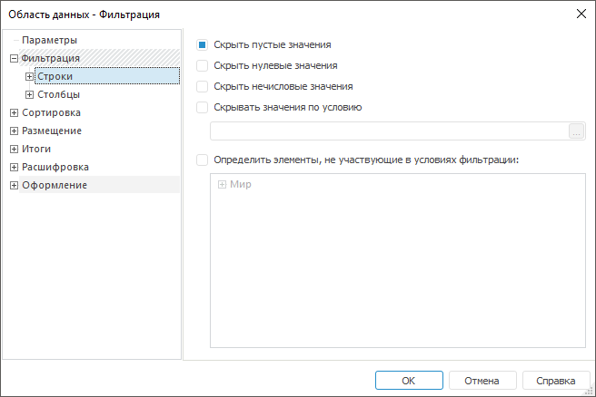
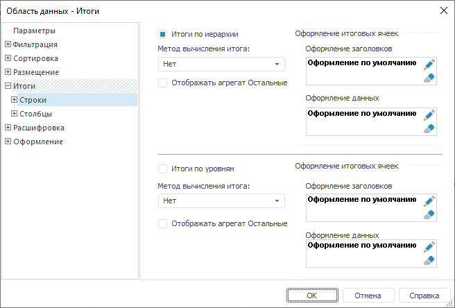
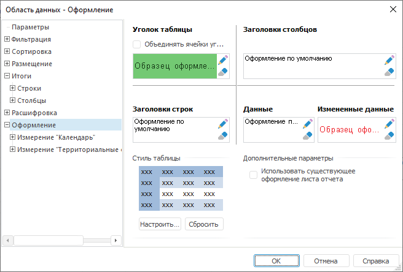
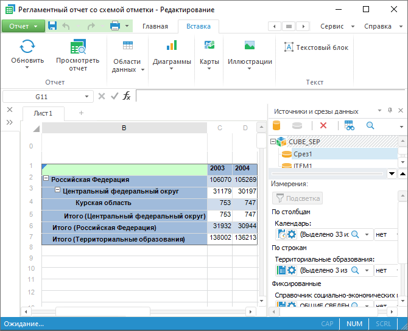

# Пример создания, размещения и оформления области данных

Пример создания, размещения и оформления области данных
-

# Пример создания, размещения и оформления области данных

Для создания области данных:

	- Выберите на панели «Источники
	 и срезы данных» необходимый срез и перетащите его на лист отчета.

	- В появившемся окне «[Свойства области данных](UiReport_AreaData_Param.htm)»
	 на вкладке «[Параметры](UiReport_AreaData_Param_Param.htm)»
	 задайте следующие значения:

	-

		- в раскрывающемся списке срезов выберите «Куб
		 Cоциально-экономические показатели:Срез 1»;

		- задайте границы области данных «B1:D6»;

		- в раскрывающемся списке доступных листов выберите: «Лист 1»;

		- в области группировки «Поведение
		 строк» установите флажок «Вставка
		 строк»;

		- в области группировки «Поведение
		 столбцов» установите флажок «Вставка
		 столбцов»;

		- установите флажок «Разрешить
		 сохранение измененных данных в источник».

После выполнения этих действий вкладка «Параметры» будет выглядеть следующим
 образом:

	- Следующим шагом по настройке параметров
	 области данных является фильтрация данных. Задайте условия фильтрации
	 строк и столбцов на вкладке «[Фильтрация](UiReport_AreaData_Param_Filter.htm)»:

		- установите флажки «Скрыть
		 пустые значения» на вкладках «Строки»
		 и «Столбцы».

После выполнения этих действий вкладка «Фильтрация» будет выглядеть следующим
 образом:

Пример области данных без использования фильтрации:

После применения фильтрации область данных
 будет выглядеть следующим образом:

	- Параметры на вкладке «[Сортировка](UiReport_AreaData_Param_Sort.htm)» оставьте
	 без изменения.

	- На вкладке «[Размещение >
	 Строки](Order/UiReport_AreaData_Param_Order_RS.htm)» установите флажки:

		- Использовать
		 раскрывающуюся иерархию;

		- Отображать
		 владельцев неисключённых строк;

		- Автоматически
		 рассчитывать отступы элементов.

После установки данных флажков вкладка «Размещение» будет выглядеть следующим
 образом:

	- На вкладке «[Итоги](UiReport_AreaData_Param_Totals.htm)»
	 настройте итоги по строкам:

		- установите флажок «Итоги
		 по иерархии»;

		- выберите метод вычисления итога
		 «Сумма».

После установки параметров вкладка «Итоги > Строки» будет выглядеть
 следующим образом:

Для задания оформления ячеек, содержащих
 итоги, нажмите кнопку , откроется окно «[Формат ячеек](../../Table/Attribute/UiReport_Table_Attribute.htm)».

	- Определите оформление области данных на вкладке «[Оформление](UiReport_AreaData_Param_appearance.htm)»:

	- [Обновите
	 отчет](../../Reports/OperationReport/UiReport_Reports_Operation_Execute.htm). После обновления отчета область данных примет вид:

Для запуска вычисления отчета с последующим
 открытием отчета на просмотр нажмите сочетание клавиш CTRL+F9.

См. также:

[Начало
 работы с инструментом «Отчёты» в веб-приложении](../../../Web/organizational_management/Starting.htm) | [Свойства
 области данных](UiReport_AreaData_Param.htm)

		Справочная
		 система на версию 10.9
		 от 18/08/2025,
		 © ООО «ФОРСАЙТ»,
