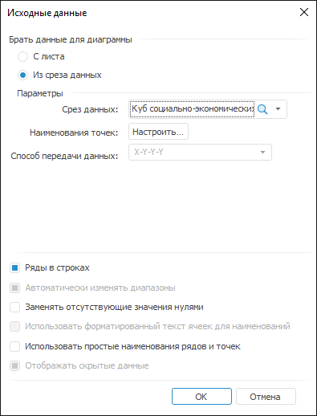
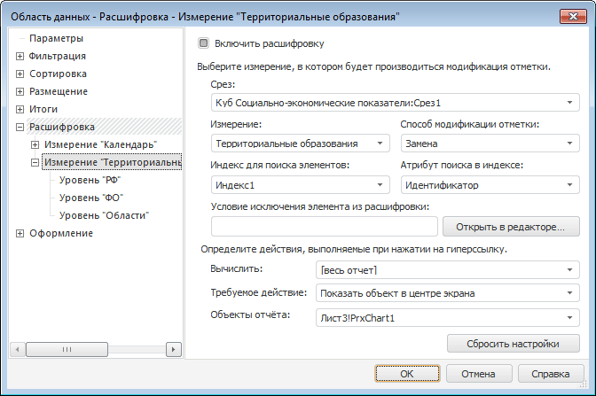
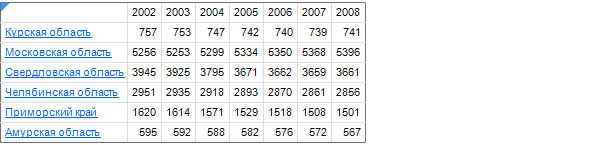
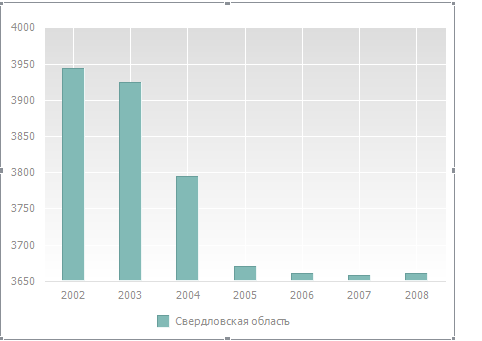

# Пример настройки расшифровки территорий: Область данных

Пример настройки расшифровки территорий: Область данных
-

# Пример настройки расшифровки территорий

В качестве примера будет рассмотрена настройка расшифровки для территорий.
 При щелчке по гиперссылке с названием территории будет открываться диаграмма,
 отображающая данные по этой территории.

Для построения области данных используется «Куб
 Социально-экономические показатели», создание которого рассмотрено
 в разделе «[Пример
 создания куба](UiNavObj.chm::/Cube/UiMd_Cube_Example.htm)».

Добавьте данный куб в область «Источники
 данных и срезы» панели «[Источники
 и срезы данных](../../Source/UiReport_Source.htm)». Создайте для него срез, который будет использоваться
 для построения области данных. Измерения среза разместите следующим образом:

	- По столбцам. Календарь;

	- По строкам. Территориальные
	 измерения;

	- Фиксированные. Социально-экономические
	 показатели, Источники данных, Факты.

Для настройки расшифровки выполните следующие действия:

	- Произведите отметку в справочниках.

	- Создайте копию данного среза, которая будет использоваться для
	 построения диаграммы.

	- На листе отчета создайте диаграмму, в качестве источника данных
	 которой выберите «Из среза данных»:

	- Создайте еще один лист отчета, на который из окна «Источники
	 и срезы данных» перетащите «Срез
	 1». Появится окно «[Свойства
	 области данных](UiReport_AreaData_Param.htm)». Перейдите в нем на вкладку «Расшифровка»:

	- Установите флажок «Включить
	 расшифровку» и задайте параметры:

		- Срез. В раскрывающемся
		 списке выберите «Куб Социально-экономические
		 показатели:Срез1», в измерении которого будет производиться
		 модификация отметки;

		- Измерение. В раскрывающемся
		 списке выберите «Территориальные
		 образования». В данном измерении будет производиться модификации
		 отметки. Изменения отметки отразятся на данных, представленных
		 диаграммой;

		- Способ модификации отметки.
		 В раскрывающемся списке выберите «Замена».
		 Т.е. отметка в измерении будет изменена: будет отмечен только
		 элемент, гиперссылка которого была нажата;

		- В качестве действия, происходящего при срабатывании гиперссылки,
		 установите «Показать объект в
		 центре экрана» и в появившемся поле «Объекты
		 отчета» выберите диаграмму, созданную ранее;

	- Нажмите кнопку «ОК».

	- [Обновите
	 отчет](../../Reports/OperationReport/UiReport_Reports_Operation_Execute.htm). После этого территории в области данных будут отображены
	 в виде гиперссылок:

При нажатии на гиперссылку, например «Свердловская область», будет открыт
 лист с диаграммой по данной области:

См. также:

[Свойства
 области данных](UiReport_AreaData_Param.htm)

		Справочная
		 система на версию 10.9
		 от 18/08/2025,
		 © ООО «ФОРСАЙТ»,
