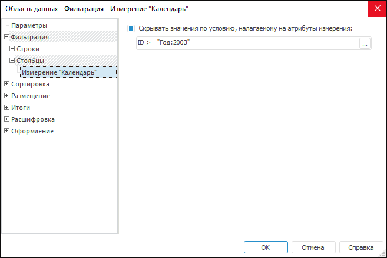

# Настройка фильтрации, привязанной к измерениям

Настройка фильтрации, привязанной к измерениям
-

# Настройка фильтрации, привязанной к измерениям

Параметры фильтрации по атрибутам измерения строк и столбцов аналогичны
 друг другу, но задаются на отдельных страницах.

При настройке фильтрации для измерения в области данных будут скрыты
 значения, удовлетворяющие заданному условию, налагаемому на атрибуты измерения.

Для настройки фильтрации, привязанной к измерениям, перейдите на вкладку
 «Фильтрация > Столбцы/Строки >
 Измерение» окна «[Свойства
 области данных](UiReport_AreaData_Param.htm)». Окно примет вид:

Установите флажок «Скрывать значения
 по условию, налагаемому на атрибуты
 измерения» и задайте условие, в соответствии с которым будет производиться
 фильтрация.

Условия фильтрации можно вводить:

	- вручную. Введите условие в поле ввода;

	- с помощью [редактора выражения](UiNav.chm::/GUI/ExpressionEditor.htm). Для запуска редактора выражения нажмите
	 кнопку .

При создании условия можно использовать атрибуты измерения и имеющиеся
 параметры регламентного отчета.

См. также:

[Начало
 работы с инструментом «Отчёты» в веб-приложении](../../../Web/organizational_management/Starting.htm) | [Настройка фильтрации](UiReport_AreaData_Param_Filter.htm)

		Справочная
		 система на версию 10.9
		 от 18/08/2025,
		 © ООО «ФОРСАЙТ»,
