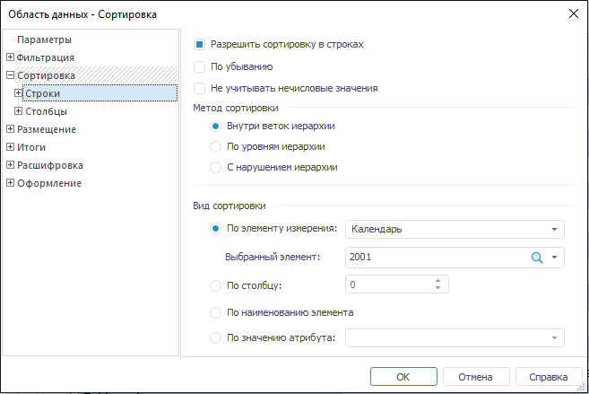

# Отчеты: Область данных: Настройка сортировки

Отчеты: Область данных: Настройка сортировки
-

# Настройка сортировки

Параметры сортировки строк и столбцов области данных аналогичны друг
 другу, но задаются на отдельных вкладках.

При сортировке фильтрованной области фильтрация не сбрасывается.

Существуют как общие параметры сортировки строк (столбцов) области данных,
 так и параметры сортировки, привязанные к измерениям.

Примечание.
 Настройка параметров сортировки, привязанных к измерениям, аналогична
 настройке параметров сортировки, привязанных к области размещения (по
 строкам/столбцам). Параметры сортировки, привязанные к измерениям, имеют
 больший приоритет, и тем самым могут перекрывать настроенные общие параметры
 области (по строкам/столбцам).

Для настройки сортировки перейдите на вкладку «Сортировка» окна
 «[Свойства
 области данных](UiReport_AreaData_Param.htm)». Окно примет вид:

На данной вкладке определите параметры сортировки данных:

[Разрешить сортировку](javascript:TextPopup(this))

	В зависимости от выбранной области (строки/столбцы/измерение), флажок
	 может называться:

		- Разрешить сортировку в
		 строках. В случае если выбрана область строк;

		- Разрешить сортировку в
		 столбцах. В случае если выбрана область столбцов;

		- Разрешить сортировку в
		 измерении. В случае если выбрано измерение, размещенное
		 в строках или столбцах.

	При установленном флажке становятся доступными параметры сортировки.
	 Если флажок не установлен, то сортировка по выбранной области (измерению)
	 не производится.

[По убыванию](javascript:TextPopup(this))

	При установленном флажке «По убыванию»
	 сортировка элементов выбранной области (строки/столбцы/измерение)
	 будет производиться по убыванию. Если флажок не установлен, то сортировка
	 элементов будет производиться по возрастанию.

[Не учитывать
 нечисловые значения](javascript:TextPopup(this))

	При установленном флажке «Не учитывать
	 нечисловые значения» все нечисловые значения помещаются в конец
	 сортируемой области. При снятом флажке пустые элементы не участвуют
	 в сортировке, нечисловые значения помещаются в начало сортируемой
	 области.

[Метод сортировки](javascript:TextPopup(this))

	Данная область включает методы сортировки, которые становятся активными
	 при выборе соответствующего переключателя:

		- Внутри веток иерархии.
		 При использовании данного метода сортировка дочерних элементов
		 каждого уровня осуществляется без нарушения иерархии:

	

		- По уровням иерархии.
		 При использовании данного метода сортировка дочерних элементов
		 каждого уровня осуществляется с нарушением иерархии:

	

		- С нарушением иерархии.
		 При использовании данного метода сортировка всех элементов осуществляется
		 с нарушением иерархии:

	

[Вид сортировки](javascript:TextPopup(this))

	Данная область включает виды сортировки, которые становятся активными
	 при выборе соответствующего переключателя:

		- По
		 элементу измерения. Выберите измерение, содержащее элемент,
		 по которому будет осуществляться сортировка. Затем выберите сам
		 элемент в комбинированном списке «Выбранный
		 элемент». При этом выборка должна осуществляться в противоположном
		 измерении (т.е. при сортировке строк элемент выбирается в
		 столбце и наоборот);

		- По
		 строке/столбцу. Задайте номер строки или столбца, по которому
		 будет осуществляться сортировка. При этом нумерация строк и столбцов
		 может быть как положительной, так и отрицательной. Положительная
		 нумерация начинается с нуля. При отрицательной нумерации - число
		 строк/столбцов должно быть определено заранее, так как нумерация
		 первой строки/столбца представляет собой номер последней строки/столбца
		 со знаком «-»;

		- По
		 наименованию элемента. При использовании данного вида сортировки,
		 будет произведена сортировка в алфавитном порядке либо по возрастанию,
		 либо по убыванию;

		- По
		 значению атрибута. Выберите в комбинированном списке один
		 из атрибутов, заданных в измерении.

См. также:

[Начало
 работы с инструментом «Отчёты» в веб-приложении](../../../Web/organizational_management/Starting.htm) | [Свойства
 области данных](UiReport_AreaData_Param.htm)

		Справочная
		 система на версию 10.9
		 от 18/08/2025,
		 © ООО «ФОРСАЙТ»,
