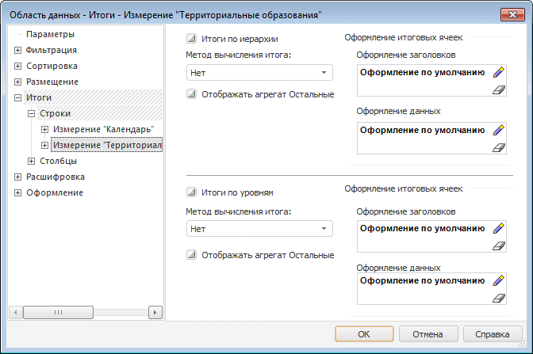
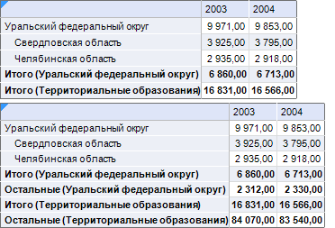
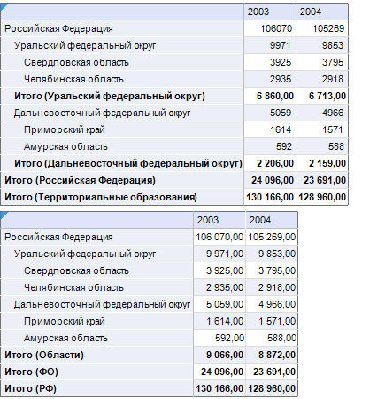

# Настройка итогов: Область данных

Настройка итогов: Область данных
-

# Настройка итогов

Для области данных можно настроить вывод итоговых значений по строкам
 и столбцам на основании данных источника.

Итоги для строк и столбцов аналогичны друг другу, но задаются на отдельных
 страницах.

Примечание.
 Настройка итогов, привязанных к уровням и измерениям, аналогична настройке
 итогов, привязанных к строкам/столбцам.

Для настройки итоговых значений по строкам/столбцам перейдите на вкладку
 «Итоги» окна «[Свойства области данных](UiReport_AreaData_Param.htm)».
 Окно примет вид:

Определите на вкладке параметры итоговых значений в двух областях:

[Итоги по иерархии](javascript:TextPopup(this))

	При установленном флажке «Итоги
	 по иерархии» будут рассчитываться итоги по всем дочерним элементам.

[Итоги по уровню](javascript:TextPopup(this))

	При установленном флажке «Итоги
	 по уровню» будут рассчитываться итоги по всем элементам отображающихся
	 уровней.

Для каждой области можно настроить следующие параметры вычисления итоговых
 значений:

[Метод вычисления
 итогов](javascript:TextPopup(this))

	Для каждой области выберите в раскрывающемся списке «Метод
	 вычисления итогов» метод:

		- Нет. Агрегация не
		 производится;

		- Сумма. Значения
		 суммируются;

		- Минимум. Выбирается
		 минимальное значение;

		- Максимум. Выбирается
		 максимальное значение;

		- Количество непустых.
		 Определяется количество непустых значений;

		- Количество пустых.
		 Определяется количество пустых значений;

		- Количество всех дочерних.
		 Определяется количество дочерних элементов;

		- Арифметическое среднее.
		 Определяется среднее значение с учетом пустых значений;

		- Фактическое среднее.
		 Определяется среднее значение без учета пустых значений;

		- Первое фактическое.
		 Берется первое имеющееся (фактическое) значение;

		- Последнее фактическое.
		 Берется последнее имеющееся (фактическое) значение;

		- Среднеквадратическое отклонение
		 на выборке. Определяется среднеквадратическое отклонение
		 ряда по выборке;

		- Медиана. Определяется
		 медиана ряда;

		- Среднеквадратическое отклонение.
		 Определяется среднеквадратическое отклонение ряда по генеральной
		 совокупности;

		- Общий итог. Данный
		 метод отображается, если в источнике данных настроена серверная
		 агрегация измерения фактов куба. При выборе данного пункта для
		 расчета итогов будет использован метод, установленный для [серверной
		 агрегации измерения фактов](UiNavObj.chm::/Cube/CreateCube/Master_Standart/UiMd_Cube_CreateCube_Master_Standart_2.htm#agregation). В случае, если
		 нет привязки элемента к стандартному факту или если метод агрегации
		 не установлен, итоги вычисляются как сумма значений. Также настроить
		 серверную агрегацию для куба можно средствами языка [Fore](KeCubes.chm::/Interface/IStandardCubeServerAggregation/IStandardCubeServerAggregation.htm).

[Агрегат «Остальные»](javascript:TextPopup(this))

	В группах «Итоги по иерархии»
	 и «Итоги по уровню» присутствует
	 флажок «Отображать агрегат Остальные».
	 При установленном флажке итоги будут вычисляться для элементов измерений,
	 не попавших в отметку. Пример отображения таблицы с итогами по иерархии
	 без отображения агрегата «Остальные»
	 (верхняя таблица) и с отображением агрегата «Остальные»
	 (нижняя таблица) приведен ниже:

	

	Если в области данных по строкам/столбцам расположено два и более
	 измерений, итоги рассчитываются по уровням с учетом данных по дочерним
	 элементам.

[Оформление
 итоговых ячеек](javascript:TextPopup(this))

	Оформление итоговых ячеек настраивается с помощью [стандартного компонента](UiNav.chm::/GUI/Style_setup.htm)
	 для заголовка и данных.

Пример области данных с настроенными итогами по иерархии (верхняя область
 данных) и по уровню (нижняя область данных):

См. также:

[Начало
 работы с инструментом «Отчёты» в веб-приложении](../../../Web/organizational_management/Starting.htm) | [Свойства
 области данных](UiReport_AreaData_Param.htm)

		Справочная
		 система на версию 10.9
		 от 18/08/2025,
		 © ООО «ФОРСАЙТ»,
