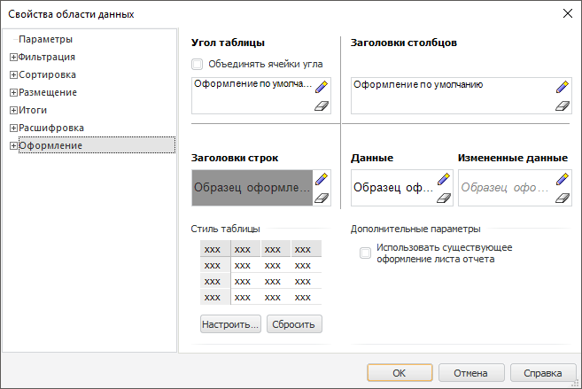

# Настройка оформления области данных: Область данных, регламентный отчёт, настольное приложение

Настройка оформления области данных: Область данных, регламентный отчёт, настольное приложение
-

# Настройка оформления области данных

Для определения параметров оформления ячеек области данных, уровней
 и измерений среза перейдите на вкладку «Оформление»
 окна «[Свойства
 области данных](UiReport_AreaData_Param.htm)».

Совет. Для настройки
 оформления ячеек дополнительно можно использовать команды в раскрывающемся
 меню кнопки «Стили ячеек», расположенной
 в группе «Стиль таблицы» на вкладке
 «Главная». Настройка выполняется
 аналогично [настройке
 оформления](UiAnalyticalArea.chm::/TableView/Formatting/Table_Elements_Styles.htm) табличного визуализатора.

Для настройки оформления уровней измерения среза убедитесь, что в справочнике,
 на котором построен куб, являющийся источником для области данных, добавлены
 уровни:

	- Табличный справочник.
	 Задайте уровни справочника на странице «[Уровни](UiNavObj.chm::/reference_book/Master_Table_reference_book/UiMd_reference_book_Master_Table_page4.htm)» мастера;

	- Вычисляемый справочник.
	 Задайте уровни справочника на странице «[Уровни](UiNavObj.chm::/reference_book/Master_Calculation_reference_book/UiMd_reference_book_Master_Calculation_page3.htm)» мастера;

	- Календарный справочник.
	 Задайте уровни справочника на странице «[Структура
	 календаря](UiNavObj.chm::/reference_book/Master_Calendar_reference_book/UiMd_reference_book_Master_Calendar_page2.htm)»
	 мастера;

	- Справочник НСИ. Задайте
	 уровни справочника на вкладке «[Уровни](UiNavObj.chm::/reference_book/Master_RDS_reference_book/Level.htm)».

На вкладке «Оформление» задаются
 общие параметры оформления области данных: формат угла таблицы, заголовков
 столбцов (шапки), заголовков строк (боковика), данных, а также данных,
 которые были изменены. Эти настройки являются настройками по умолчанию
 и могут быть переопределены для любого уровня любого измерения области
 данных.

Примечание.
 Параметры оформления ячеек, привязанных к измерениям, имеют больший приоритет,
 и тем самым могут перекрывать общие параметры оформления той области,
 в которой они расположены (по строкам/столбцам).

После перехода на вкладку окно примет вид:

Определите на вкладке параметры оформления следующих частей таблицы:

[Угол
 таблицы](javascript:TextPopup(this))

	Задайте оформление угла таблицы (пересечение заголовков строк и
	 столбцов).

	В случае, если угол области данных содержит несколько строк-столбцов,
	 то при установленном флажке ячейки угла таблицы будут объединены в
	 одну. Дополнительно в угол таблицы можно вывести любое выражение,
	 в том числе вычисленное по формуле. Для этого выполните команду контекстного
	 меню «Редактировать текст»
	 на поле «Образец оформления»
	 в части «Угол таблицы». Будет
	 открыто окно для ввода текста или формулы.

[Заголовки столбцов](javascript:TextPopup(this))

	Задайте оформление заголовков столбцов.

[Заголовки строк](javascript:TextPopup(this))

	Задайте оформление заголовков строк.

Примечание.
 Если в строках/столбцах добавлено несколько измерений, оформление настраивается
 для всего заголовка сразу.

[Данные и измененные
 данные](javascript:TextPopup(this))

	При работе с данными области данных доступна настройка как самих
	 данных, так и изменённых данных, например, внесение нового значения
	 в ячейку.

	В соответствующих областях задайте оформление области данных таблицы
	 и оформление ячеек, в которых происходит изменение данных.

[Стиль таблицы](javascript:TextPopup(this))

	Группа параметров содержит настройки чередующегося стиля таблицы.
	 Для настройки свойств стиля нажмите кнопку «Настроить».
	 Будет открыто окно «[Свойства
	 чередующегося стиля таблицы](UiAnalyticalArea.chm::/TableView/Formatting/Custom_styles.htm)».

[Использовать
 существующее оформление листа отчета](javascript:TextPopup(this))

	По умолчанию для области данных используются параметры оформления,
	 заданные в ее параметрах. В случае, когда необходимо использовать
	 уже заданное оформление листа, установите флажок «Использовать
	 существующее оформление листа отчета». В этом случае настройки
	 оформления, заданные в области данных будут проигнорированы.

	Примечание.
	 Для добавления внешних границ области данных установите флажок «Использовать существующее оформление листа
	 отчета», заранее задав оформление в группе «Шрифт»
	 на вкладке «Главная» ленты
	 инструментов.

Для настройки оформления, привязанного к измерениям, смотрите статью
 «[Настройка оформления,
 привязанного к измерениям](UiReport_AreaData_Param_AppearanceDim.htm)».

См. также:

[Начало
 работы с инструментом «Отчёты» в веб-приложении](../../../Web/organizational_management/Starting.htm) | [Свойства
 области данных](UiReport_AreaData_Param.htm)

		Справочная
		 система на версию 10.9
		 от 18/08/2025,
		 © ООО «ФОРСАЙТ»,
