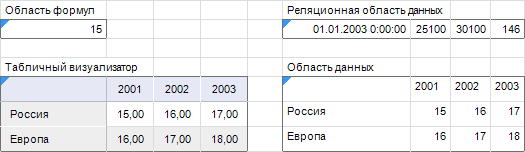
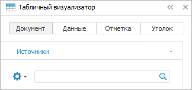
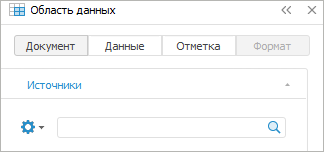

# Визуализация данных в виде таблиц

Визуализация данных в виде таблиц
-

# Визуализация данных в виде таблиц

В регламентном отчете существует несколько видов таблиц и областей для
 работы с данными:

	- [Табличный
	 визуализатор](DataTable.htm). Таблица с данными, построенная на основе
	 среза многомерного источника данных. Обладает расширенной функциональностью.
	 В отличие от области данных в табличном визуализаторе доступно использование
	 индикаторов, спарклайнов, трансформации, альтернативной иерархии,
	 объединения, группировки, расшифровки измерений с подстановками, настройки
	 агрегации на измерениях;

	- [Область
	 данных](UiReport_AreaData.htm). Устаревший тип таблицы с данными, построенной на
	 основе среза многомерного источника данных;

	- [Реляционная
	 область данных](../Relational_data_area/UIReport_Relational_data_area.htm). Область для отображения данных напрямую
	 из реляционных объектов, таких как таблицы данных, запросы и представления;

	- [Область
	 формул](../AreaFormula/UiReport_AreaFormula.htm). Диапазон ячеек, значения которого вычисляются по
	 единой формуле.

Каждая из указанных областей отмечается синим треугольником в верхнем
 левом углу:

Для определения типа области с данными необходимо выделить ячейку данной
 области и раскрыть боковую панель. В верхней части боковой панели будет
 отображено наименование типа выделенного объекта:

[Основные отличия
 табличного визуализатора от области данных](javascript:TextPopup(this))

	Табличный визуализатор является новой версией устаревшей области
	 данных, оставленной для совместимости с версиями Prognoz Platform.
	 Табличный визуализатор обладает более удобным интерфейсом и большими
	 аналитическими возможностями. При работе основные отличия таблиц заключаются
	 в следующем:

### Создание таблиц

		- Для создания табличного
		 визуализатора используются срезы, созданные на вкладке
		 «[Источники](../organizational_management/Starting.htm)»
		 группы вкладок «Документ»
		 боковой панели. Наименования среза по умолчанию: «ITEM1». Наименование
		 среза может быть изменено пользователем.

		- Для создания области данных
		 используются срезы, созданные на панели «[Источники и срезы данных](../Source/UiReport_Source.htm#old)».
		 Наименования среза по умолчанию: «Срез1». Наименование среза может
		 быть изменено пользователем.

### Работа с измерениями

		- Работа с измерениями табличного
		 визуализатора происходит на вкладке «[Отметка](../organizational_management/Starting.htm)»
		 боковой панели.

		- Работа с измерениями области
		 данных происходит на панели «[Источники и срезы данных](../Source/UiReport_Source.htm#old)»
		 или на вкладке «Отметка»
		 боковой панели.

### Работа с настройками

		- Работа с настройками табличного
		 визуализатора происходит на вкладке «[Таблица](../organizational_management/Starting.htm)»
		 боковой панели.

		- Работа с настройками области
		 данных происходит с помощью окна «[Свойства области
		 данных](Param/UiReport_AreaData_Param_Param.htm)». Для открытия данного диалога используйте команду
		 пункт «Параметры области данных»
		 в контекстном меню области данных.

См. также:

[Начало
 работы с инструментом «Отчёты» в веб-приложении](../../Web/organizational_management/Starting.htm) | [Визуализация
 данных в виде диаграмм](../Diagrams/UiReport_Diagrams_appointment.htm) | [Визуализация
 данных в виде карт](../Maps/svgmap.htm) | [Управление
 отметкой](../Reports/Selection.htm) | [Построение отчёта](../CreateReport.htm) | [Работа с готовым
 отчётом](../Reports/OperationReport/Work_witn_report.htm)

		Справочная
		 система на версию 10.9
		 от 18/08/2025,
		 © ООО «ФОРСАЙТ»,
