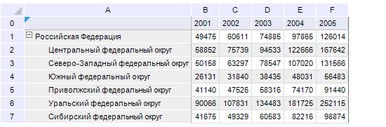
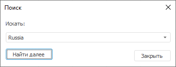
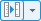

# Область данных

Область данных
-

# Область данных

Область данных. Устаревший тип
 таблицы с данными, построенной на основе среза. В «Форсайт. Аналитическая платформа»
 используется только в инструменте «[Отчеты](../../UiReport_purpose.htm)»
 и рассчитывается только с помощью формул.

Совет. Для создания
 новых таблиц используйте [табличный визуализатор](DataTable.htm).
 Для определения типа таблицы обратитесь к статье «[Работа
 с таблицами](Table_Types.htm)».

## Операции над областью данных

[Создание
 области данных](javascript:TextPopup(this))

	Для создания области данных используйте панель «[Источники и срезы данных](../Source/UiReport_Source.htm#old)»:

		- Добавьте источник данных на указанную панель одним из способов:

			- перетащите выбранный на панели «[Репозиторий](../organizational_management/Starting.htm)»
			 источник данных на панель «[Источники и срезы
			 данных](../Source/UiReport_Source.htm#old)», используя механизм Drag&Drop;

			- нажмите кнопку  «Добавить источник данных»
			 или выполните одноименную команду контекстного меню свободной
			 области панели «[Источники
			 и срезы данных](../Source/UiReport_Source.htm#old)»;

		- Добавьте срез источника данных на панели «[Источники и срезы данных](../Source/UiReport_Source.htm#old)»:

			- выделите добавленный источник данных и нажмите кнопку
			  «Добавить срез»;

			- выполните команду «Добавить
			 срез» контекстного меню добавленного источника данных;

		- Добавьте область данных. Для этого перенесите добавленный
		 срез с панели «[Источники
		 и срезы данных](../Source/UiReport_Source.htm#old)» на лист отчета, используя механизм
		 Drag&Drop.

	Примечание.
	 В отличие от [табличного визуализатора](DataTable.htm)
	 для созданных объектов области данных и ее среза на панели «[Источники
	 и срезы данных](../Source/UiReport_Source.htm#old)» будет доступно контекстное меню.

	Для определения параметров области данных используйте окно «[Свойства
	 области данных](Param/UiReport_AreaData_Param.htm)».

	После определения параметров области данных для ячеек, входящих
	 в область данных, будет отображаться граница с голубым треугольником
	 в левом верхнем углу:

	

	Чтобы отобразить данные в области данных [обновите
	 отчет](../Reports/OperationReport/UiReport_Reports_Operation_Execute.htm).

[Создание
 копии области данных](javascript:TextPopup(this))

	Для создания копии области данных:

		- выделите любую из ячеек копируемой области данных и выполните
		 команду контекстного меню «Создать
		 копию»;

		- выберите область данных на панели «[Источники и срезы данных](../Source/UiReport_Source.htm#old)»
		 и выполните команду контекстного меню «Создать
		 копию».

	Примечание.
	 Если на листе отчета выделены ячейки нескольких областей данных, при
	 использовании команды «Создать копию»
	 произойдет копирование той области данных, которая была создана раньше.

	После выполнения действия появится окно «Выбор
	 диапазона». Введите в нем диапазон ячеек, на котором будет
	 располагаться копия области данных. Диапазон можно ввести, выделив
	 соответствующий диапазон на листе отчета, или задать вручную.

[Отображение/скрытие
 области данных](javascript:TextPopup(this))

	Для отображения/скрытия области данных в окне «Источники
	 и срезы данных» нажмите кнопку  на панели
	 инструментов в окне «Источники и
	 срезы данных». В результате под срезами будут отображены/скрыты
	 области данных, в которых они расположены.

[Вычисление
 области данных](javascript:TextPopup(this))

	Для вычисления области данных на листе отчета:

		- отметьте любую из ячеек области данных и выполните команду
		 контекстного меню «Вычислить
		 область данных» ячейки;

		- выберите область данных на панели «[Источники и срезы данных](../Source/UiReport_Source.htm#old)»
		 и выполните команду контекстного меню «Вычислить»;

		- [обновите
		 отчет](../Reports/OperationReport/UiReport_Reports_Operation_Execute.htm).

	Примечание.
	 Возможна настройка [автоматического
	 вычисления](../Reports/OperationReport/UiReport_Reports_Operation_Execute.htm#upgrade) (обновления) области данных.

[Редактирование
 параметров области данных](javascript:TextPopup(this))

	Для редактирования параметров области данных:

		- выделите любую из ячеек области и выполните команду контекстного
		 меню «Параметры области данных»;

		- выделите область данных на панели «[Источники и срезы данных](../Source/UiReport_Source.htm#old)»
		 и выполните команду контекстного меню «Параметры
		 области данных».

	После выполнения любого действия появится окно «[Свойства
	 области данных](Param/UiReport_AreaData_Param.htm)».

[Расширение/уменьшение
 области данных](javascript:TextPopup(this))

	При вычислении область данных занимает необходимое количество ячеек,
	 то есть автоматически увеличивается или уменьшается в зависимости
	 от выбранной в срезе отметки.

	В области данных можно добавлять и удалять [строки](../Table/OperationRow/UiReport_Table_Row.htm)/[столбцы](../Table/OperationColumn/UiReport_Table_Column.htm).

### Особенности при расширении/уменьшении области данных

	Если в область данных была добавлена [область
	 формул](../AreaFormula/UiReport_AreaFormula.htm) или [реляционная
	 область данных](../Relational_data_area/UIReport_Relational_data_area.htm), то при снятии отметки с шапки/боковика области
	 данных область формул и реляционная область данных будут удалены.

	При добавлении столбцов/строк
	 учитывайте следующие особенности:

		- вставка столбцов справа (слева) от крайнего правого (левого)
		 столбца области данных не расширяет область данных;

		- вставка строк выше (ниже) от крайней верхней (нижней) строки
		 области данных не расширяет область данных.

	При снятии отметки с измерений
	 область данных будет уменьшаться по следующим правилам:

		- при снятии отметки с измерений, находящихся в [боковике](DataTable.htm),
		 нижняя граница области данных смещается к верхней границе области
		 данных;

		- при снятии отметки с измерений, находящихся в [шапке](DataTable.htm),
		 правая граница области данных смещается к левой границе области
		 данных;

		- при снятии отметки с измерений, находящихся [в
		 шапке и боковике](DataTable.htm), область данных сжимается до нулевых размеров;

		- при снятии отметки с фиксированных измерений граница области
		 данных не изменяется.

	Если области данных расположены
	 друг под другом (либо друг за другом):

		- при снятии отметки с шапки/боковика у первой области и последующего
		 обновления отчета, граница первой области расширяется в зависимости
		 от области ниже неё, либо от области правее неё;

		- при снятии отметки с шапки/боковика у последней области
		 и последующего обновления отчета, границы области выше неё сжимаются
		 до размеров последней области;

		- при снятии отметки с шапки/боковика у первой области и последующего
		 обновления отчета, первая область перестраивается следующим образом:
		 правая граница области данных сместится к левой границе области
		 данных;

		- при снятии отметки с шапки/боковика у последней области
		 и последующего обновления отчета, область выше неё перестраивается
		 следующим образом: правая граница области данных сместится к левой
		 границе области данных;

		- при снятии отметки с шапки/боковика у первой области и последующего
		 обновления отчета, граница первой области данных не изменяется;

		- при снятии отметки с шапки/боковика у последней области
		 и последующего обновления отчета, границы областей данных выше
		 неё не изменяются.

	Если для области данных заданы [настройки
	 размещения](Param/Order/UiReport_AreaData_Param_Order.htm):

		- если включено отображение данных и отключено отображение
		 заголовка столбцов/строк, то при снятии отметки с боковика/шапки
		 граница области данных сжимается до одной пустой ячейки. Если
		 снимаем отметку с шапки/боковика, граница области данных сжимается
		 до строки с заголовками боковика/шапки;

		- если включено отображение заголовков, но отключено отображение
		 данных, то при снятии отметки с шапки/боковика граница области
		 данных сжимается до столбца/строки с боковиком/шапкой;

		- если отключено отображение заголовков и включено отображение
		 только данных, то при снятии отметки с шапки/боковика граница
		 области данных сжимается до одной пустой ячейки.

	Если диапазон области данных целиком используется в качестве [исходных
	 данных диаграммы](../Diagrams/UiDiagrams_Report_create_source.htm#from_datasheet) и свойству [IPrxReportOptions.CorrectChartRanges](KeReport.chm::/Interface/IPrxReportOptions/IPrxReportOptions.CorrectChartRanges.htm)
	 было присвоено значение «True»,
	 то при снятии отметки с боковика/шапки области данных и последующем
	 добавлении отметки диапазон диаграммы корректно восстановится.

[Поиск
 области данных](javascript:TextPopup(this))

	Для поиска области данных на листе отчета нажмите кнопку  на панели инструментов,
	 расположенной на панели «[Источники
	 и срезы данных](../Source/UiReport_Source.htm#old)». Откроется окно «Поиск»:

	

	В области «Искать» введите
	 название источника данных. Если найден источник с совпадающим названием,
	 он будет выделен в списке.

	После нажатия кнопки «Найти далее»
	 будет выделен следующий источник с совпадающим названием.

[Удаление
 области данных](javascript:TextPopup(this))

	Для удаления области данных:

		- отметьте любую из ячеек области данных и выполните команду
		 контекстного меню «Удалить область
		 данных» ячейки;

		- выберите область данных на панели «[Источники и срезы данных](../Source/UiReport_Source.htm#old)»
		 и выполните команду контекстного меню «Удалить».

	При удалении строк/столбцов на листе проверьте, не входят ли в удаляемый
	 диапазон области данных. При вхождении одной и более областей данных
	 в удаляемый диапазон выдается сообщение о подтверждение операции.
	 При подтверждении области данных будут удалены как с листа, так и
	 из отчета. Удаленные таким образом области данных не отображаются
	 на боковой панели и на панели «Источники
	 и срезы данных».

[Сохранение
 данных в источник](javascript:TextPopup(this))

	Регламентный отчет позволяет [сохранять
	 измененные данные](../Reports/OperationReport/Save_Report.htm) в источник.

[Пересчет
 единиц изменения области данных](javascript:TextPopup(this))

	[Пересчет
	 единиц измерения области данных](uinavobj.chm::/Units/Units.htm) позволяет отображать данные, сохраненные
	 в разных масштабах, в одинаковом масштабе.

	Пересчет единиц доступен, если в качестве [источника
	 среза данных](../Source/UiReport_Source.htm) регламентного отчета используется [база данных временных рядов](uidw.chm::/UiDw_Title.htm).

	Для запуска пересчета единиц измерения области данных нажмите кнопку
	  «Пересчет единиц
	 измерения», расположенную на панели инструментов панели «[Источники
	 и срезы данных](../Source/UiReport_Source.htm#old)».

	Примечание.
	 В зависимости от размера окна регламентного отчета кнопка «Пересчет
	 единиц измерения» может быть скрыта. Для перерасчета единиц
	 измерения нажмите кнопку «Свойства
	 панели инструментов» на [панели](../Source/UiReport_Source.htm)
	 и выберите в раскрывающемся списке пункт «Пересчет
	 единиц измерения».

	При нажатии на кнопку 
	 «Пересчет единиц измерения»
	 производится нормализация данных. В раскрывающемся меню кнопки «Пересчет единиц измерения» будет
	 отмечен пункт «Нормализовать».
	 Остальные пункты данного меню соответствуют элементам справочника
	 единиц измерений для базы данных временных рядов, являющегося источником
	 данных отчета. Выбор конкретной единицы измерения для нормализации
	 данных осуществляется путем ее отметки в меню.

	При повторном нажатии на кнопку «Пересчет
	 единиц измерения» пересчет не ведется.

[Отображение
 прав доступа к данным](javascript:TextPopup(this))

	Если в качестве [источника
	 среза данных](../Source/UiReport_Source.htm) регламентного отчета выступает [база данных временных рядов](uidw.chm::/UiDw_Title.htm),
	 то возможно отображение прав доступа к данным.

См. также:

[Начало
 работы с инструментом «Отчёты» в веб-приложении](../../Web/organizational_management/Starting.htm) | [Табличный
 визуализатор](DataTable.htm) | [Реляционная
 область данных](../Relational_data_area/UIReport_Relational_data_area.htm) | [Область
 формул](../AreaFormula/UiReport_AreaFormula.htm) | [Расширенная
 аналитика](../Table/AdvancedAnalytics.htm) | [Построение отчёта](../CreateReport.htm) | [Работа с готовым
 отчётом](../Reports/OperationReport/Work_witn_report.htm)

		Справочная
		 система на версию 10.9
		 от 18/08/2025,
		 © ООО «ФОРСАЙТ»,
