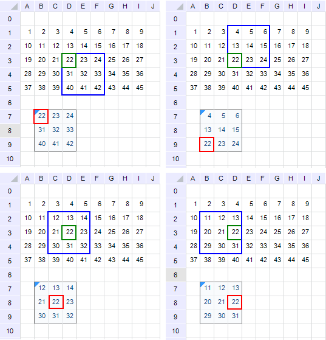
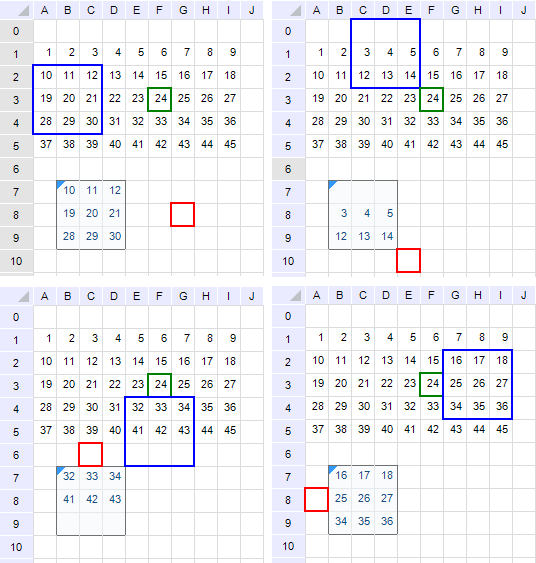

# Особенности работы

Особенности работы
-

# Особенности работы

Выбор формулы и базовой
 ячейки определяют расчетные формулы для всей области формул.

В качестве базовой ячейки можно определить любую ячейку на листе, находящуюся
 как в области формул, так и за ее пределами. Если базовая ячейка задана
 внутри области формул, то данная ячейка будет содержать исходную формулу.

Изменение формул в ячейках области формул рассмотрено на примерах, приведенных
 ниже.

## Пример 1. Выбор базовой ячейки внутри области формул

Была создана область формул (B7:D9),
 выделенная серым цветом. Базовая ячейка
 выделена красным контуром. В окне «[Параметры области
 формул](UiReport_AreaFormula.htm#create)» в качестве формулы
 введено выражение «=D3».

В базовой ячейке будет находиться введенная формула без изменений. Синим
 контуром выделены ячейки, адреса которых были присвоены ячейкам области
 формул.

Ячейка с адресом D3 выделена
 зеленым цветом:

## Пример 2. Выбор базовой ячейки за пределами области формул

Была создана область формул (B7:D9),
 выделенная серым цветом. Базовая ячейка
 выделена красным контуром. В окне «[Параметры области
 формул](UiReport_AreaFormula.htm#create)» в качестве формулы
 введено выражение «=F3».

Синим контуром выделены ячейки, адреса которых были присвоены ячейкам
 области формул.

Ячейка с адресом F3 выделена
 зеленым цветом:

## Сохранение ссылок в формулах

В приведенных выше примерах видно, что происходит изменение ссылок в
 формулах. Если требуется, чтобы ссылки не изменялись, добавьте знак доллара
 ($) перед той частью ссылки, которая
 не должна изменяться.

Например, если необходимо создать абсолютную ссылку на ячейку C1, поместите знак доллара следующим
 образом « =$C$1». После применения
 такой формулы все ячейки области формул будут заполнены содержимым ячейки
 С1, независимо от того где выбрана
 базовая ячейка.

См. также:

[Начало
 работы с инструментом «Отчёты» в веб-приложении](../../Web/organizational_management/Starting.htm) | [Область формул](UiReport_AreaFormula.htm)

		Справочная
		 система на версию 10.9
		 от 18/08/2025,
		 © ООО «ФОРСАЙТ»,
