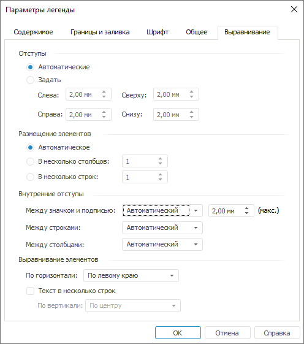

# Настройка выравнивания: Регламентный отчёт, настольное приложение

Настройка выравнивания: Регламентный отчёт, настольное приложение
-

# Настройка выравнивания

Для настройки выравнивания общей легенды перейдите на вкладку «Выравнивание» окна «Параметры
 легенды».

[Для открытия
 окна «Параметры легенды»](javascript:TextPopup(this))

	Выполните команду «Параметры легенды»
	 в контекстном меню [общей
	 легенды диаграммы](UiDiagrams_Legend.htm).

Задайте на вкладке следующие параметры:

[Отступы](javascript:TextPopup(this))

	Выберите способ задания отступов от краев внешней легенды:

		- Автоматические.
		 Отступы формируются в автоматическом режиме;

		- Задать. При установке
		 переключателя задайте отступы в полях «Слева»,
		 «Справа», «Сверху»
		 и «Снизу».

	Примечание.
	 Минимальное значение в полях ввода равно нулю.

[Размещение элементов](javascript:TextPopup(this))

	Для задания размещения элементов в общей легенде выберите переключатель:

		- Автоматическое.
		 Количество строк и столбцов подбирается в зависимости от количества
		 элементов общей легенды и ее размеров;

		- В несколько столбцов.
		 Укажите количество столбцов для размещения элементов легенды.
		 При любом размере легенды будет использоваться заданное количество
		 столбцов;

		- В несколько строк.
		 Укажите количество строк для размещения элементов легенды. При
		 любом размере легенды будет использоваться заданное количество
		 строк.

[Внутренние отступы](javascript:TextPopup(this))

	Определите внутренние отступы в общей легенды:

		- Между значком и подписью.
		 Задайте интервал между значком и подписью:

			- Автоматический.
			 При сжатии легенды интервал между значком и подписью определяется
			 значениями: минимальное – 0 мм, максимальное – значение, заданное
			 в поле для ввода вещественных значений;

			- Заданный. Заданный
			 в поле для ввода вещественных значений интервал между значком
			 и подписью при любых условиях остается неизменным;

		- Между строками.
		 Задайте отступ между строками:

			- Автоматический.
			 Отступы подбираются в зависимости от количества элементов
			 внешней легенды и ее размеров;

			- Заданный. Задайте
			 отступ в появившемся поле для ввода вещественных значений;

		- Между столбцами.
		 Задайте отступ между столбцами:

			- Автоматический.
			 Отступы подбираются в зависимости от количества элементов
			 внешней легенды и ее размеров;

			- Заданный. Задайте
			 отступ в появившемся поле для ввода вещественных значений.

	Примечание.
	 Доступен ввод значений [в
	 разных системах измерения](UiNav.chm::/GUI/Format/Different_units.htm). В поле ввода редактора
	 отображаются значения в единицах измерения, соответствующих текущим
	 региональным настройкам операционной системы.

[Выравнивание
 элементов](javascript:TextPopup(this))

	Определите выравнивание элементов общей легенды:

		- По горизонтали.
		 В раскрывающемся списке выберите способ выравнивания элементов
		 легенды по горизонтали: по левому краю, по центру, по правому
		 краю;

		- Текст в несколько строк.
		 При установленном флажке наименования элементов общей легенды
		 будут располагаться в несколько строк, если текст не может быть
		 размещен в одну строку. При снятом флажке текст всегда будет занимать
		 одну строку;

		- По вертикали. Определяет
		 положение маркера относительно многострочного текста: по верхнему
		 краю, по центру, по нижнему краю.

	Примечание.
	 Параметр «По вертикали» доступен,
	 если установлен флажок «Текст в несколько
	 строк».

	Пример выравнивания многострочного текста по верхнему краю (изображение
	 слева), по центу (изображение в центре) и по нижнему краю (изображение
	 справа):

	

## Особенности размещения элементов внутренней и внешней легенд

Если значения всех внутренних отступов заданы как автоматические, то
 при изменении размера легенды (как внешней, так и внутренней) по высоте
 будет происходить перенос элементов легенды, непомещающихся в свободную
 область, следующим образом:

	- при сжатии по горизонтали элементы легенды будут выстроены в
	 ряд;

	- при сжатии по вертикали элементы легенды будут располагаться
	 по столбцам.

См. также:

[Начало
 работы с инструментом «Отчёты» в веб-приложении](../../Web/organizational_management/Starting.htm) | [Настройка
 общей легенды диаграмм](UiDiagrams_Legend.htm)

		Справочная
		 система на версию 10.9
		 от 18/08/2025,
		 © ООО «ФОРСАЙТ»,
