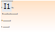
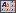
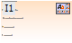

# Настройка общей легенды диаграмм

Настройка общей легенды диаграмм
-

# Настройка общей легенды диаграмм

Объект «Легенда диаграмм» предназначен
 для создания легенды диаграмм как отдельного объекта, не привязанного
 к конкретной диаграмме. Легенда может включать в себя данные нескольких
 диаграмм, расположенных в отчете.

Для добавления на лист отчета легенды диаграмм:

	- Определите область, в которой будет располагаться
	 легенда. Для этого:

		- выберите ячейку листа отчета, которая будет являться верхним
		 левым углом легенды. Такой способ позволяет создать легенду стандартных
		 размеров;

		- нажмите кнопку мыши в ячейке, которая будет являться
		 верхним левым углом легенды. Удерживая нажатой кнопку
		 мыши, переместите курсор мыши к ячейке, которая будет являться
		 нижним правым углом легенды. Такой способ позволяет установить
		 пользовательские размеры легенды.

	- Выберите пункт  «Общая легенда диаграмм», расположенный
	 в раскрывающемся меню «Легенда»
	 в группе «Диаграммы» на вкладке
	 «Вставка» ленты инструментов.

Будет открыто окно «Параметры легенды»,
 содержащее вкладки:

	- для настройки параметров общей легенды:

		- [Содержимое](UiDiagrams_Legend_content.htm);

		- [Общее](UiDiagrams_Legend_common.htm);

	- для настройки оформления общей легенды:

		- [Границы и заливка](UiDiagrams_Legend_border.htm);

		- [Шрифт](UiDiagrams.chm::/Tuning_format/Format_Title/UiDiagrams_FormatTitle_type.htm);

		- [Выравнивание](ExternLegend_Align.htm).

## Настройка стиля общей легенды диаграмм

Для единого оформления общих легенд диаграмм, применяемого в пределах
 текущего отчёта, используйте стиль легенды:

[Создание
 стиля](javascript:TextPopup(this))

	Для создания стиля оформления общей легенды диаграмм:

		- Выделите общую легенду диаграмм.

		- Перейдите на вкладку «Легенда»
		 ленты инструментов.

		- Нажмите кнопку , расположенную в группе
		 «Стиль легенды».

		- Выберите пункт «Создать
		 новый стиль».

		- В открывшемся окне введите наименование стиля.

	В группу «Стиль легенды»
	 будет добавлен шаблон стиля. Например:

	

	Шаблон содержит заданные настройки оформления общей легенды:

		- [граница и заливка
		 легенды](UiDiagrams_Legend_border.htm);

		- [шрифт
		 текста легенды](UiDiagrams.chm::/Tuning_format/Format_Title/UiDiagrams_FormatTitle_type.htm);

		- [выравнивание элементов
		 легенды](Aligning_diagram_components.htm).

	Для использования единого оформления общей легенды диаграмм в нескольких
	 регламентных отчетах [экспортируйте](#export_style) созданный
	 стиль во внешние стили.

[Применение
 стиля](javascript:TextPopup(this))

	Для применения стиля к общей легенде диаграмм:

		- Выделите общую легенду диаграмм.

		- Перейдите на вкладку «Легенда»
		 ленты инструментов. Затем:

			- щёлкните по стилю в группе «Стиль легенды»;

			- выполните команду «Применить»
			 в контекстном меню стиля.

	Выбранный стиль будет применён к оформлению общей легенды диаграмм.

[Переименование
 стиля](javascript:TextPopup(this))

	Для переименования стиля общей легенды диаграмм:

		- Выделите общую легенду диаграмм.

		- Перейдите на вкладку «Легенда»
		 ленты инструментов.

		- Выберите необходимый стиль в группе «Стиль
		 легенды».

		- Выполните команду «Переименовать»
		 в контекстном меню стиля.

	В открывшемся окне введите новое наименование стиля.

[Удаление
 стиля](javascript:TextPopup(this))

	Для удаления стиля общей легенды диаграмм:

		- Выделите общую легенду диаграмм.

		- Перейдите на вкладку «Легенда»
		 ленты инструментов.

		- Выберите необходимый стиль в группе «Стиль
		 легенды».

		- Выполните команду «Удалить»
		 в контекстном меню стиля.

	Будет запрошено подтверждение об удалении выбранного стиля.

Для единого оформления общих легенд диаграмм в нескольких регламентных
 отчетах используйте [таблицу
 стилей](UiNav.chm::/StylesTable/StylesTablePurpose.htm):

[Настройка
 внешних стилей](javascript:TextPopup(this))

	Для оформления общей легенды диаграмм можно использовать внешние
	 стили, сохранённые в [таблице
	 стилей](UiNav.chm::/StylesTable/StylesTablePurpose.htm):

		- Выделите общую легенду диаграмм.

		- Перейдите на вкладку «Легенда»
		 ленты инструментов.

		- Нажмите кнопку , расположенную в группе
		 «Стиль легенды».

		- Выберите пункт «Настроить
		 внешние стили». Будет открыт диалог «Параметры».

		- Перейдите на вкладку «[Настройки](../Reports/UiReport_Reports_Param3.htm)».
		 В раскрывающемся списке «Набор
		 стилей оформления» выберите [таблицу
		 стилей](UiNav.chm::/StylesTable/StylesTablePurpose.htm), содержащую стили общих легенд диаграмм.

	В группу «Стиль легенды»
	 будут добавлены стили из таблицы стилей, которые можно применить для
	 оформления общей легенды диаграмм.

[Экспорт
 во внешние стили](javascript:TextPopup(this))

	Для экспорта созданного стиля общей легенды диаграмм во внешние
	 стили:

		- Выделите общую легенду диаграмм.

		- Перейдите на вкладку «Легенда»
		 ленты инструментов.

		- Выберите стиль в группе «Стиль
		 легенды», затем:

			- нажмите кнопку , расположенную в
			 группе «Стиль легенды»,
			 и выберите пункт «Экспорт
			 во внешние стили»;

			- выполните команду «Экспорт
			 во внешние стили» в контекстном меню стиля.

		- В открывшемся окне выберите [таблицу
		 стилей](UiNav.chm::/StylesTable/StylesTablePurpose.htm).

	Выбранный стиль будет экспортирован в заданную [таблицу стилей](UiNav.chm::/StylesTable/StylesTablePurpose.htm).

	При подключении к отчёту таблицы стилей, в которую был произведён
	 экспорт, в правом верхнем углу шаблона стиля добавится значок  и
	 шаблон стиля примет вид:

	

	Если идентификатор экспортируемого стиля совпадает с идентификатором
	 стиля из [таблицы
	 стилей](UiNav.chm::/StylesTable/StylesTablePurpose.htm),
	 будет выдано сообщение для выбора действия:

	

	Установите флажок «Применить во
	 всех подобных случаях», чтобы выбранное действие применялось
	 во всех подобных ситуациях.

	Нажмите одну из кнопок:

		- Оставить оба. Экспортируемый
		 стиль будет добавлен в таблицу стилей с новым уникальным идентификатором;

		- Заменить. Стиль
		 в текущей таблице стилей будет заменён на экспортируемый;

		- Пропустить. Стиль
		 не будет экспортирован в таблицу стилей;

		- Отмена. Операция
		 экспорта стиля будет отменена.

[Отключение
 внешних стилей](javascript:TextPopup(this))

	Для отключения внешней таблицы стилей:

		- Выделите общую легенду диаграмм.

		- Перейдите на вкладку «Легенда»
		 ленты инструментов.

		- Нажмите кнопку , расположенную в группе
		 «Стиль легенды».

		- Выберите пункт «Отключить
		 внешние стили».

	Внешняя таблица стилей будет отключена. Перед отключением будет
	 предложено скопировать стили из внешней таблицы в текущий отчет.

См. также:

[Начало
 работы с инструментом «Отчёты» в веб-приложении](../../Web/organizational_management/Starting.htm) | [Визуализация
 данных в виде диаграмм](UiReport_Diagrams_appointment.htm)

		Справочная
		 система на версию 10.9
		 от 18/08/2025,
		 © ООО «ФОРСАЙТ»,
