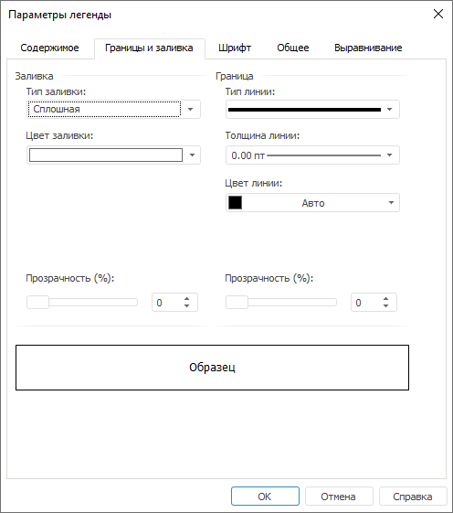

# Настройка границы и заливки: Регламентный отчёт, настольное приложение

Настройка границы и заливки: Регламентный отчёт, настольное приложение
-

# Настройка границы и заливки

Для настройки границ и заливки общей легенды перейдите на вкладку «Границы и заливка» окна «Параметры
 легенды».

[Для открытия
 окна «Параметры легенды»](javascript:TextPopup(this))

	Выполните команду «Параметры легенды»
	 в контекстном меню [общей
	 легенды диаграммы](UiDiagrams_Legend.htm).

Задайте на вкладке следующие параметры:

[Заливка](javascript:TextPopup(this))

	Задайте формат заливки легенды. В раскрывающемся списке «Тип
	 заливки» выберите тип заливки, в зависимости от выбранного
	 типа меняется набор настраиваемых параметров:

		- Нет. При выборе
		 данного типа заливка не используется;

		- Сплошная. В раскрывающейся
		 палитре «Цвет заливки»
		 выберите цвет, который будет использоваться в качестве сплошной
		 заливки, либо выберите новый цвет в расширенной палитре цветов,
		 вызываемой при нажатии на кнопку «Другой»;

		- Градиентная. Определите
		 следующие параметры:

			- Цвет 1. В раскрывающейся
			 палитре выберите начальный цвет градиента;

			- Цвет 2. В раскрывающейся
			 палитре конечный цвет градиента;

			- Угол градиента.
			 Задайте угол наклона градиента. Допустимые значения [-359;
			 359];

		- С изображением.
		 Данный формат позволяет в качестве заливки использовать указанное
		 изображение. Для определения изображения в поле «Файл
		 с изображением» нажмите кнопку ;

		- Со штриховкой. Данный
		 формат позволяет применить сплошную заливку и штриховку одновременно.
		 Определите следующие параметры:

			- Цвет заливки.
			 В раскрывающейся палитре выберите цвет заливки;

			- Цвет штриховки.
			 В раскрывающейся палитре выберите цвет штриховки;

			- Штриховка. В
			 раскрывающемся списке выберите тип штриховки;

		- Прозрачность. Определите
		 прозрачность заливки в процентах. 100% соответствует полной
		 прозрачности (заливка станет невидимой), 0% соответствует полной
		 непрозрачности. Значение задается с помощью ползунка или с помощью
		 редактора чисел.

	Примечание.
	 Для формата заливки «С изображением»
	 параметр отсутствует.

[Граница](javascript:TextPopup(this))

	В данной группе задайте параметры границ объекта «Легенда
	 диаграмм»:

		- Тип линии. В раскрывающемся
		 списке выберите тип линии;

		- Толщина линии. В
		 раскрывающемся списке выберите необходимую толщину линии. При
		 выборе пункта «Пользовательский»
		 будет открыто окно «Толщина линии»,
		 в котором можно с помощью редактора чисел или вручную задать требуемую
		 толщину линий;

	Примечание.
	 Толщина линий может задаваться [в разных единицах
	 измерения](UiNav.chm::/GUI/Format/Different_units.htm), однако значение в поле ввода будет всегда
	 отображаться в единицах point (1/72 дюйма).

		- Цвет линии. В раскрывающейся
		 палитре выберите цвет линии границы, либо выберите новый
		 цвет в расширенной палитре цветов, вызываемой при нажатии на кнопку
		 «Другой»;

		- Прозрачность. Определите
		 прозрачность линии. 100% соответствует полной прозрачности (линия
		 станет невидимой), 0% соответствует полной непрозрачности. Значение
		 задается с помощью ползунка или с помощью редактора чисел.

[Образец](javascript:TextPopup(this))

	В данной области будет отображен внешний вид заливки легенды, который
	 она примет после применения установленных параметров.

	Проверьте, соответствует ли внешний вид легенды ожидаемому результату.

См. также:

[Начало
 работы с инструментом «Отчёты» в веб-приложении](../../Web/organizational_management/Starting.htm) | [Настройка
 общей легенды диаграмм](UiDiagrams_Legend.htm)

		Справочная
		 система на версию 10.9
		 от 18/08/2025,
		 © ООО «ФОРСАЙТ»,
