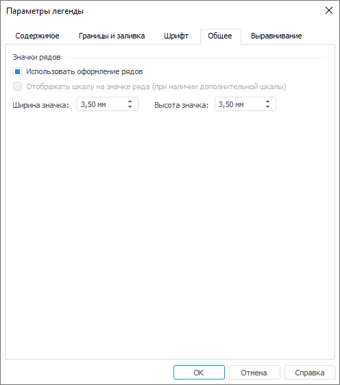

# Общие настройки легенды

Общие настройки легенды
-

# Общие настройки легенды

Для определения формата значков легенды перейдите на вкладку «Общее» окна «Параметры
 легенды».

[Для открытия
 окна «Параметры легенды»](javascript:TextPopup(this))

	Выполните команду «Параметры легенды»
	 в контекстном меню [общей
	 легенды диаграммы](UiDiagrams_Legend.htm).

Совет. Для быстрой
 настройки формата значков общей легенды диаграммы используйте флажки «Обозначение шкалы на значке» и «Тип ряда на значке», расположенные
 на вкладке «Легенда» ленты инструментов.

Задайте на вкладке следующие параметры формата значков в группе «Значки рядов»:

[Использовать
 оформление рядов](javascript:TextPopup(this))

	При установленном флажке к рядам легенды будет применено оформление
	 рядов на диаграмме.

	Примечание.
	 Параметр «Использовать оформление
	 рядов» доступен только для легенд диаграмм, содержащих точечные
	 и линейные ряды, при установленном флажке «Отображать
	 значки рядов» на вкладке «[Содержимое](UiDiagrams_Legend_content.htm)».

[Отображать шкалу
 на значке ряда](javascript:TextPopup(this))

	При установке флажка у каждого элемента в легенде значком будет
	 отражено, по какой оси расположен ряд.

	Примечание.
	 Параметр «Отображать шкалу на значке
	 ряда» доступен, если диаграммы, входящие в общую легенду, используют
	 [дополнительную
	 ось](uidiagrams.chm::/Params_diagram/UiDiagrams_Axis.htm).

[Ширина и высота
 значка](javascript:TextPopup(this))

	C помощью редактора чисел установите ширину и высоту значка.

	Примечание.
	 Доступен ввод значения [в
	 разных системах измерения](UiNav.chm::/GUI/Format/Different_units.htm). В поле ввода редактора
	 отображаются значения в единицах измерения, соответствующих текущим
	 региональным настройкам операционной системы.

См. также:

[Начало
 работы с инструментом «Отчёты» в веб-приложении](../../Web/organizational_management/Starting.htm) | [Настройка
 общей легенды диаграмм](UiDiagrams_Legend.htm)

		Справочная
		 система на версию 10.9
		 от 18/08/2025,
		 © ООО «ФОРСАЙТ»,
