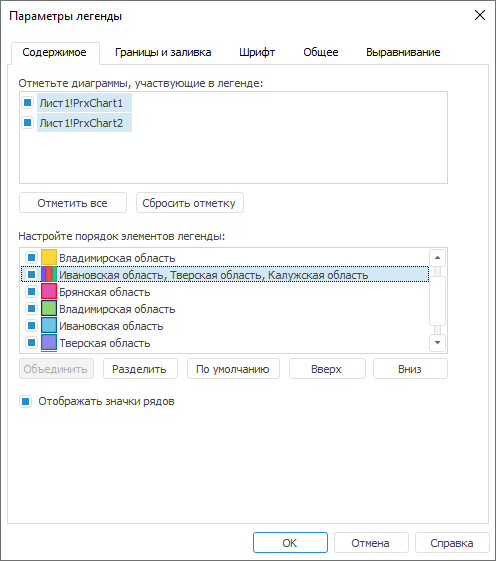

# Настройка содержимого

Настройка содержимого
-

# Настройка содержимого

Для настройки содержимого общей легенды перейдите на вкладку «Содержимое» окна «Параметры
 легенды».

[Для открытия
 окна «Параметры легенды»](javascript:TextPopup(this))

	Выполните команду «Параметры легенды»
	 в контекстном меню [общей
	 легенды диаграммы](UiDiagrams_Legend.htm).

Совет. Для быстрой
 настройки содержимого общей легенды диаграммы нажмите кнопку  «Выбрать
 данные», расположенную на вкладке «Легенда»
 ленты инструментов. Будет открыто окно «Параметры
 легенды» на вкладке «Содержимое».

Задайте на вкладке следующие параметры:

[Отметьте диаграммы,
 участвующие в легенде](javascript:TextPopup(this))

	В списке находятся все диаграммы, расположенные на листе отчета.
	 При вызове окна «Параметры легенды»
	 диаграммы, выделенные на листе отчета в момент создания легенды, автоматически
	 отмечаются в списке диаграмм, участвующих в легенде.

	Для снятия отметки со всех диаграмм:

		- нажмите кнопку «Сбросить
		 отметку»;

		- выполните команду контекстного меню «Сбросить
		 все».

	Для отметки всех диаграмм:

		- нажмите кнопку «Отметить
		 все»;

		- выполните команду контекстного меню «Отметить
		 все».

	Примечание.
	 Любое изменение состава легенды ведет к перестроению списка элементов
	 легенды.

[Настройте порядок
 элементов легенды](javascript:TextPopup(this))

	Список предназначен для настройки порядка элементов в легенде. Для
	 настройки порядка элементов в общей легенде доступны операции:

		- Изменение порядка элементов
		 легенды. Для перемещения выделенного элемента общей легенды:

			- перетащите его в требуемое положение, используя механизм
			 Drag&Drop;

			- нажмите кнопку «Вверх»/«Вниз» для перемещения элемента
			 легенды на одну позицию вверх/вниз;

			- выполните команду контекстного меню «Вверх»/«Вниз» элемента легенды для
			 перемещения его на одну позицию вверх/вниз;

		- Скрытие/отображение элементов
		 легенды. Снимите/установите флажки напротив элементов легенды,
		 которые необходимо скрыть/отобразить в общей легенде;

		- Объединение элементов легенды.
		 Для объединения элементов легенды в один:

			- Зажмите клавишу CTRL и щёлкайте по элементам легенды
			 из списка для выделения нескольких элементов. Для задания
			 диапазона элементов легенды выделите требуемый элемент в начале
			 диапазона и, удерживая зажатой клавишу SHIFT, щёлкните по
			 желаемому элементу в конце диапазона.

			- Выполните одно из действий:

				- нажмите кнопку «Объединить»;

				- выполните команду контекстного меню «Объединить».

	При объединении элементов происходит
	 изменение текста и значка. При объединении текста рядов используется
	 разделитель (по умолчанию - запятая). Для изменения разделителя выполните
	 команду контекстного меню «Изменить
	 разделитель». Откроется диалог «Разделитель
	 текста» для ввода нового разделителя. При изменении разделителя
	 будут изменены наименования объединенных элементов;

		- Разделение рядов.
		 Для разделения выделенного составного элемента на составляющие
		 части:

			- нажмите кнопку «Разделить»;

			- выполните команду контекстного меню «Разделить».

	Примечание.
	 Если элемент не является составным, то он не будет разделён на составляющие
	 части.

		- Восстановление исходного
		 состояния. Для разбиения всех элементов на составляющие
		 и установки исходного порядка элементов нажмите кнопку «По умолчанию».

[Отображать значки
 рядов](javascript:TextPopup(this))

	Флажок предназначен для отображения значков элементов в соответствии
	 с типом ряда в диаграмме.

	Если флажок снят, отображается маркер, закрашенный основным цветом
	 заливки ряда в диаграмме.

	При изменении состояния флажка значки элементов легенды в списке
	 будут обновлены.

См. также:

[Начало
 работы с инструментом «Отчёты» в веб-приложении](../../Web/organizational_management/Starting.htm) | [Настройка
 общей легенды диаграмм](UiDiagrams_Legend.htm)

		Справочная
		 система на версию 10.9
		 от 18/08/2025,
		 © ООО «ФОРСАЙТ»,
