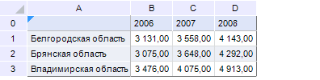
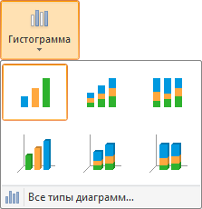
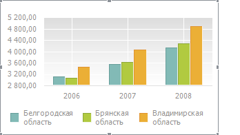

# Пример создания диаграммы

Пример создания диаграммы
-

# Пример создания диаграммы

Рассмотрим в качестве источника данных диаграммы данные, расположенные
 на листе отчета «Показатели»:

Для добавления на лист отчета диаграммы:

	- Отметьте диапазон ячеек B1:D3.

	- Выберите тип диаграммы с помощью кнопки «Гистограмма»,
	 расположенной в группе «Диаграммы»
	 на вкладке «Вставка» ленты
	 инструментов:

После выбора типа диаграммы будет открыт
 диалог «Исходные данные».

	- Определите параметры диаграммы:

	-

		- лист отчета: Показатели;

		- диапазон области данных: B1:D3;

		- диапазон наименования рядов: A1:A3;

		- диапазон наименования точек: B0:D0;

		- ряды в строках: Да
		 (флажок установлен);

		- автоматически изменять диапазоны: Да
		 (флажок установлен).

Нажмите кнопку «ОК».
 На листе отчета появится диаграмма следующего вида:

## Пример создания диаграммы на несвязном диапазоне

При использовании нескольких диапазонов (комбинированная область) для
 построения диаграммы ряды будут отражены в порядке выделения этих диапазонов.

Для построения используется несвязный диапазон, порядок выделения обозначен
 цифрами:

При создании диаграммы диапазоны наименований рядов также указываются
 в порядке выделения данных:

Диаграмма будет выглядеть следующим образом:

См. также:

[Начало
 работы с инструментом «Отчёты» в веб-приложении](../../Web/organizational_management/Starting.htm) | [Создание
 диаграммы](UiDiagrams_Report_create.htm)

		Справочная
		 система на версию 10.9
		 от 18/08/2025,
		 © ООО «ФОРСАЙТ»,
