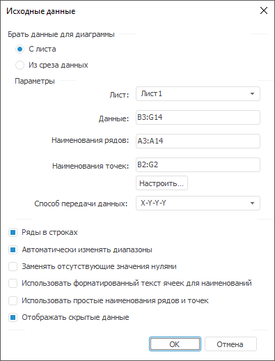

# Создание диаграммы

Создание диаграммы
-

# Создание диаграммы

Для добавления диаграммы на лист отчета:

	- выберите необходимый [тип
	 диаграммы](uidiagrams.chm::/type_diagrams/uidiagrams_type_diagrams.htm) в группе «Диаграммы»
	 на вкладке «Вставка» ленты
	 инструментов;

	- нажмите сочетание клавиш CTRL+ALT+D.

После выполнения одного из действий будет открыт диалог «[Исходные данные](UiDiagrams_Report_create_source.htm)»:

Задайте параметры [исходных
 данных](UiDiagrams_Report_create_source.htm) диаграммы и нажмите кнопку «ОК»
 для сохранения.

См. также:

[Начало
 работы с инструментом «Отчёты» в веб-приложении](../../Web/organizational_management/Starting.htm) | [Визуализация
 данных в виде диаграмм](UiReport_Diagrams_appointment.htm)

		Справочная
		 система на версию 10.9
		 от 18/08/2025,
		 © ООО «ФОРСАЙТ»,
