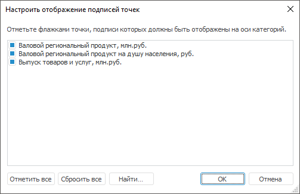
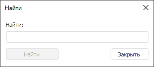
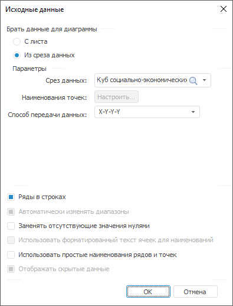
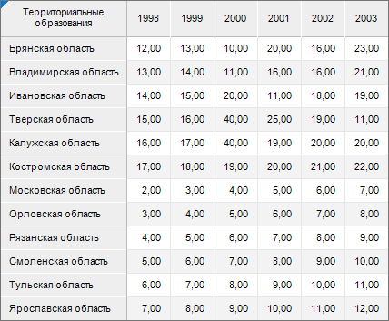
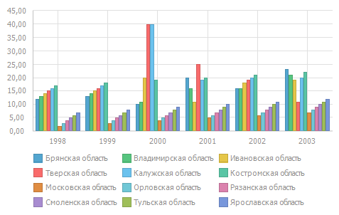
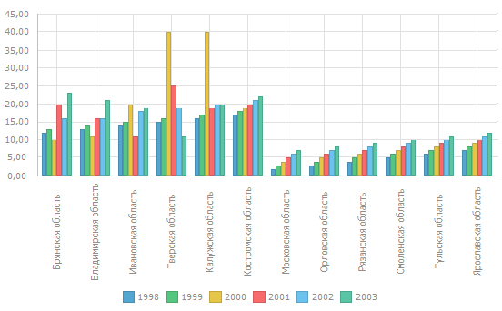
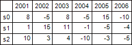
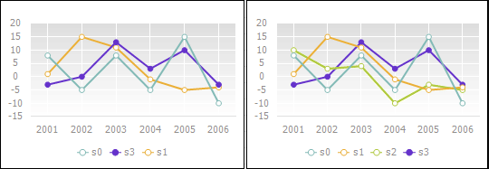
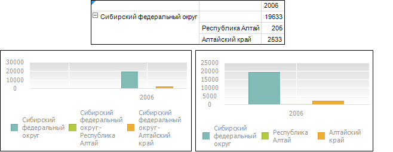
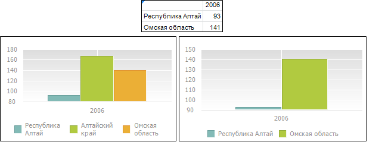

# Исходные данные: Регламентный отчёт, настольное приложение

Исходные данные: Регламентный отчёт, настольное приложение
-

# Исходные данные

Для заполнения и редактирования исходных данных диаграммы используйте
 диалог «Исходные данные».

[Для открытия
 диалога «Исходные данные»](javascript:TextPopup(this))

		- добавьте новую диаграмму на лист отчета, выбрав необходимый
		 [тип
		 диаграммы](UiDiagrams.chm::/type_diagrams/uidiagrams_type_diagrams.htm) в группе «Диаграммы»
		 на вкладке «Вставка» ленты
		 инструментов;

		- выберите готовую диаграмму выполните команду контекстного
		 меню диаграммы «Исходные данные».

	После выполнения одного из действий будет открыт диалог «Исходные
	 данные».

Диалог состоит из двух групп:

	- Брать данные для диаграммы.
	 Группа содержит переключатели и параметры для определения источника
	 данных диаграммы:

		- [С листа](#from_datasheet).
		 В качестве исходных данных будет использоваться выделенный диапазон
		 ячеек;

		- [Из
		 среза данных](#from_dataslice). В качестве исходных данных будет использоваться
		 срез источника данных;

Примечание.
 Внешний вид параметров группы зависит от выбранного источника данных.

	- [Параметры
	 данных диаграммы](#parameters). Группа содержит флажки для настройки
	 параметров данных диаграммы.

## С листа

Переключатель установлен по умолчанию. В качестве источника данных для
 диаграммы используется область, расположенная на листе отчета:

После установки переключателя определите следующие параметры:

[Лист](javascript:TextPopup(this))

	В раскрывающемся списке выберите лист с исходными данными.

[Данные](javascript:TextPopup(this))

	Задайте диапазон ячеек с данными для диаграммы.

	Диапазон ячеек может задаваться в виде комбинированной или прямоугольной
	 области. При использовании нескольких диапазонов ряды на диаграмме
	 будут отражены в порядке выделения этих диапазонов.

[Наименования
 рядов](javascript:TextPopup(this))

	Задайте диапазон ячеек с наименованиями рядов.

	Для корректного отображения горизонтальной оси и легенды диаграммы:

		- при задании вертикального диапазона наименований рядов установите
		 флажок «[Ряды
		 в строках](#series_in_rows)». Указанные наименования рядов будут отображаться
		 в легенде;

		- при задании горизонтального диапазона наименований рядов
		 снимите флажок «[Ряды
		 в строках](#series_in_rows)». Указанные наименования рядов будут отображаться
		 в легенде.

	Если диапазон наименований задан в виде открытого диапазона (весь
	 столбец или строка), то для наименования ряда будет использовано значение
	 в ячейке, находящейся на пересечении диапазона данных и диапазона
	 наименований рядов. Если для построения диаграммы используется нескольких
	 диапазонов, то диапазоны наименований рядов необходимо указывать в
	 том же порядке, что и выделение данных.

	Примечание.
	 Для [каскадной
	 диаграммы](uidiagrams.chm::/Type_diagrams/WaterFall_chart.htm) в легенде отображаются предопределенные
	 названия: «Увеличить», «Уменьшить» и «Итог».

	При задании диапазона ячеек с наименованиями рядов учитывайте следующие
	 особенности:

		- в [легенде диаграммы](UiDiagrams_Legend.htm)
		 не будет отображаться то наименование ряда, для которого в заданном
		 диапазоне отсутствует значение;

		- при использовании [объемной
		 гистограммы с группами](uidiagrams.chm::/Type_diagrams/3DHistogram_with_Groups.htm) в поле «Наименования
		 рядов» указываются ряды, которые будут располагаться по
		 оси рядов данных (Z);

		- при использовании [объемной
		 гистограммы с группами](uidiagrams.chm::/Type_diagrams/3DHistogram_with_Groups.htm) с накоплением в поле
		 «Наименования рядов» должен
		 быть указан диапазон ячеек, состоящий не менее чем из двух столбцов
		 (строк), последний из которых будет учитываться в накоплении.

[Наименования
 точек](javascript:TextPopup(this))

	Задайте диапазон ячеек с наименованиями точек.

	Для корректного отображения горизонтальной оси и легенды диаграммы:

		- при задании горизонтального диапазона наименований точек
		 установите флажок «[Ряды
		 в строках](#series_in_rows)». Указанные наименования точек будут отображаться
		 на горизонтальной оси диаграммы, если она присутствует;

		- при задании вертикального диапазона наименований точек снимите
		 флажок «[Ряды
		 в строках](#series_in_rows)». Указанные наименования точек будут отображаться
		 на горизонтальной оси диаграммы, если она присутствует.

	Если диапазон наименований задан в виде открытого диапазона (весь
	 столбец или строка), то для наименования точки будет использовано
	 значение в ячейке, находящейся на пересечении диапазона данных и диапазона
	 наименований точек.

	При задании диапазона ячеек с наименованиями точек учитывайте следующие
	 особенности:

		- [подпись](UiDiagrams.chm::/Property_diagramm/UiDiagrams_PropertyDiagramm_Label.htm)
		 точки не будет отображаться на диаграмме, если соответствующая
		 ячейка диапазона наименований точек не содержит значения (пуста);

		- при использовании [объемной
		 гистограммы с группами](uidiagrams.chm::/Type_diagrams/3DHistogram_with_Groups.htm) в поле «Наименования
		 точек» указываются ряды, которые будут располагаться по
		 оси категорий (X).

		- при использовании [каскадной
		 диаграммы](uidiagrams.chm::/Type_diagrams/WaterFall_chart.htm) в поле «Наименования
		 точек» указываются столбцы, которые будут располагаться
		 по оси категорий (X).

	Для настройки отображения подписей точек нажмите кнопку «Настроить».

	Примечание.
	 Кнопка «Настроить» доступна,
	 если введен корректный диапазон ячеек «Наименования
	 точек».

	При нажатии кнопки будет открыт диалог «Настроить
	 отображение подписей точек»:

	

	В списке находятся наименования точек с учетом параметров, установленных
	 в окне «Исходные данные».

	Установите флажки напротив наименований точек, подписи к которым
	 должны быть отображены на оси категорий. Для установки/снятия всех
	 отметок нажмите кнопки «Отметить
	 все»/«Сбросить все».

	Для выбранных точек доступна настройка [подсказок](uidiagrams.chm::/Params_diagram/UiDiagrams_promthing.htm)
	 и [подписей
	 данных](uidiagrams.chm::/Params_diagram/UiDiagrams__DataTitle.htm).

	Для поиска точки нажмите кнопку «Найти».
	 Будет открыт одноимённый диалог:

	

	В поле «Найти» введите полное
	 наименование или часть наименования искомой точки. После нажатия кнопки
	 «Найти далее» фокус будет
	 перемещён к первому найденному элементу. При последующем нажатии кнопки
	 фокус будет перемещён к следующему найденному элементу и так далее.

[Способ
 передачи данных](javascript:TextPopup(this))

	Поле «Способ передачи данных»
	 доступно только для диаграмм точечного и пузырькового типов.

	Задайте способ передачи данных для [точечной диаграммы](uidiagrams.chm::/Type_diagrams/UiDiagrams_scatter.htm):

		- X-Y-Y-Y. При выборе
		 данного варианта у всех рядов значения по оси Х
		 будут одинаковыми и содержаться либо в верхней строке (при размещении
		 рядов в строках), либо в первом столбце (при размещении рядов
		 в столбцах), в остальных строках/столбцах содержатся значения
		 рядов по оси Y;

		- X-Y-X-Y. При выборе
		 данного варианта значения по осям X
		 и Y будут чередоваться
		 в строках/столбцах (в зависимости от расположения рядов). Если
		 ряды расположены в строках, то чередование будет происходить сверху
		 вниз, а если ряды расположены в столбцах, то слева направо;

		- Y-X-X-X. При выборе
		 данного варианта у всех рядов значения по оси Y
		 будут одинаковыми и содержаться либо в верхней строке (при размещении
		 рядов в строках), либо в первом столбце (при размещении рядов
		 в столбцах), в остальных строках/столбцах содержатся значения
		 рядов по оси X;

		- Y-X-Y-X. При выборе
		 данного варианта значения по осям Y
		 и X будут чередоваться
		 в строках/столбцах (в зависимости от расположения рядов). Если
		 ряды расположены в строках, то чередование будет происходить сверху
		 вниз, а если ряды расположены в столбцах, то слева направо.

	Задайте способ передачи данных для [пузырьковой
	 диаграммы](uidiagrams.chm::/Type_diagrams/Bubble_Chart.htm):

		- XYZYZ. При выборе
		 данного варианта значения по оси X
		 одинаковые и содержатся либо в верхней строке (при размещении
		 рядов в строках), либо в первом столбце (при размещении рядов
		 в столбцах). Значения по осям Y,
		 Z чередуются в строках/столбцах
		 (в зависимости от расположения рядов). Если ряды расположены в
		 строках, то чередование происходит сверху вниз, если ряды расположены
		 в столбцах - слева направо. Где Z
		 - размер пузырьков;

		- XYZXYZ. При
		 выборе данного варианта значения по осям X,
		 Y, Z
		 чередуются в строках/столбцах (в зависимости от расположения рядов).
		 Если ряды расположены в строках, то чередование происходит сверху
		 вниз, если ряды расположены в столбцах - слева направо. Где Z - размер пузырьков;

		- YXZYXZ. При
		 выборе данного варианта значения по оси Y
		 одинаковые и содержатся либо в верхней строке (при размещении
		 рядов в строках), либо в первом столбце (при размещении рядов
		 в столбцах). Значения по осям X,
		 Z чередуются в строках/столбцах
		 (в зависимости от расположения рядов). Если ряды расположены в
		 строках, то чередование происходит сверху вниз, если ряды расположены
		 в столбцах - слева направо. Где Z
		 - размер пузырьков;

		- YXZYXZ. При
		 выборе данного варианта значения по осям Y,
		 X, Z
		 чередуются в строках/столбцах (в зависимости от расположения
		 рядов). Если ряды расположены в строках, то чередование происходит
		 сверху вниз, если ряды расположены в столбцах - слева направо.
		 Где Z - размер пузырьков.

	Для настройки размещения рядов в столбцах или строках используйте
	 флажок «[Ряды
	 в строках](#series_in_rows)».

## Из среза данных

При установленном переключателе в качестве источника данных для диаграммы
 используется имеющийся срез данных. Диалог «Исходные
 данные» примет вид:

После установки переключателя определите следующие параметры:

[Срез
 данных](javascript:TextPopup(this))

	В раскрывающемся списке выберите срез, который будет служить источником
	 данных для диаграммы.

[Наименования
 точек](javascript:TextPopup(this))

	Для настройки подписей данных нажмите кнопку «Настроить».
	 Откроется диалог «[Настроить
	 отображение подписей точек](#set_up)».

	Примечание.
	 Кнопка «Настроить» становится
	 доступной после выбора среза в списке «Срез
	 данных» для всех типов диаграмм, кроме [каскадной](uidiagrams.chm::/Type_diagrams/WaterFall_chart.htm).

[Способ
 передачи данных](javascript:TextPopup(this))

	Поле «Способ передачи данных»
	 доступно только для диаграмм точечного и пузырькового типа.

	Задайте [способ передачи данных](#data_passing_method_sheet)
	 для точечной/пузырьковой диаграммы.

## Параметры данных диаграммы

После задания параметров, связанных с источником данных, определите
 параметры данных диаграммы:

[Ряды
 в строках](javascript:TextPopup(this))

	Задайте способ интерпретации числовых рядов для указанной области
	 данных.

	Установите флажок «Ряды в строках»
	 для построчного формирования массива значений для ряда данных на диаграмме.
	 При снятии флажка массив формируется из значений по столбцам.

	Для примера использования флажка «Ряды
	 в строках», построим гистограмму. В качестве исходных данных
	 используем «Объём продукции по регионам,
	 млн. руб.»:

	

	Отображение гистограммы при расположении рядов в строках:

	

	Отображение гистограммы при расположении рядов в столбцах:

	

[Автоматически
 изменять диапазоны](javascript:TextPopup(this))

	Данный флажок недоступен, если в качестве источника диаграммы используется
	 срез.

	При установленном флажке «Автоматически
	 изменять диапазоны» появляется возможность автоматически изменять
	 данные диаграммы в соответствии с изменениями размеров диапазона ячеек,
	 на котором она построена. При вставке строк/столбцов в диапазон ячеек,
	 на котором построена диаграмма, диапазон диаграммы автоматически увеличивается,
	 при удалении строк/столбцов - уменьшается.

	Например, исходная диаграмма была построена по данным таблицы:

	

	Затем в таблицу после ряда «s0» был добавлен ряд «s3», содержащий
	 точки: «-3», «0», «13», «3», «10», «-3».

	Диапазон диаграммы, для которой не был установлен флажок (изображение
	 слева), не изменится. Исходные данные для диаграммы в данном случае
	 будут соответствовать рядам «s0», «s3» и «s1». Ряд «s2» не будет входить
	 в исходные данные.

	Диапазон диаграммы, для которой был установлен флажок (изображение
	 справа), увеличится. Исходные данные для диаграммы будут соответствовать
	 рядам «s0», «s3», «s1» и «s2».

	

[Заменять
 отсутствующие значения нулями](javascript:TextPopup(this))

	При установленном флажке «Заменять
	 отсутствующие значения нулями» отсутствующие значения автоматически
	 заменяются нулями. При снятом флажке промежутки, содержащие отсутствующие
	 значения, отображаются пунктиром, соединяя два ближайших имеющихся
	 значения.

[Использовать
 форматированный текст ячеек для наименований](javascript:TextPopup(this))

	Данный флажок недоступен, если в качестве источника диаграммы используется
	 срез.

	При установленном флажке «Использовать
	 форматированный текст ячеек для наименований» наименования
	 рядов и точек диаграммы формируются с учетом форматирования текста
	 в ячейке. Если флажок снят, то при их формировании используется неформатированный
	 текст ячеек. По умолчанию флажок снят.

	Примечание.
	 Под форматированным текстом ячейки понимается формат отображения данных
	 ([ITabRange.FormattedText](TabSheet.chm::/Interface/ITabRange/ITabRange.FormattedText.htm)).

	Ниже приведен пример диаграммы, для заголовков рядов и точек которой
	 не используется форматирование текста (диаграмма слева) и используется
	 (диаграмма справа):

	

	В данном случае было применено следующее форматирование текста ячеек:

		- для заголовков рядов:

			- изменено начертание текста на «подчеркнутый»;

			- наименование ряда «2001» выделено красным цветом;

		- для заголовков точек изменено начертание текста на «курсив»
		 и «жирный».

[Использовать
 простые наименования рядов и точек](javascript:TextPopup(this))

	При снятом флажке «Использовать
	 простые наименования рядов и точек» при форматировании наименований
	 рядов и точек диаграммы используются все наименования родителей. При
	 установленном флажке для формирования наименований рядов и точек используется
	 наименование только последнего родителя.

	Ниже приведен пример отображения подписей диаграммы для представленной
	 таблицы со снятым (слева) и установленным (справа) флажком.

	

[Отображать
 скрытые данные](javascript:TextPopup(this))

	При установленном флажке «Отображать
	 скрытые данные» появляется возможность отображать на диаграмме
	 все значения области данных, в том числе данные скрытых строк/столбцов
	 и данные строк/столбцов, высота/ширина которых равна нулю. Если флажок
	 снят, то диаграмма будет построена только по видимой области данных.
	 По умолчанию флажок установлен. Данный флажок недоступен, если
	 в качестве источника диаграммы используется срез.

	Ниже приведен пример диаграммы области данных, часть строк которой
	 скрыта, с установленным (слева) и со снятым (справа) флажком:

	

См. также:

[Начало
 работы с инструментом «Отчёты» в веб-приложении](../../Web/organizational_management/Starting.htm) | [Создание
 диаграммы](UiDiagrams_Report_create.htm)

		Справочная
		 система на версию 10.9
		 от 18/08/2025,
		 © ООО «ФОРСАЙТ»,
