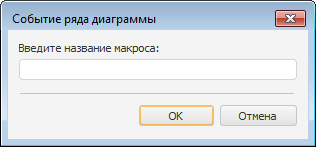
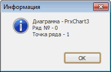

# Настройка обработчика событий

Настройка обработчика событий
-

# Настройка обработчика событий

При активации диаграмма позволяет управлять своим содержимым: выделять
 ряды, области и т.д. Для повышения интерактивности отчета можно обрабатывать
 события, генерируемые диаграммой.

Для использования обработчика событий отметьте диаграмму, расположенную
 на листе отчета, и выполните команду контекстного меню «Обработчик
 событий».

После выполнения команды появится окно «Событие
 ряда диаграммы»:

В окне «Событие ряда диаграммы»
 введите название макроса, который будет выполняться при нажатии на ряд
 диаграммы.

В зависимости от расположения реализации макроса различается способ
 указания пути к макросу в данном окне:

	- если макрос реализован в модуле/форме репозитория: <идентификатор
	 модуля/формы>.<наименование макроса>;

	- если макрос реализован в одном из объектов сборки репозитория:
	 <идентификатор сборки>.<наименование макроса>.

В модулях/формах репозитория реализация пользовательских макросов должна
 производиться в глобальном пространстве имен (Global Scope).

Примечание.
 Объект среды разработки, в котором содержится реализация макроса, должен
 быть [подключен](../Reports/Event/UiReport_Reports_Event.htm)
 к регламентному отчету.

Макрос, используемый в качестве обработчика событий для диаграммы, должен
 иметь следующую сигнатуру:

Public Sub OnChartClick(Serie: Integer; Chart: IPrxChart; Point: Integer);

Begin

End Sub OnChartClick;

Если макрос реализован в обычном модуле/форме репозитория, то параметр
 Point, в котором будет передаваться
 точка ряда, является необязательным. Если он не указан, то в макрос будет
 передаваться только индекс ряда и диаграмма.

## Пример использования обработчика событий

Для подключения к диаграмме макроса в окне «Навигатор
 объектов» создайте модуль:

	Public Sub OnChartClick(Serie: Integer; Chart: IPrxChart; Point: Integer);

	Begin

	    WinApplication.InformationBox("Диаграмма - " + (Chart As ITabObject).Id + #13 + #10 +

	        "Ряд № - " + Serie.ToString + #13 + #10 +

	        "Точка ряда - " + Point.ToString);

	End Sub OnChartClick;

Где OnChartClick - имя макроса;
 Serie - номер ряда; Chart
 - диаграмма; Point - номер точки
 ряда.

Для выполнения примера добавьте ссылки на системные сборки: Report,
 Tab и Ui.

После подключения данного макроса в случае обращения к некоторому ряду
 на диаграмме будет выдаваться сообщение, например:

См. также:

[Начало
 работы с инструментом «Отчёты» в веб-приложении](../../Web/organizational_management/Starting.htm) | [Визуализация
 данных в виде диаграмм](UiReport_Diagrams_appointment.htm)

		Справочная
		 система на версию 10.9
		 от 18/08/2025,
		 © ООО «ФОРСАЙТ»,
