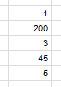
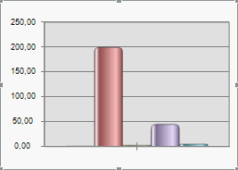
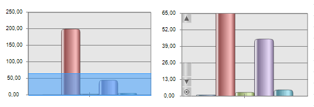

# Настройка режима масштабирования

Настройка режима масштабирования
-

# Настройка режима масштабирования

Для настройки режима масштабирования шкал осей диаграммы выполните команду
 контекстного меню «Режим масштабирования»
 активированной диаграммы.

Примечание.
 Данная команда контекстного меню недоступна для [круговой](UiDiagrams.chm::/Type_diagrams/UiDiagrams_round.htm),
 [лепестковой](UiDiagrams.chm::/Type_diagrams/UiDiagrams_petalous.htm),
 [точечной](UiDiagrams.chm::/Type_diagrams/uidiagrams_scatter.htm)
 и [объемных](UiDiagrams.chm::/Property_diagramm/UiDiagrams_PropertyDiagramm_Volume.htm)
 диаграмм.

В раскрывающемся меню установите флажок напротив необходимого режима
 масштабирования:

	- Только по оси Х. Масштабируется
	 шкала только по оси Х;

	- Только по оси Y. Масштабируется
	 шкала только оси Y;

	- По осям Х и Y. Масштабируются
	 шкалы осей Х и Y;

	- Только по дополнительной оси
	 Y. Масштабируется шкала только для дополнительной оси Y;

	- По оси Х и дополнительной Y.
	 Масштабируются шкалы по дополнительной оси Y и по оси Х;

	- По оси Y и дополнительной Y.
	 Масштабируются шкалы по дополнительной оси Y и по оси Н;

	- По всем осям. Масштабируются
	 шкалы по всем осям.

Если флажок не установлен, масштабирование шкалы не будет использоваться.

Для постоянного отображения на диаграмме при масштабировании полосы
 прокрутки установите флажок «Отображать
 полосы прокрутки» в раскрывающемся меню «Режим
 масштабирования». При снятом флажке полосы прокрутки
 отображаются только при наведении курсора мыши. Горизонтальная полоса
 прокрутки имеет следующий вид:

После выбора режима масштабирования выделите с помощью мыши участок
 диаграммы, который необходимо увеличить, после чего вид диаграммы автоматически
 перестроится. Для просмотра диаграммы вдоль осей используйте полосы прокрутки.

Для возвращения диаграммы к первоначальному виду нажмите кнопку  на панели прокрутки, если диаграмма масштабировалась
 несколько раз, то для возвращения к первоначальному виду столько же раз
 нажмите данную кнопку.

## Пример масштабирования диаграммы

Построим диаграмму для следующих данных (ряды располагаются в строках):

Вид диаграммы будет следующий:

Активируйте диаграмму и в контекстном меню «Масштабирование»
 установите флажки «Только по оси Y»
 и «Отображать полосы прокрутки».
 Затем выделите диапазон, который необходимо увеличить. На приведенном
 ниже рисунке показан выделенный диапазон (слева) и результат масштабирования
 (справа):

С помощью полосы прокрутки можно просматривать всю диаграмму.

См. также:

[Начало
 работы с инструментом «Отчёты» в веб-приложении](../../Web/organizational_management/Starting.htm) | [Формат
 оси](UiDiagrams.chm::/Params_diagram/UiDiagrams_Axis.htm#axis_format) | [Визуализация
 данных в виде диаграмм](UiReport_Diagrams_appointment.htm)

		Справочная
		 система на версию 10.9
		 от 18/08/2025,
		 © ООО «ФОРСАЙТ»,
