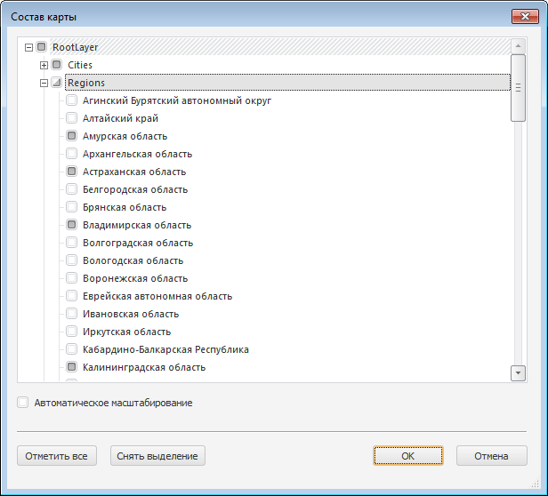

# Изменение состава карты

Изменение состава карты
-

# Изменение состава карты

Для изменения состава карты выполните команду «Изменить
 состав карты» в контекстном меню карты. Откроется окно
 «Состав карты»:

В окне доступны следующие операции:

[Отметка элементов](javascript:TextPopup(this))

	В дереве элементов установите флажки напротив элементов, которые
	 требуется отобразить на карте. По умолчанию выбраны все элементы.

	Для отметки всех элементов нажмите кнопку «Отметить
	 все». Для снятия отметки со всех элементов нажмите кнопку «Снять выделение».

[Автоматическое
 масштабирование](javascript:TextPopup(this))

	Масштабирование позволяет изменять размер отображаемого участка
	 карты с сохранением пропорций.

	Для выполнения масштабирования установите флажок «Автоматическое
	 масшабирование». После установки флажка границы топоосновы
	 будут автоматически изменены таким образом, чтобы вмещать только выбранные
	 элементы карты.

Примечание.
 В веб-приложении карты отображаются в соответствии с настройками, заданными
 в настольном приложении.

См. также:

[Начало
 работы с инструментом «Отчёты» в веб-приложении](../../Web/organizational_management/Starting.htm) | [Возможности
 карты в регламентном отчете](UiMaps_Report_property.htm)

		Справочная
		 система на версию 10.9
		 от 18/08/2025,
		 © ООО «ФОРСАЙТ»,
