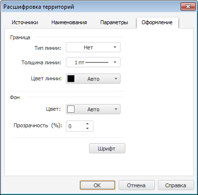

# Настройка оформления расшифровки: Регламентный отчёт, настольное приложение

Настройка оформления расшифровки: Регламентный отчёт, настольное приложение
-

# Настройка оформления расшифровки

Для настройки оформления расшифровки территорий используйте вкладку
 «Оформление» в диалоге «Расшифровка территорий».

[Для отображения
 диалога «Расшифровка территорий»](javascript:TextPopup(this))

		- В рабочей области выделите карту.

		- Убедитесь, что расшифровка территорий отображается.

		- Выполните команду контекстного меню «Параметры
		 расшифровки».

	Будет отображен диалог «Расшифровка
	 территорий».

Доступные параметры:

	- Граница.
	 Определите параметры оформления границы расшифровки:

	-

		- Тип линии. Выберите
		 тип линии границы. По умолчанию тип линии не выбран и граница
		 расшифровки не отображается;

		- Толщина линии. Выберите
		 толщину линии границы. Для ввода толщины границы вручную выберите
		 вариант «Пользовательский».
		 Будет открыт диалог «Толщина
		 линии», в котором задайте требуемое значение;

		- Цвет линии. Выберите
		 цвет линии границы;

	- Фон. Определите параметры
	 заливки фона расшифровки:

	-

		- Цвет. Выберите цвет
		 фона расшифровки;

		- Прозрачность. Укажите
		 степень прозрачности фона расшифровки. 0% - фон полностью непрозрачный,
		 100% - фон полностью прозрачный;

	- Шрифт. Определите параметры
	 шрифта для элементов расшифровки. Нажмите кнопку «Шрифт».
	 Будет открыт диалог «[Шрифт](UiNav.chm::/GUI/Format/UiReport_Table_Attribute_Type.htm)».

Совет.
 Для настройки параметров шрифта расшифровки также можно использовать группы
 «Шрифт», расположенные на вкладках
 «Главная» и «Обьект.
 Расшифровка» ленты инструментов.

См. также:

[Начало
 работы с инструментом «Отчёты» в веб-приложении](../../../Web/organizational_management/Starting.htm) | [Настройка расшифровки территорий](TerritoryInfo_setup.htm)

		Справочная
		 система на версию 10.9
		 от 18/08/2025,
		 © ООО «ФОРСАЙТ»,
