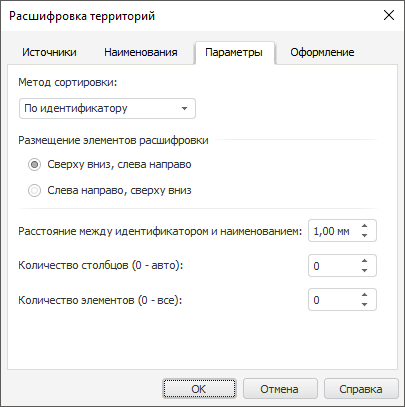

# Настройка элементов расшифровки

Настройка элементов расшифровки
-

# Настройка элементов расшифровки

Для настройки элементов расшифровки территорий используйте вкладку «Параметры» в диалоге «Расшифровка
 территорий».

[Для отображения
 диалога «Расшифровка территорий»](javascript:TextPopup(this))

		- В рабочей области выделите карту.

		- Убедитесь, что расшифровка территорий отображается.

		- Выполните команду контекстного меню «Параметры
		 расшифровки».

	Будет отображен диалог «Расшифровка
	 территорий».

Доступные параметры:

	- Метод сортировки. Выберите
	 метод сортировки, применяемый к элементам расшифровки;

	- Размещение элементов расшифровки.
	 Укажите порядок размещения элементов расшифровки:

	-

		- Сверху вниз, слева направо.
		 Элементы размещаются по столбцам;

		- Слева направо, сверху вниз.
		 Элементы размещаются по строкам;

	- Показывать только видимые территории.
	 По умолчанию флажок установлен и в расшифровке присутствуют только
	 элементы, соответствующие видимым объектам слоя карты. Если флажок
	 снят, то в расшифровке будут содержаться элементы, соответствующие
	 всем объектам слоя, в том числе и невидимым;

	- Расстояние между идентификатором
	 и наименованием. Задайте расстояние между идентификатором и
	 наименованием элемента расшифровки;

	- Количество столбцов.
	 Задайте количество столбцов в расшифровке. Для автоматического подбора
	 количества столбцов укажите значение «0» (используется по умолчанию);

	- Количество элементов.
	 Задайте количество элементов, которые будут указаны в расшифровке.
	 Для отображения всех элементов укажите значение «0» (используется
	 по умолчанию).

См. также:

[Начало
 работы с инструментом «Отчёты» в веб-приложении](../../../Web/organizational_management/Starting.htm) | [Настройка расшифровки территорий](TerritoryInfo_setup.htm)

		Справочная
		 система на версию 10.9
		 от 18/08/2025,
		 © ООО «ФОРСАЙТ»,
