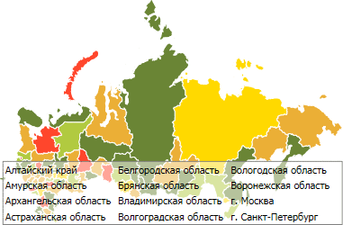
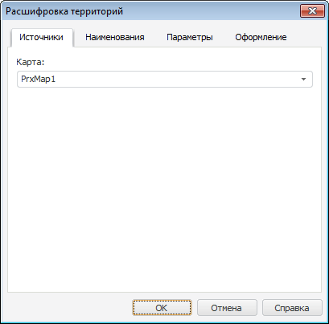

# Настройка расшифровки территорий

Настройка расшифровки территорий
-

# Настройка расшифровки территорий

Расшифровка территорий предназначена для отображения списка территорий
 карты.

Пример карты с расшифровкой территорий:

Для отображения расшифровки нажмите кнопку «Расшифровка»,
 расположенную в группе «Карта»
 на вкладке «Вставка» ленты инструментов.

Будет открыто окно «Расшифровка
 территорий»:

На вкладке «Источники» в раскрывающемся
 списке выберите карту, для которой необходимо отобразить расшифровку территорий.
 Затем настройте:

	- [наименования территорий](TerritoryInfo_territoryNames.htm);

	- [элементы расшифровки](Dlg_TerritoryInfo_Params.htm);

	- [оформление расшифровки](Dlg_TerritoryInfo_Format.htm).

См. также:

[Начало
 работы с инструментом «Отчёты» в веб-приложении](../../../Web/organizational_management/Starting.htm) | [Возможности
 карты в регламентном отчете](../UiMaps_Report_property.htm)

		Справочная
		 система на версию 10.9
		 от 18/08/2025,
		 © ООО «ФОРСАЙТ»,
