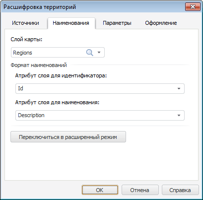
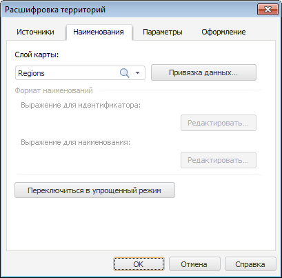

# Настройка наименований территорий

Настройка наименований территорий
-

# Настройка наименований территорий

Для настройки наименований территорий в расшифровке используйте вкладку
 «Наименования» в диалоге «Расшифровка территорий».

[Для отображения
 диалога «Расшифровка территорий»](javascript:TextPopup(this))

		- В рабочей области выделите карту.

		- Убедитесь, что расшифровка территорий отображается.

		- Выполните команду контекстного меню «Параметры
		 расшифровки».

	Будет отображен диалог «Расшифровка
	 территорий».

Вкладка «Наименования» может
 быть представлена в двух режимах: упрощенном и расширенном. Упрощенный
 режим позволяет задать атрибуты для формирования наименований элементов
 путем их выбора из раскрывающегося списка. Расширенный режим позволяет
 задать атрибуты для формирования наименований элементов при помощи выражений.
 Для переключения между режимами нажмите кнопку «Переключиться
 в расширенный режим»/«Переключиться
 в упрощенный режим».

### Упрощенный режим

В упрощенном режиме вкладка «Наименования» окна «Расшифровка территорий»
 выглядит следующим образом:

Определите на вкладке следующие параметры:

[Слой карты](javascript:TextPopup(this))

	Из раскрывающегося списка выберите необходимый слой карты.

[Формат наименований](javascript:TextPopup(this))

	Определите атрибуты слоя для формирования наименований элементов:

		- Атрибут слоя для идентификатора.
		 Из раскрывающегося списка выберите один из атрибутов слоя для
		 идентификатора элемента;

		- Атрибут слоя для наименования.
		 Из раскрывающегося списка выберите один из атрибутов слоя для
		 наименования элемента.

### Расширенный режим

В расширенном режиме вкладка «Наименования»
 окна «Расшифровка территорий»
 выглядит следующим образом:

Определите на вкладке следующие параметры:

[Слой карты](javascript:TextPopup(this))

	Из раскрывающегося списка выберите необходимый слой карты.

[Привязка данных](javascript:TextPopup(this))

	Для задания атрибутов с помощью выражений определите привязку к
	 данным. Для этого нажмите кнопку «Привязка
	 данных». Будет открыт диалог «[Адаптер данных](../UiReports_map_Data_adapt.htm)».
	 Определите в нем привязку к данным. После того как привязка к данным
	 определена станет доступной группа параметров «Формат
	 наименований».

[Формат наименований](javascript:TextPopup(this))

	Группа недоступна, пока не определена привязка к срезу данных.

	Определите в группе выражения для формирования наименований элементов:

		- Выражение для идентификатора.
		 Задает выражение, на основании которого будет формироваться идентификатор
		 элемента;

		- Выражение для наименования.
		 Задает выражение, на основании которого будет формироваться наименование
		 элемента.

	Выражение можно ввести с клавиатуры или определить его в окне «[Редактор
	 формул](UiNavObj.chm::/equation_editor/UiMd_Equation_editor.htm)».
	 Для этого нажмите кнопку «Редактировать»,
	 расположенную рядом с полем для ввода выражения.

Если необходимо, после настройки наименований территорий задайте настройки
 [элементов расшифровки территорий](Dlg_TerritoryInfo_Params.htm)
 и их [оформление](Dlg_TerritoryInfo_Format.htm).

См. также:

[Начало
 работы с инструментом «Отчёты» в веб-приложении](../../../Web/organizational_management/Starting.htm) | [Настройка расшифровки территорий](TerritoryInfo_setup.htm)

		Справочная
		 система на версию 10.9
		 от 18/08/2025,
		 © ООО «ФОРСАЙТ»,
