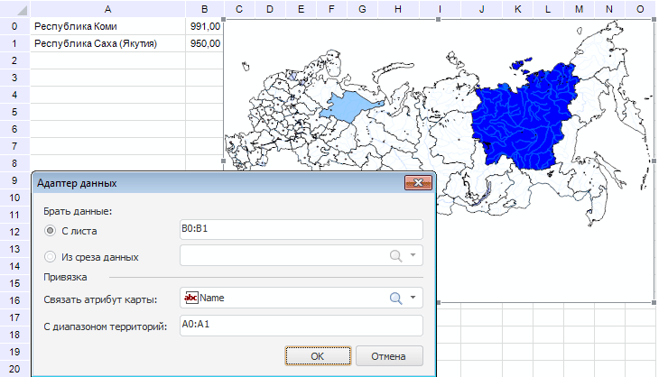
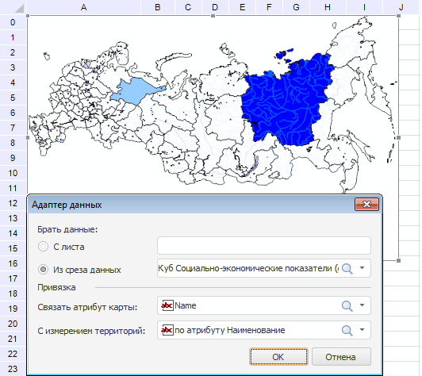

# Пример настройки карты

Пример настройки карты
-

# Пример настройки карты

Для полной настройки карты, используемой в регламентном отчете, выполните
 последовательность действий:

	- Перед работой с картой убедитесь,
	 что выполняются [требования
	 для работы с картой](UiMaps.chm::/Common/Requirements.htm).

	- Подготовьте источники данных, которые будут использоваться для
	 карты: из среза данных или с листа.

Примечание.
 В карте могут использоваться несколько источников данных одновременно.

		- При использовании данных из
		 среза в отчете [создайте
		 срез](../Source/Window/UiReport_Source_Window_AreaSource.htm#add_slice1), содержащий территориальное измерение как первое измерение
		 по строкам;

		- При использовании данных с
		 листа, создайте на листе таблицу с данными, содержащую
		 область с территориями. В области с территориями используйте данные,
		 которые соответствуют значениям из топоосновы, например, наименование
		 территории.

Примечание.
 Сравнить данные о территориях в таблице и топооснове можно с помощью [расшифровки территорий](TerritoryInfo/TerritoryInfo_setup.htm).

	- Добавьте карту на лист отчета.

	- Настройте [атрибуты](UiMaps_Report_property_1.htm)
	 и [свойства карты](UiMaps_Report_property_param.htm).

[Пример
 создания карты по данным с листа](javascript:TextPopup(this))

	Для выполнения примера выполните пункты
	 1-3 настройки карты. Данные на лист введите так, как показано на рисунке
	 ниже. Выполните команду контекстного меню «Свойства
	 карты» для карты.

	В открывшемся окне «Свойства карты» на вкладке «[Атрибуты](UiMaps_Report_property_1.htm)»
	 создайте [картографический
	 показатель](UiMaps_Report_property_1_atr_1.htm) для слоя Regions
	 и задайте следующие параметры в поле «Атрибуты»:

			- Щёлкните по значению «нет» напротив атрибута
			 «Привязка данных».
			 В открывшемся окне «Адаптер
			 данных» заполните поля, как показано на рисунке ниже.
			 Для сохранения значений нажмите кнопку «OK».

	Примечание.
	 В таблице на листе отчета используются наименования территорий, поэтому
	 в поле «Связать атрибут карты»
	 выберите значение Name.

			- В группе «Заливка»
			 напротив атрибута «Привязка
			 данных» щёлкните по значению «нет».
			 В открывшемся окне «Адаптер
			 данных» заполните поля, как показано на рисунке ниже.
			 Для сохранения значений нажмите кнопку «OK»;

			- В группе «Заливка»
			 выберите [шкалу
			 отчета](../Reports/OperationReport/Scale/UiReport_Reports_Operation_Scale.htm);

			- [Обновите
			 отчет](../Reports/OperationReport/UiReport_Reports_Operation_Execute.htm).

	После применения заданных настроек выбранные
	 территории карты будут залиты цветом в соответствии с выбранной шкалой
	 отчета:

	

[Пример
 создания карты по данным из среза](javascript:TextPopup(this))

	Для выполнения примера выполните пункты
	 1-3 настройки карты. При этом в срезе данных настройте измерения следующим
	 образом:

			- выберите 2 территории;

			- в календарном измерении выберите период, например год.

	Выполните команду контекстного меню «Свойства карты» для карты.

	В открывшемся окне «Свойства карты» на вкладке «[Атрибуты](UiMaps_Report_property_1.htm)»
	 создайте [картографический
	 показатель](UiMaps_Report_property_1_atr_1.htm) для слоя Regions
	 и задайте следующие параметры в поле «Атрибуты»:

			- Щёлкните по значению «нет» напротив атрибута
			 «Привязка данных».
			 В открывшемся окне «Адаптер
			 данных» заполните поля, как показано на рисунке ниже.
			 Для сохранения значений нажмите кнопку «OK».

	Примечание.
	 В таблице на листе отчета используются наименования территорий, поэтому
	 в поле «Связать атрибут карты»
	 выберите значение Name.

			- В группе «Заливка»
			 напротив атрибута «Привязка
			 данных» щёлкните по значению «нет».
			 В открывшемся окне «Адаптер
			 данных» заполните поля, как показано на рисунке ниже.
			 Для сохранения значений нажмите кнопку «OK»;

			- В группе «Заливка»
			 выберите [шкалу
			 отчета](../Reports/OperationReport/Scale/UiReport_Reports_Operation_Scale.htm);

			- [Обновите
			 отчет](../Reports/OperationReport/UiReport_Reports_Operation_Execute.htm).

	После применения заданных настроек выбранные
	 территории карты будут залиты цветом в соответствии с выбранной шкалой
	 отчета:

	

	Примечание.
	 Если в результате выполнения примера на карте не отобразились данные,
	 проверьте наличие данных в срезе, создав область данных на основе
	 этого среза.

	- Добавьте [внутреннюю и внешнюю
	 легенды](UiMaps_Report_Legend.htm) карты.

	- Добавьте [расшифровку
	 территорий](TerritoryInfo/TerritoryInfo_setup.htm).

Для настройки карты, источником данных для которой является [табличный
 визуализатор](../AreaData/DataTable.htm), используйте боковую панель. Подробное описание возможностей
 таких карт приведено в разделе «[Настройка
 карты](UiMaps.chm::/Configure/MapConfigure.htm)».

См. также:

[Начало
 работы с инструментом «Отчёты» в веб-приложении](../../Web/organizational_management/Starting.htm) | [Визуализация
 данных в виде карт](svgmap.htm)

		Справочная
		 система на версию 10.9
		 от 18/08/2025,
		 © ООО «ФОРСАЙТ»,
